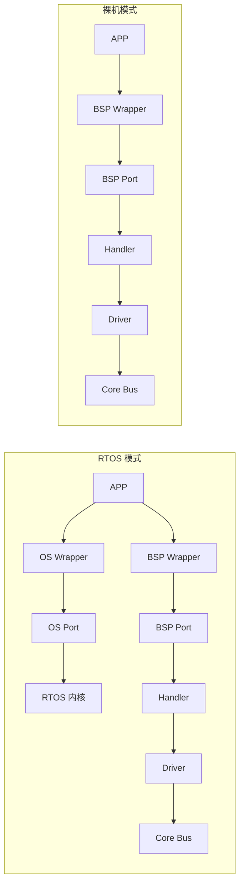

# 嵌入式软件分层架构参考模型

> 本文件定义嵌入式软件的分层架构（APP → OS/BSP Wrapper → Port → Handler/Driver → Core Bus），
> 作为所有相关 skill（driver 开发/代码审查/架构评审/移植）的共享参考依据。
> 所有代码生成、审查、移植工作必须遵循此分层规则，**禁止跨层操作**。
>
> **关键区分**：裸机（无 RTOS）和 RTOS 两种模式下，层间连接方式不同——详见"裸机 vs RTOS 依赖规则"章节。
>
> **更新说明**：本文件已随 code 分支架构升级更新，引入 BSP Wrapper/Port/Handler/Driver/Core Bus 五子层、
> OS Wrapper/Port 两层抽象，以及 Adapter 归属规则。

## 架构全景（已更新为 code 分支新架构）

```mermaid
flowchart TB
    subgraph APP[APP 层 — 业务逻辑]
        APP_TASKS[main / manager / task / logic / ui / profile]
    end

    subgraph SYS[System 层 — 全局配置]
        GLOBALS[全局宏/系统参数/配置文件]
    end

    subgraph MID[Middlewares 层 — 通用中间件]
        LVGL[LVGL GUI]
        MQTT[MQTT 通信]
        FATFS[FatFs 文件系统]
        OTHER[其他通用库]
    end

    subgraph OS[OS 层 — 抽象]
        OW[OS Wrapper: osal_*]
        OP[OS Port: os_*_impl()]
        SCHED[RTOS 内核]
    end

    subgraph BSP[BSP 层 — 板级外设]
        BW[BSP Wrapper]
        BP[BSP Port]
        BH[BSP Handler]
        BD[BSP Driver]
    end

    subgraph CORE[Core 层 — MCU 外设封装]
        CB[Core Bus 事务级 API]
        ADC_INIT[ADC 初始化与读取]
        TIM_PWM[TIM PWM 配置]
        UART_IO[USART 收发封装]
    end

    subgraph DRV[Driver 层 — 硬件抽象]
        HAL[STM32 HAL 库]
        REG_OPS[寄存器级操作]
        CLOCK[时钟系统配置]
    end

    APP --> OW
    APP --> BW
    APP --> MID
    MID --> OW
    MID --> BW

    OW --> OP
    OP --> SCHED

    BW --> BP
    BP -->|constructs, registers, injects| BH
    BH -->|transaction Driver Ops| BD
    BD -->|transaction Bus Ops| CB

    CB --> HAL
    CB --> REG_OPS

    SYS -..->|全局配置被所有层引用| APP
```

## 关键架构升级点

1. **Adapter 仅存在于 OS 和 BSP**：Core、Middleware、Driver 不创建 Wrapper/Port 调用层。
2. **BSP 拆分为 5 个子层**：Wrapper → Port → Handler → Driver → Core Bus。
3. **Core Bus 是事务级总线抽象**：硬件后端绑定 HAL/LL/CMSIS；软件后端仅在私有实现中使用 GPIO 和微秒时基。
4. **共享总线锁归 Core Bus**：跨设备总线互斥由 Core 负责；单设备请求串行化归 Handler。
5. **Port 只装配，不实现**：Port 注入 Core Bus、OSAL、时基、Driver Ops；不调用 HAL、不实现软件 IIC、不持有业务状态。
6. **Driver 只封装器件协议**：默认仅导出 `bsp_xxx_driver_inst()`；其余为实例 `pf_*` 或 `static`。
7. **Handler 管理单设备生命周期**：缓存、队列、线程、事件、回调；不重复器件协议。

## 逐层定义

### Driver 层（硬件抽象层）

| 属性 | 内容 |
|------|------|
| **定义** | CPU 厂商/MCU 厂商提供的驱动库，用于 CPU 和片上外设编程 |
| **代表** | STM32 HAL/LL 库、CMSIS-Core、寄存器操作封装 |
| **职责** | 提供 GPIO/UART/SPI/I2C/TIM/ADC 等片上外设的底层接口 |
| **约束** | 直接操作寄存器实现时钟系统、总线控制、中断 |
| **换芯片** | 更换芯片**必须**修改此层代码 |
| **通信** | **仅为 Core 层提供硬件操作接口，不与 BSP 层通信** |
| **抽象粒度** | 对硬件（寄存器）的抽象 |

```c
// Driver 层示例: STM32 HAL 的 GPIO 初始化
// 文件: Driver/STM32F4xx_HAL_Driver/Src/stm32f4xx_hal_gpio.c

void HAL_GPIO_Init(GPIO_TypeDef *GPIOx, GPIO_InitTypeDef *GPIO_Init)
{
    uint32_t position;
    for (position = 0; position < 16; position++)
    {
        // 直接操作 GPIOx->MODER, ->OTYPER, ->OSPEEDR, ->PUPDR 寄存器
        // 不包含任何业务逻辑
    }
}
```

**面向对象映射**：`GPIO_TypeDef` = 类（封装寄存器地址），`HAL_GPIO_Init` = 方法（操作成员寄存器）

---

### Core 层（MCU 外设封装层 / Core Bus）

| 属性 | 内容 |
|------|------|
| **定义** | 面向 MCU 编程，提供事务级 Core Bus API；内部用 Driver 层实现总线后端 |
| **代表** | `i2c_bus_write()` / `i2c_bus_read()` / `spi_bus_xfer()` / `uart_bus_send()` |
| **职责** | 统一片上外设的事务级接口；管理共享总线锁；隐藏 HAL/LL/寄存器差异 |
| **约束** | **不创建 Adapter**；公共 API 不暴露 HAL/LL/RTOS 类型；事务级而非位级 |
| **换芯片** | Core Bus 接口不变，后端实现重写 |
| **通信** | 内部调用 Driver 层；为 BSP Driver 提供事务级 Bus Ops |

```c
// Core 层示例: I2C Core Bus 事务级接口
// 文件: Core/Src/i2c_bus.c

int32_t i2c_bus_write(i2c_bus_handle_t bus, uint8_t addr,
                      const uint8_t *data, uint16_t len, uint32_t timeout_ms)
{
    // 内部可能调用 HAL_I2C_Master_Transmit 或 LL 实现
    // 对上层只暴露事务级 write，不暴露 START/STOP/ACK 细节
    return HAL_I2C_Master_Transmit(&bus->hi2c, addr << 1, data, len, timeout_ms);
}
```

**面向对象映射**：`i2c_bus_write()` = 类的公开方法，`HAL_I2C_Master_Transmit` = 私有实现

---

### BSP 层（板级外设驱动层）

BSP 现在明确拆分为 5 个子层，所有器件交互都遵循统一链路：

```text
APP / Middleware → BSP Wrapper → BSP Port → BSP Handler → BSP Driver → Core Bus
```

| 子层 | 职责 | 禁止 |
|------|------|------|
| **Wrapper** | 稳定的上层设备 API | 不得包含 Driver/Handler/HAL/RTOS 头；不持有平台句柄 |
| **Port** | 装配：注入 Core Bus、OSAL、时基、Driver Ops；就绪门控 | 不调用 HAL、不实现软件 IIC、不持有业务状态 |
| **Handler** | 单设备生命周期、请求串行化、缓存、队列、线程、事件、回调 | 不重复器件协议；不直接访问 Driver 内部成员 |
| **Driver** | 器件协议封装（命令、时序、解码） | 不包含 HAL/RTOS/Handler；默认仅导出 `bsp_xxx_driver_inst()` |
| **Core Bus** | 共享总线事务与跨设备互斥 | 不承载业务语义 |

```c
// BSP Driver 示例: AHT21 协议封装（不包含 HAL）
// 文件: BSP/aht21/bsp_aht21_driver.c

static int32_t pf_trigger_measurement(bsp_aht21_instance_t *inst)
{
    uint8_t cmd[3] = {0xAC, 0x33, 0x00};
    return inst->ops.i2c_write(inst->bus, AHT21_ADDR, cmd, 3, AHT21_TIMEOUT_MS);
}

bsp_aht21_instance_t *bsp_aht21_driver_inst(const bsp_aht21_ops_t *ops,
                                             i2c_bus_handle_t bus)
{
    // 分配/注册实例，注入 ops 和 bus
}
```

**面向对象映射**：Driver 的 `pf_*` = 实例方法；`ops` = 依赖注入接口

---

### OS 层（实时操作系统抽象层）

| 属性 | 内容 |
|------|------|
| **定义** | 通过 Wrapper/Port 抽象 RTOS 原生 API |
| **代表** | `osal_task_create()` / `osal_mutex_lock()` / `osal_queue_send()` |
| **职责** | 提供任务、队列、信号量、互斥锁、定时器、延时、时基、内存、临界区的稳定 API |
| **约束** | Wrapper 只暴露项目需要且 Port 已实现的最小 API；`osal_internal_*.h` 只是两层内部边界 |
| **通信** | `Caller → osal_task_create() → os_task_create_impl() → native RTOS API` |

```c
// OS Wrapper 示例
// 文件: OS/osal_task.h

osal_status_t osal_task_create(osal_task_t *task,
                               const char *name,
                               osal_task_entry_t entry,
                               void *arg,
                               uint32_t stack_depth,
                               osal_priority_t priority);

// OS Port 示例（FreeRTOS 实现）
// 文件: OS/Port/FreeRTOS/osal_task_impl.c

osal_status_t os_task_create_impl(osal_task_t *task, ...)
{
    return xTaskCreate(entry, name, stack_depth, arg, priority, &task->handle)
           == pdPASS ? OSAL_OK : OSAL_ERR_NO_MEM;
}
```

---

### Middlewares 层（中间件层）

| 属性 | 内容 |
|------|------|
| **定义** | 项目间通用的外设抽象程序，模块化设计可快速开发 |
| **代表** | LVGL（GUI）、MQTT（通信）、FatFs（文件系统）、mbedTLS（加密） |
| **职责** | 提供跨项目复用的功能模块 |
| **约束** | **不创建 Adapter**；通过 OS Wrapper 或 BSP Wrapper 接入底层；只暴露公共 API |
| **通信** | 调用 OS Wrapper API；必要时通过 BSP Wrapper 访问设备 |

---

### System 层（系统配置层）

| 属性 | 内容 |
|------|------|
| **定义** | 系统全局宏定义、全局参数、配置文件 |
| **代表** | FreeRTOSConfig.h、stm32f4xx_hal_conf.h、全局类型定义、错误码枚举 |
| **职责** | 定义对全局系统有影响的参数和文件 |
| **约束** | 被所有层引用，但不依赖任何层 |
| **通信** | 无（全局配置，被所有层引用） |

---

### APP 层（业务逻辑层）

| 属性 | 内容 |
|------|------|
| **定义** | 结合实际需求的业务逻辑实现，main/manager/task/logic/ui/profile 文件存放位置 |
| **代表** | 人机交互界面、物联网通信协议、机械臂运动算法 |
| **职责** | 调用 OS Wrapper、BSP Wrapper 和 Middleware 公共 API 完成逻辑算法 |
| **换项目** | 业务逻辑完全可替换，底层驱动不变 |
| **约束（RTOS）** | **只调用 OS Wrapper、BSP Wrapper 和 Middleware 公共 API**，不直接访问 BSP Port/Handler/Driver/Core/Driver |
| **约束（裸机）** | **可调用 BSP Wrapper**（无 OS 层），但不能直接调 BSP Port/Handler/Driver/Core/Driver |

```c
// ── RTOS 模式 ──
// 文件: APP/Tasks/app_temp_report.c

void App_TempReportTask(void *params)
{
    while (1)
    {
        float temp;
        // ✅ 正确: 通过 OS Wrapper 队列获取数据（Handler 投递）
        osal_queue_receive(&temp_queue, &temp, OSAL_WAIT_FOREVER);

        // ✅ 正确: 调用中间件发送
        mqtt_publish("sensor/temp", &temp, sizeof(temp), 0);

        // ❌ 禁止 (RTOS 模式): 直接调用 BSP Driver/Handler 或 HAL
        // mpu6050_read_temperature(&temp);  // 跨层！
        // HAL_I2C_Master_Transmit(...);       // 跨两层！
    }
}

// ── 裸机模式 ──
// 文件: APP/main.c

int main(void)
{
    // 初始化 (Core 层)
    SystemClock_Config();
    UART_Init(115200);
    I2C_Init(100000);

    // 初始化 (BSP Wrapper)
    sensor_temp_init();  // 裸机模式下允许

    while (1)
    {
        // ✅ 正确 (裸机): APP 直接调 BSP Wrapper
        float temp;
        sensor_temp_read(&temp);

        // ✅ 正确: 通过 Core 层 API 发送
        UART_Send((uint8_t*)&temp, sizeof(temp));

        // ❌ 禁止: 直接调 BSP Driver / Core / Driver
        // bsp_aht21_driver_inst(...);
        // HAL_UART_Transmit(...);

        HAL_Delay(1000);  // 通过 Core 层延时
    }
}
```

---

## 分层铁律

### 裸机 vs RTOS 依赖规则

**关键区分**：OS 层在裸机模式下**不存在**，APP 只能依赖 BSP Wrapper 和 Middleware。



| 连接 | RTOS 模式 | 裸机模式 |
|------|-----------|---------|
| APP→BSP Wrapper | 允许 | 允许 |
| APP→BSP Port/Handler/Driver/Core | 禁止 | 禁止 |
| APP→OS Wrapper | 允许 | 不存在 |
| APP→Middleware 公共 API | 允许 | 允许 |
| APP→Core/Driver | 禁止 | 禁止 |
| BSP Driver→Core Bus | 允许 | 允许 |
| BSP Port→HAL | 禁止 | 禁止 |
| Core Bus→Driver HAL | 允许 | 允许 |

### 依赖方向（单向）

```
RTOS 模式：
  Vendor Driver → Core Bus → BSP Driver → BSP Handler → BSP Port → BSP Wrapper → APP
                                       ↗ OS Wrapper → OS Port → RTOS
  Middleware 公共 API → APP / OS Wrapper / BSP Wrapper

裸机模式：
  Vendor Driver → Core Bus → BSP Driver → BSP Handler → BSP Port → BSP Wrapper → APP
  Middleware 公共 API → APP / BSP Wrapper
```

**核心原则**：
- **Vendor Driver → Core Bus → BSP Driver → Handler → Port → Wrapper** 这条调用链在任何模式下都固定不变
- **BSP Port 始终不能调用 HAL 或实现软件 IIC**
- **Handler 不重复器件协议，Core Bus 不承载业务语义**
- OS 层仅在 RTOS 模式下存在，裸机时 APP 直接调 BSP Wrapper
- APP 始终禁止调 Core/Driver；RTOS 模式下 APP 也禁止调 BSP Port/Handler/Driver

### 禁止行为

| 违规 | 后果 | 正确做法 |
|------|------|---------|
| BSP Port 调用 HAL | Port 只做装配，不应包含平台实现 | Port 注入 Core Bus Ops，由 Core Bus 后端调用 HAL |
| BSP Driver 包含 HAL/RTOS | Driver 只封装器件协议 | Driver 只注入事务级 Bus Ops、GPIO Ops、timebase Ops |
| BSP Handler 直接访问 Driver 内部 | 破坏封装，无法替换器件 | Handler 只调用泛化 Driver Ops (`pf_*`) |
| APP 直接调用 Core/Driver | 完全绕过所有抽象层，芯片换不了 | APP → OS/BSP Wrapper → Port → ... |
| Core 直接暴露 HAL/LL 类型 | 上层被迫依赖具体芯片 | Core 公共 API 只使用项目自定义类型 |
| Middleware 创建 Adapter | 中间件应提供公共 API，不做设备绑定 | Middleware → OS/BSP Wrapper |
| ISR 中调 BSP/APP 函数 | ISR 不受 RTOS 管理，可能死锁 | ISR 仅做标志位或 FromISR API |

### 允许的例外

- **中断服务函数**：ISR 可以调用 Driver 层（寄存器操作）和 Core 层（外设操作），**但需标记为跨层操作并特别审查**
- **System 层**：全局宏和配置可以被任何层引用
- **调试阶段**：printf 直接从任意层到 UART（通过 `_write` syscall），正式版本应约束
- **裸机 APP → BSP Wrapper**：这是架构允许的正确路径，不是违规——只要项目中确实没有 OS 层

---

## 面向对象思想在 C 语言中的实现

嵌入式 C 代码通过以下模式实现 OOP 的三大特性：

### 封装（Encapsulation）

```c
// ── 头文件（公开接口）──
// Core/Inc/uart_core.h
typedef struct {
    USART_TypeDef *Instance;
    uint32_t BaudRate;
} UART_Handle_t;

void UART_Init(UART_Handle_t *huart);
void UART_Send(UART_Handle_t *huart, uint8_t *data, uint16_t len);

// ── 源文件（私有实现）──
// Core/Src/uart_core.c
static uint8_t tx_buffer[256];  // 私有变量，外部不可见
void UART_Init(UART_Handle_t *huart) { /* ... */ }
```

### 继承（通过结构体包含实现）

```c
// "基类": 通用设备接口
typedef struct {
    void (*init)(void);
    void (*read)(uint8_t *buf, uint16_t len);
    void (*write)(uint8_t *buf, uint16_t len);
} Device_t;

// "子类": MPU6050 继承 Device_t
typedef struct {
    Device_t base;       // "基类"成员（必须在第一个字段）
    float accel_offset;  // 子类特有
    uint8_t i2c_addr;    // 子类特有
} MPU6050_t;
```

### 多态（通过函数指针表实现）

```c
// ── 统一的传感器接口 ──
typedef struct {
    void (*init)(void);
    float (*read_temperature)(void);
    float (*read_humidity)(void);
} SensorOps_t;

// ── 不同的传感器实现同一接口 ──
SensorOps_t DHT22_Ops = { DHT22_Init, DHT22_ReadTemp, DHT22_ReadHumidity };
SensorOps_t SHT30_Ops = { SHT30_Init, SHT30_ReadTemp, SHT30_ReadHumidity };
SensorOps_t MPU6050_Ops = { MPU6050_Init, MPU6050_ReadTemp, NULL };
```

---

## 架构在技能中的映射

| 技能 | 对应层/子层 | 说明 |
|------|------------|------|
| `stm32-hal-development` | Driver | HAL 库使用指南 |
| `mcu-peripheral-registers` | Driver | 寄存器级操作 |
| `arm-core-registers` | Driver | Cortex-M 内核寄存器 |
| `i2c-bus` / `spi-bus` / `uart-module` 等 | Core Bus | 事务级总线 API 与总线协议 |
| `core-mcu` | Core | MCU 外设封装与总线后端 |
| `bsp-hal-driver` | BSP Driver | 器件协议封装 |
| `bsp-handler` | BSP Handler | 生命周期、并发、缓存、事件 |
| `bsp-adapter` | BSP Wrapper/Port | 板级绑定与依赖注入 |
| `bsp-platform-adapter` | BSP Port | 平台适配与 Fake Port |
| `os-abstraction` | OS Wrapper/Port | OSAL 抽象 |
| `rtos-freertos` | OS Port/RTOS | FreeRTOS 原生配置 |
| `fatfs-module` / `middleware-*` | Middlewares | 文件系统/通信/GUI/算法中间件 |
| `workflow-project-integration` | 跨层 | 现有工程架构审计与迁移 |
| `embedded-architect` | 全层 | 所有层的架构决策 |
| `embedded-reviewer` | 全层 | 所有层的代码与方案审查 |
