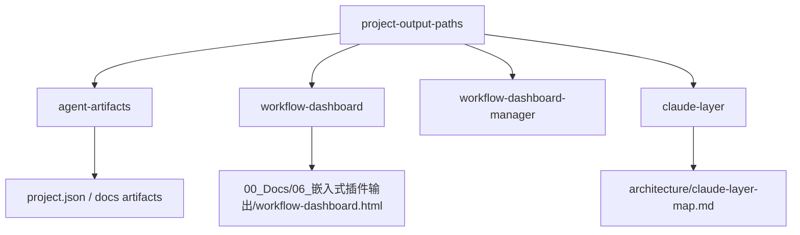

# 集成实施计划：嵌入式插件输出统一归档到 00_Docs

## 1. 元数据

| 字段 | 内容 |
|---|---|
| request_id | `REQ-PLUGIN-OUTPUT-00DOCS-20260821` |
| spec_version | `v1.0` |
| plan_version | `v1.0` |
| 状态 | `awaiting_user_review` |
| 目标输出根 | `00_Docs/06_嵌入式插件输出/` |
| 施工仓库 | `C:\\Users\\zhang\\Documents\\mcu-workbench` |

## 2. 方案目标

将插件生成的四类文档和 Dashboard 的默认输出统一到：

```text
<target-project>/00_Docs/06_嵌入式插件输出/
├─ architecture/
├─ verification/
├─ devlog/
├─ notes/
└─ workflow-dashboard.html
```

旧 `docs/*` 仅作为读取兼容来源，不自动迁移或删除。

## 3. 候选方案

### 方案 A：共享路径契约模块 + 新写入/旧读取兼容（推荐）

新增一个小型路径契约模块，例如 `lib/project-output-paths.js`，统一提供：

- `PLUGIN_OUTPUT_ROOT`：`00_Docs/06_嵌入式插件输出`；
- 四个文档目录的 POSIX 相对路径；
- Dashboard 默认路径和绝对路径解析；
- 新路径与旧 `docs/*` 的读取候选集合。

同步修改：

1. `scripts/agent-artifacts.js`：初始化新目录和 `artifact_roots`；
2. `lib/workflow-dashboard.js`：默认输出、证据扫描、监听目录和越界校验；
3. `lib/workflow-dashboard-manager.js`：start/status/open 的返回路径；
4. `lib/claude-layer.js`：分层报告新写入路径，保留旧报告兼容清理边界；
5. `agents/*.md`、`AGENTS.md`、`CLAUDE.md`、README 和相关 Skill 文档；
6. Dashboard、Agent Artifact、Claude Layer 测试。

优点：

- 路径语义集中，减少后续再次漂移；
- Dashboard、Agent、Claude 报告使用同一契约；
- 旧项目可继续读取 `docs/*`；
- 可单独测试路径越界、中文路径和兼容优先级。

代价：

- 增加一个内部路径模块；
- 需要修改的测试和文档较多；
- 需要明确新旧路径的来源优先级。

### 方案 B：各模块局部替换路径

不新增共享模块，直接在 `agent-artifacts.js`、Dashboard、Claude Layer 和文档中分别将 `docs/*` 替换为 `00_Docs/06_嵌入式插件输出/*`。

优点：

- 改动文件较少；
- 初始实现速度较快。

缺点：

- 路径字符串继续分散在多个模块；
- 新增插件产物时容易遗漏某个消费者；
- 旧路径兼容逻辑会重复实现；
- Dashboard、Agent 和 Claude 报告可能产生路径不一致。

## 4. 推荐与待用户选择

推荐方案 A。原因是本次变更同时影响多个输出生产者和 Dashboard 读取者，已经满足“共享接缝”的条件；统一路径契约能提高修改的局部性和测试可替换性。

本 Plan 尚未进入代码施工，等待用户选择方案 A 或方案 B。若用户选择方案 A，后续生成的 Task 将以共享路径模块为唯一主实现边界。

## 5. 依赖关系与文件范围



预期涉及文件：

- 新增：`lib/project-output-paths.js`；
- 修改：`scripts/agent-artifacts.js`、`lib/workflow-dashboard.js`、`lib/workflow-dashboard-manager.js`、`lib/claude-layer.js`；
- 修改：相关 Agent、根规则、README、Skill 文档；
- 修改：`tests/agent-artifacts.test.js`、`tests/workflow-dashboard.test.js`、`tests/workflow-dashboard-manager.test.js`、相关 Claude Layer 测试；
- 不修改：固件源码、Vendor 源码、`00_Docs/04_需求文档` 既有请求、`.mcu-workbench/workflows` 既有请求状态。

## 6. 接口与生命周期

- 路径模块只返回路径和候选路径，不创建目录、不写文件。
- Agent Artifact 初始化负责创建四个文档目录；重复初始化保持现有 `project.json` 保护行为。
- Dashboard 生成器负责原子写入单个 HTML；Watcher 不监听自身输出。
- Claude Layer 负责写入新架构报告；旧报告只作为兼容迁移识别对象，不删除用户文档。
- 所有路径必须限制在目标工程根目录内；Dashboard 输出进一步限制在插件输出根目录内。

## 7. 验证计划

| 阶段 | 命令/检查 | 证据等级 |
|---|---|---|
| 路径模块 | `node --check lib/project-output-paths.js` | static |
| Agent 产物 | `npm test -- --runInBand tests/agent-artifacts.test.js` | host |
| Dashboard | `npm test -- --runInBand tests/workflow-dashboard.test.js tests/workflow-dashboard-manager.test.js` | host |
| Claude Layer | `npm test -- --runInBand tests/claude-layering.test.js` | host |
| 插件契约 | `npm run validate:plugin` | static |
| Markdown 链接 | `npm run validate:links` | static |
| 差异检查 | `git diff --check` | static |
| 全量回归 | `npm test -- --runInBand` | host |

目标板、浏览器 `file://` 和真实 Claude/Codex/OpenCode 宿主行为不属于本次验证范围。

## 8. 回滚

- 回滚代码变更即可恢复旧默认路径；不删除目标项目的新目录和文件。
- 旧 `docs/*` 保持不变，因此兼容读取和人工恢复均可继续进行。
- 若新路径与用户现有目录冲突，停止施工并回传 Spec，不自动移动或覆盖文件。

## 9. 当前状态

等待用户选择方案。选择后由 `workflow-task-breakdown` 生成任务清单；Plan 未批准前不修改实现代码。
