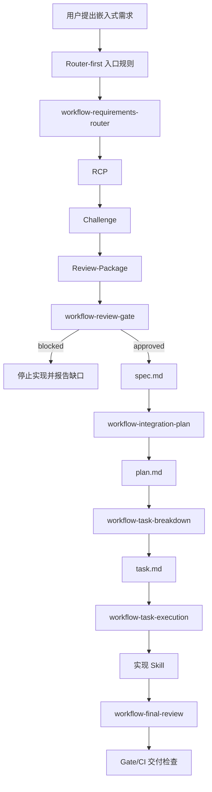

# 实施计划：Codex Router-first 与嵌入式任务交付门禁

## 1. 计划状态

| 字段 | 内容 |
|---|---|
| request_id | `REQ-CODEX-ROUTER-GATE-20260819` |
| 计划版本 | `v0.5` |
| 计划状态 | `approved-for-task-execution` |
| 选定方案 | `A：确定性交付门禁方案` |
| 输入 Spec | `00_Docs/04_需求文档/spec.md` |
| 输入 Review-Package | `REQ-CODEX-ROUTER-GATE-20260819-Review-Package.md` |
| 项目根目录 | `C:\Users\zhang\Documents\mcu-workbench` |
| 固件目标工程 | 不在本计划施工范围内 |
| 当前分支基线 | `host_ai @ 1652881d99578b8c45326d67ba455b6734df716f` |

用户已选择方案 A，并确认允许修改 `README.md`、`scripts/`、`package.json` 和 `.github/workflows/ci.yml`。范围变更已回写 RCP、Review-Package 和 `spec.md v0.2`，现放行到任务执行。仍排除固件工程、其他宿主和未经确认的 Codex Hook。

本次需求变更：不恢复已删除 BSP fixture，T-03 只删除 `tests/validate-bsp-contract.test.js` 中引用这些 fixture 的测试段；不修改 `scripts/validate-bsp-contract.js`，不处理独立的 `embedded-framework` 快照缺口。该选择会减少 BSP 合同回归覆盖，必须在最终报告中单独列出。

本次继续变更：移除 `tests/embedded-framework-baseline.test.js` 测试入口，不同步 `tests/fixtures/embedded-framework` 快照；该基准验证覆盖被明确移除，不能计入通过证据。

本次继续变更：将 `tests/quality-format-profile.test.js` 的 `ColumnLimit` 期望改为 `80`，保持实际质量 profile 不变；该调整只修正测试契约，不改变生成代码格式行为。

## 2. 目标与交付结果

### 2.1 目标

解决 Codex 偶发绕过嵌入式插件 Router 的交付风险，形成两层保障：

1. 入口层：明确 Router-first，提供目标工程可复制的入口约束。
2. 交付层：通过确定性 Gate 检查 RCP、Challenge、Review-Package、Spec、Plan 和变更状态。

第一版不承诺拦截 Codex 每一次内部动作；必须保证未经有效 Gate 的结果不能被标记为合规交付。

### 2.2 交付物

| 交付物 | 作用 | 验收证据 |
|---|---|---|
| Router-first 入口规则 | 约束第一阶段只做需求路由和证据收集 | 静态契约测试、真实宿主记录 |
| Gate 校验命令 | 输出 `pass`、`blocked` 或明确错误 | 主机测试、CLI 输出 |
| 状态矩阵测试 | 覆盖缺失、阻塞、放行和需求变更 | Jest/主机测试 |
| CI 门禁 | 阻止无有效 Gate 证据的合规交付 | CI fixture/失败与通过记录 |
| 目标工程接入材料 | 说明 AGENTS/Gate 如何接入工程 | 文档审查和接入演练 |
| 三类宿主回归记录 | 测量真实 Codex 是否首阶段遵循 Router | Composer 会话记录，证据等级为真实宿主 |

## 3. 设计边界

### 3.1 不修改范围

- `D:\zhuomian\embedded_framework` 及其固件代码；
- HAL、RTOS、BSP、Driver 和目标板资源；
- OpenCode、Claude 适配逻辑；
- 未经确认的 Codex Hook、MCP 或宿主 API；
- 既有 Skill ID、旧别名、缓存刷新语义。

### 3.2 插件内部流程



### 3.3 Gate 的定位

Gate 是文档状态和变更范围的确定性检查器，不是模型行为拦截器。它必须：

- 不依赖模型自述“已执行 Router”；
- 不把插件缓存一致性当作宿主执行证明；
- 能对缺失、`blocked`、非放行和有效放行状态给出不同结果；
- 在需求范围、接口、资源边界或验收标准变化时要求回到 Spec；
- 输出可保存、可审查、可在 CI 中比较的结果。

## 4. 计划阶段拆解

### 阶段 P0：接口和文件范围冻结

责任：`embedded-lead`、`system-architect`

工作内容：

- 审查本计划与 `spec.md`、RCP、Review-Package 的一致性；
- 确定 Gate 状态文件格式、命令参数和退出码；
- 确定项目级接入材料是模板、生成片段还是校验入口；
- 检查 `.codex-plugin/plugin.json` 是否无需修改；默认按“不修改 Manifest”执行；
- 逐项确认现有脏工作区文件不属于本任务。

放行条件：

- Gate 输入、输出和状态模型已固定；
- 施工文件清单已固定；
- 未确认的宿主能力不再作为实现前提。

### 阶段 P1：入口规则和接入材料

责任：`system-architect`、`knowledge-engineer`

规划修改：

- `codex/AGENTS.md`：补充 Router-first 的最小入口契约、只读前置和 Gate 交接条件；
- `codex/` 下的接入材料：提供目标工程可复制的规则片段和证据记录格式；
- `README.md`：说明 Codex 的能力边界、如何接入目标工程、如何区分静态/主机/真实宿主证据；
- `AGENTS.override.md`：只通过既有生成流程更新，不手工维护。

入口契约必须明确：

- 第一有效动作是需求路由和证据收集；
- 没有 RCP/Spec/Gate 放行时只能分析或报告阻塞；
- 直接调用实现 Skill 不等于完成需求审查；
- 目标工程必须提供项目路径、芯片/板卡、构建方式和验收边界；
- 真实宿主回归记录不能由静态校验代替。

### 阶段 P2：确定性 Gate 实现

责任：`firmware-engineer`、`toolchain-engineer`

规划修改：

- `scripts/`：新增或扩展 Gate 校验入口；
- `package.json`：增加独立命令，不改变既有命令语义；
- 必要的 `codex/` 配置：定义状态字段、允许状态和变更检测规则。

Gate 最小接口：

```text
npm run validate:workflow-gate -- --root <project-root> [--json] [--strict]
```

建议退出码：

| 结果 | 退出码 | 含义 |
|---|---:|---|
| `pass` | `0` | 所需产物存在且状态满足当前阶段 |
| `blocked` | `2` | 发现缺失、阻塞、过期或未放行状态 |
| `invalid-input` | `3` | 参数、路径或文档格式无效 |
| `tool-error` | `1` | 工具本身执行失败 |

Gate 检查项：

1. RCP 是否存在、字段是否完整、证据等级是否有效；
2. Challenge 是否完成，是否存在未解决的实现阻塞；
3. Review-Package 是否与 request ID 和 Spec 关联；
4. Spec 是否为允许实现的状态；
5. Plan/Task 是否与当前 Spec 版本关联；
6. 需求关键字段变化后是否重新生成 Spec；
7. 变更文件是否超出计划范围；
8. 是否误把真实宿主证据写成静态或 CI 证据。

Gate 输出至少包含：

- `request_id`；
- `stage`；
- `status`；
- `checked_files`；
- `missing_items`；
- `blocking_reasons`；
- `evidence_level`；
- `next_action`。

### 阶段 P3：主机回归和兼容性验证

责任：`verification-engineer`

规划修改：

- `tests/`：新增 Gate 状态矩阵、入口契约和变更范围 fixture；
- 只增加与本需求直接相关的测试，不恢复或改写其他既有删除内容。

必须覆盖：

| Fixture | 预期 |
|---|---|
| 缺少 RCP | `blocked` |
| RCP 存在但 Challenge 未完成 | `blocked` |
| Spec 非放行状态 | `blocked` |
| Spec 放行但变更超出范围 | `blocked` |
| Spec/Plan/Task 版本不一致 | `blocked` |
| 完整且一致的放行链 | `pass` |
| `--json --strict` 输出 | 可解析且退出码稳定 |

兼容性验证：

- `npm run validate:plugin`；
- `npm test -- --runInBand`；
- `npm run build:codex-compat`；
- `npm run plugin:check-refresh -- --json --strict`；
- `git diff --check`。

### 阶段 P4：CI 接入和交付闭环

责任：`toolchain-engineer`

规划修改：

- `.github/workflows/ci.yml`：接入插件自身 Gate/Spec 校验；
- 保留原有 Jest、插件结构、链接和版本检查；
- 不在 CI 中伪造真实 Codex 会话结果。

CI 必须区分：

- 静态文档和状态 Gate；
- 主机测试；
- 插件缓存/兼容桥；
- 真实 Codex 宿主回归。

真实宿主回归可作为单独的人工或受控任务记录，不得因为 CI 通过而自动标记 V-06～V-08 通过。

### 阶段 P5：真实宿主回归

责任：`verification-engineer`、`embedded-lead`

使用三个独立 Codex 任务：

1. 简单代码修改请求；
2. 嵌入式架构设计请求；
3. 构建或调试请求。

每个任务记录：

- 首个有效动作；
- 是否先进入 Router；
- 是否先收集项目证据；
- 是否在 Spec/Gate 前产生实现写入；
- 使用的 Skill/入口；
- 会话时间、项目路径和分支；
- 是否能由 Gate 识别违规状态。

该阶段只产生验证记录，不新增宿主 Hook，不修改目标固件。

## 5. 文件清单与修改权限

| 路径 | 计划动作 | 状态 |
|---|---|---|
| `codex/AGENTS.md` | 强化入口契约 | 计划修改 |
| `codex/` 接入材料 | 增加可复制的项目级规则/记录材料 | 计划修改 |
| `scripts/` | 增加 Gate 校验 | 计划修改 |
| `package.json` | 增加 Gate 命令 | 计划修改 |
| `tests/` | 增加主机 fixture 和契约测试 | 计划修改 |
| `.github/workflows/ci.yml` | 接入确定性 Gate | 计划修改 |
| `README.md` | 补充使用和证据边界 | 计划修改 |
| `.codex-plugin/plugin.json` | 默认不修改，除非 Schema 检查证明必要且兼容 | 保护 |
| `AGENTS.override.md` | 只由生成脚本更新 | 生成文件 |
| `D:\zhuomian\embedded_framework` | 不修改 | 明确排除 |
| `opencode.mjs`、Claude 适配 | 不修改 | 明确排除 |

施工时必须逐项检查 `git status` 和 `git diff`，禁止使用 `git add -A`，禁止覆盖用户已有变更。

## 6. 接口、状态和生命周期

### 6.1 状态模型

```text
missing → challenged → review-blocked → spec-approved
                                      → plan-approved
                                      → task-ready
                                      → implementation
                                      → final-review
                                      → delivery-pass
```

任意阶段出现需求范围、接口、资源边界或验收标准变化时，必须回到：

```text
需求变化 → 更新 RCP → Challenge → Review Gate → 新 Spec 版本
```

### 6.2 所有权和资源

本需求只涉及 Markdown、JSON、JavaScript 校验脚本、测试 fixture 和 CI 配置：

- 不涉及 FreeRTOS 任务、ISR、DMA、堆、栈或固件运行时缓冲区；
- Gate 输出由命令进程拥有，调用者只读取或保存结果；
- 不引入长期驻留进程、后台服务或动态硬件资源；
- 失败时返回稳定退出码和阻塞原因，不静默放行。

## 7. 验收计划

| 验收 ID | 阶段 | 验收条件 | 证据等级 |
|---|---|---|---|
| V-01 | P3 | 插件结构校验通过 | 静态 |
| V-02 | P3 | Jest 全量回归通过 | 主机 |
| V-03 | P3 | Gate 状态矩阵全部符合预期 | 主机 |
| V-04 | P3 | 缓存检查给出一致或明确刷新结果 | 主机 |
| V-05 | P3 | Codex 兼容桥无未预期差异 | 主机 |
| V-06 | P5 | 简单代码请求首动作符合 Router-first | 真实宿主 |
| V-07 | P5 | 架构设计请求首动作符合 Router-first | 真实宿主 |
| V-08 | P5 | 构建/调试请求首动作符合 Router-first | 真实宿主 |
| V-09 | P4 | 无 Gate 证据的变更不能合规放行 | 交付/CI |

放行条件：V-01～V-05、V-09 必须通过；V-06～V-08 必须有真实会话记录并单独标注结果。若真实宿主不可用，只能标记 `unverified`，不得改写为通过。

## 8. 风险、回滚与阻塞

| 风险 | 处理方式 |
|---|---|
| Codex 没有可确认的强制 Hook | 不把 Hook 作为依赖，用项目规则和交付 Gate 兜底 |
| Gate 过严阻塞正常文档工作 | 先在 fixture 中验证状态矩阵，保留 `--json` 诊断信息 |
| Manifest Schema 不兼容 | 默认不修改，若必须修改则退回 Review Gate |
| CI 把宿主行为误判为通过 | CI 只验证静态/主机/交付状态，真实宿主单独记录 |
| 当前工作区已有大量变更 | 只编辑计划清单文件，施工前按路径审阅 diff |
| 目标工程接入路径不明确 | 提供接入材料但不修改 `embedded_framework`，以演练结果补证 |

回滚顺序：

1. 回滚 CI 中新增的 Gate 步骤；
2. 回滚 `package.json` 的新增命令；
3. 回滚 Gate 脚本和测试 fixture；
4. 回滚入口规则和 README；
5. 重新运行既有插件校验和兼容桥。

禁止使用破坏性清理或覆盖整个工作区的回滚命令。

## 9. 实施交接

计划审查通过后交给 `workflow-task-breakdown`，按 P0→P5 拆分为可独立验证的 `task.md`。每个任务只能有一个主实现 Skill，并必须记录：

- Summary；
- Evidence；
- Changed files；
- Tests；
- Artifacts；
- Blockers；
- Next handoff。

如果实施中发现需要新增宿主 Hook、修改公共 Manifest 兼容字段、修改其他宿主适配或触碰 `embedded_framework`，必须暂停并回到 Router/Challenge/Review Gate。

## 10. 当前计划结论

`方案 A` 可实施，推荐按 P0→P5 顺序推进。当前仍处于 `draft-for-review`，尚未开始代码施工；下一步是对本计划进行计划级 Review，确认 Gate 接口、文件范围和 CI 接入点后，再生成 `task.md`。
