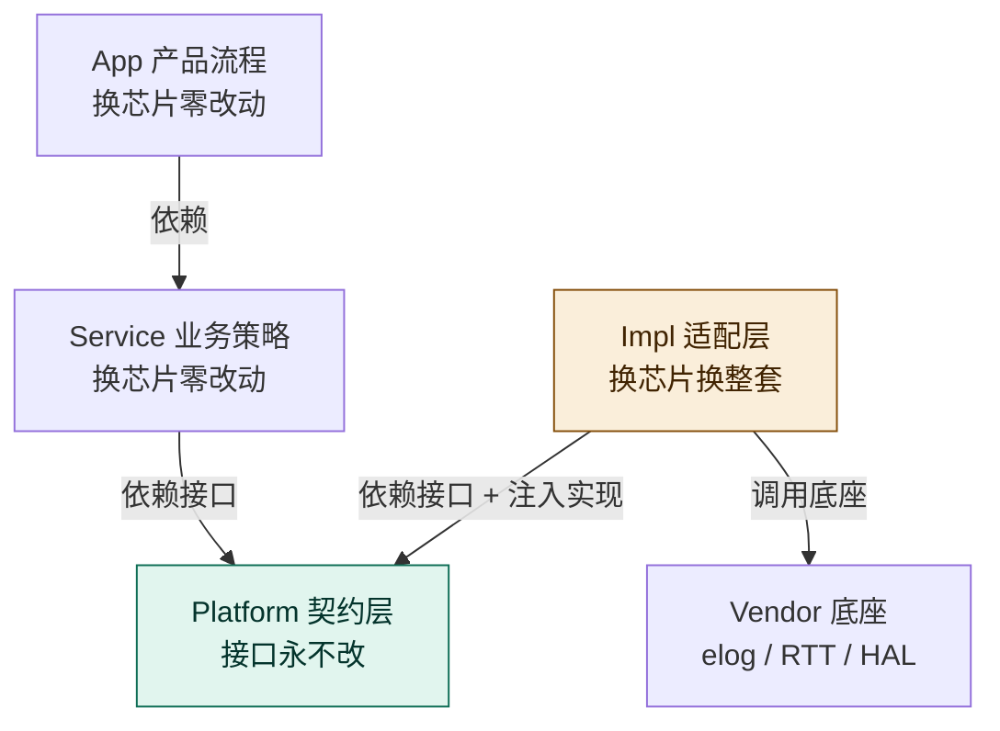
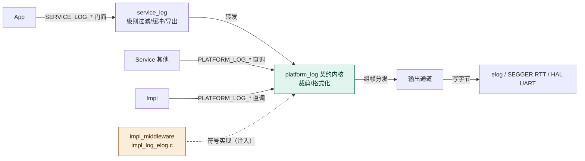
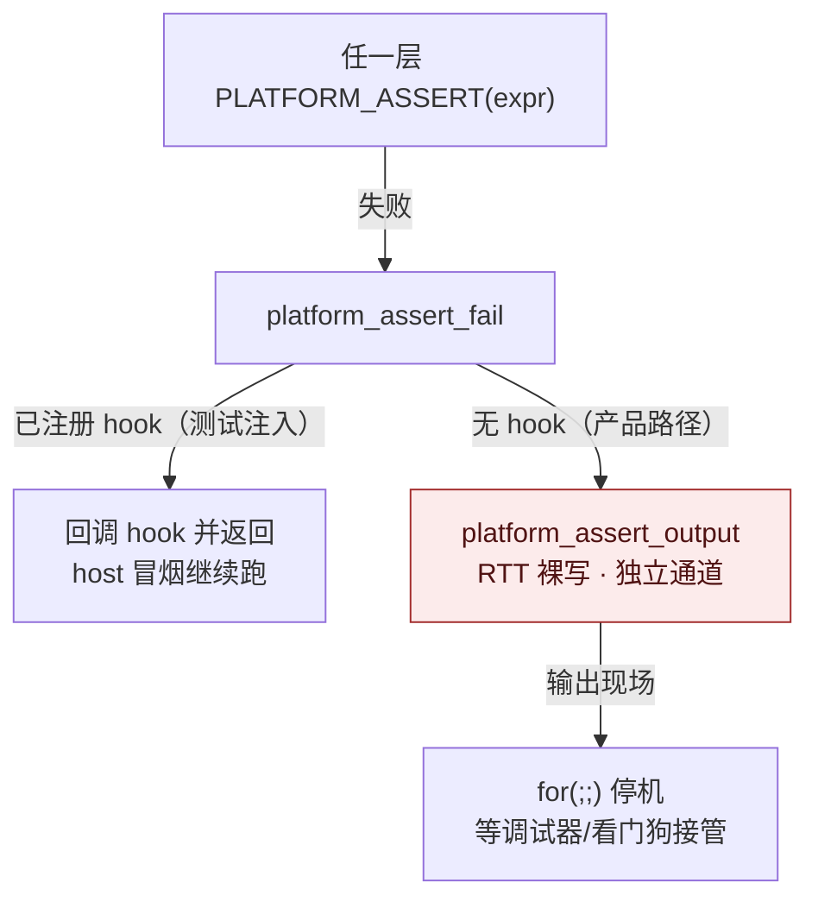
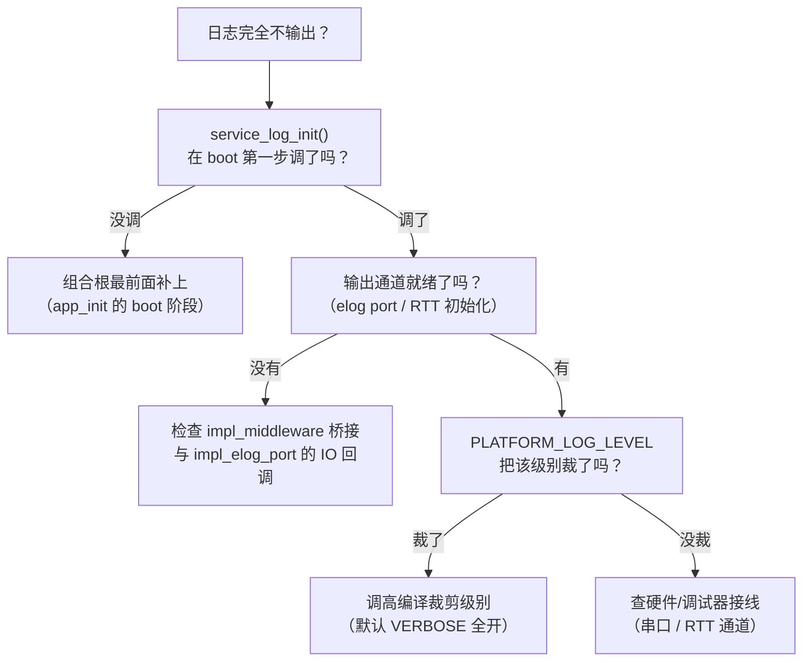

# 日志与检测架构设计思路（为什么 / 怎么做 / 出问题怎么办）

> v2.0（2026-08-09）：新增 mermaid 图、费曼式大白话术语表、口述验证题。
> 配套实践工程：`D:\zhuomian\embedded_framework`（分支 feature/log-diagnosis-system）
> 本文以 2026-08-09 对该工程的代码质量检查为真实案例，回答三个问题：
> **为什么这样设计**（动机与权衡）、**我自己怎么做**（实操步骤）、**出问题怎么解决**（排查路径）。

---

## 0. 一次真实检查的记录（先看案例）

对工程全部 23 个 `.c` 按五层契约检查后，结论：**依赖纪律全部合规，发现 3 处文档残留**。

| # | 位置 | 问题 | 级别 |
|---|---|---|---|
| 1 | `03_Platform/platform_common/diag/platform_assert.h` | `@par dependencies` 仍列 `platform_log.h`，实际只依赖 `platform_type.h` | 低（文档漂移） |
| 2 | `03_Platform/platform_common/diag/platform_assert.c` | 同上，P2 落地时改了代码漏改注释 | 低 |
| 3 | `04_Impl/impl_mcu/impl_reset_reason.c` | 同上 | 低 |

已确认合规的关键点：Platform 零反向（唯一例外 `platform_type.h → board_types.h` 类型出口）、App 只调 Service、Service 只调 Platform、P2 断言独立（RTT 裸写不碰日志）、P5 槽语义（满 `NO_RESOURCE` / 重复 `ALREADY_INIT`）、桥接正确（va_list 组帧 + 平台头在前防 bool 冲突）。

**案例教训**：改代码必须同步改注释，否则文档与代码漂移。检查的意义不是找大问题，而是防小问题积累成大问题。

---

## 1. 为什么要这样设计

### 1.1 五层契约解决什么问题

嵌入式工程最痛的是**换芯片/换板/换 RTOS 全工程跟着动**。五层契约的目标：让"变的"和"不变的"分离。



箭头 = 依赖/调用方向。**Platform 是"稳定契约层"：App/Service 依赖它，Impl 实现它**。日志、断言、复位原因、hardfault 这些"横切可观测能力"放 `platform_common/diag`，因为它们**被所有层共享、且不绑任何芯片**。

### 1.2 日志为什么分三层放（机制/策略/落地）

日志不是"一个模块"，是三个不同性质的关注点，硬塞一层会互相污染：

| 关注点 | 为什么放这层 | 工程实例 |
|---|---|---|
| 级别/裁剪/格式化/输出通道（**机制**） | Platform：接口永不改，所有层共用 | `platform_log.h`（级别宏 + `PLATFORM_LOG_LEVEL` 裁剪 + `PLATFORM_LOG_A/E/W/I/D/V` 宏） |
| 级别过滤策略、环形缓冲、按需导出（**策略**） | Service：带产品决策，允许演进 | `service_log`（App 门面 `SERVICE_LOG_*`） |
| 真正写字节到硬件（**落地**） | Impl：绑定具体中间件/硬件 | `impl_log_elog.c`（桥接 elog/RTT） |

**为什么 App 不能直接用 `PLATFORM_LOG_*`？** 依赖铁律 App→Service→Platform：App 直连能力实现，换实现时 App 跟着动（P3 痛点，`app_init.c` 曾直连 4 个 platform 头被拉回 service_log 门面）。

### 1.3 日志流转的三个方向（核心模型）



- **调用向下**：日志产生方在各层，统一汇聚到 `platform_log`，**不是逐层接力**。App 用 `SERVICE_LOG_*`（门面），Service/Impl 用 `PLATFORM_LOG_*`（直调合法）。
- **注入由 Impl**（黄色虚线）：Platform 只声明 `platform_log_output()` 等签名，**Impl 写函数体**（符号实现，链接期）。为什么不用运行期 ops 表注册？——更简单：零 RAM、无初始化顺序问题。动态切通道对这种规模是**过度设计**（不为凑灵活性引入复杂度）。
- **输出到底**：组帧后写 Vendor 底座，**单出口**，无接力。

### 1.4 为什么断言独立于日志（P2）

断言失败时，**日志系统可能是坏的**（缓冲损坏、未初始化、死在日志代码里）。



**关键对比**：hardfault（硬件异常）用 `PLATFORM_LOG_E` 输出**可以接受**——hardfault 发生时日志早已初始化（运行期被动异常）；assert 可能是 boot 早期或日志自身故障（主动软件检查）。**设计判断标准：故障发生时，依赖的那个东西还可靠吗？** 可靠→可以用；不可靠→必须自足。这就是 P2 背后的思维。

### 1.5 错误码为什么用 enum 不用宏

```c
typedef enum { PLATFORM_ERR_OK = 0, ... } platform_err_t;
```

宏 `#define PLATFORM_ERR_OK 0` 会在预处理期把枚举名替换成数字，导致**同名枚举编译错误**。enum 有类型检查 + 调试器可读。但 `PLATFORM_LOG_LVL_*` **必须用宏**——`#if` 裁剪在预处理期比较，enum 成员预处理不可见（被视为 0）。**同一个"级别"，两个用途两种载体**：裁剪用宏、类型化 API 用 enum。

---

## 2. 我自己怎么做（实操步骤）

### 2.1 判断一个模块放哪层（三层判定）

1. **它依赖谁？** include 芯片/HAL/RTOS/Vendor 头 → 只能放 Impl（或 Vendor）。include `platform_*` 头 → 可放 Service/App。
2. **它带业务策略吗？** 有产品决策（阈值/超时/降级顺序）→ Service。纯机制（驱动/转发/组帧）→ Platform/Impl。
3. **它被谁调用？** 被 App 直接调 → 必须是 Service 门面。

### 2.2 加一个新的日志输出通道（三步）

假设加"串口通道"：

1. **Platform 头已声明**——不用改 Platform！
2. **Impl 写符号实现**：新建 `04_Impl/impl_bsp/impl_log_uart.c`，实现 `platform_log_output()` 函数体，字节经 HAL UART 发出。注意链接期同名覆盖——**全工程只能有一个 `platform_log_output` 实现**（elog 或 uart 二选一）。
3. **验证**：gcc -fsyntax-only + include 白名单检查。

要点：**加通道不改 Platform、不改 Service**——这就是注入模型的价值。

### 2.3 快速验证依赖纪律（两条命令）

```bash
# Platform 层禁止反向（应只有 platform_type.h → board_types.h 一条外部 include）
grep -rn '#include' 03_Platform | grep -v 'platform_\|board_types'

# App 层只允许 service_*（+ platform_error.h 类型出口）
grep -rn '#include' 01_App
```

### 2.4 提交前自检清单

- [ ] 头注释 `@par dependencies` 与实际 include 逐行一致（本次就栽在这）
- [ ] 错误码统一 `platform_err_t` / `PLATFORM_ERR_*`，不压平为 -1
- [ ] 类型/宏出自 `platform_type.h` / `platform_def.h`，不自造
- [ ] include 方向符合依赖铁律（跑上面两条 grep）
- [ ] 故障路径（assert）不依赖日志
- [ ] gcc -fsyntax-only 通过（含 `-DSTM32F411xE` 目标分支）

---

## 3. 出问题怎么解决（排查路径）

### 3.1 编译错误

| 症状 | 根因 | 解法 |
|---|---|---|
| `fatal error: xxx.h: No such file or directory` | include 路径漏了，或跨层引用了不该引用的头 | 先确认该头在哪个层：跨层引用是架构问题不是路径问题；再补 -I |
| `conflicting types for 'bool'` | board_types 的 `typedef uint8 bool` 与 `<stdbool.h>` 冲突 | **平台头在前**（先 include `platform_*` 再 include Vendor 头） |
| `expected identifier before numeric constant` | 宏名被数字替换（enum/宏同名） | 裁剪用宏（`PLATFORM_LOG_LVL_*`），类型化 API 用 enum |
| 芯片分支语法错误 | 守卫宏 `STM32F411xE` 未定义，代码块被跳过 | 编译加 `-DSTM32F411xE` 验证目标分支 |

### 3.2 链接错误

| 症状 | 根因 | 解法 |
|---|---|---|
| `undefined reference to 'platform_log_output'` | **注入缺失**：没有 Impl 实现该符号 | 检查 `impl_log_elog.c`（或 uart 版）是否参与编译 |
| `multiple definition of 'platform_log_output'` | **重复注入**：两个 Impl 实现同一符号 | 全工程只能有一个实现，删掉不用的 |

### 3.3 运行期问题（在板上）



其他运行期问题：

| 症状 | 排查路径 |
|---|---|
| 断言触发但看不到输出 | 断言走 `platform_assert_output`（RTT 通道 0 裸写），**不是日志通道**——去 RTT 看，别去串口日志看 |
| 复位原因不对 | `impl_reset_reason.c` 读 RCC_CSR 后写 RMVF 清除标志——检查清除是否执行；判定优先级：上电 > 欠压 > 引脚 > 看门狗 > 软件 > 低功耗 |
| hardfault 后无 dump | dump 走 `PLATFORM_LOG_E`（elog 通道），日志本身已坏则看不到——设计取舍：hardfault 依赖日志，assert 不依赖 |

### 3.4 架构问题排查（比 bug 更难发现）

- 换芯片时 App 层要改 → App 直连了 Platform 能力实现（违反"App 只调 Service"）。
- Platform include 了 `impl_*` 或 `04_Impl` 路径 → 反向依赖，绝对禁止（唯一例外 `board_types.h`）。
- 排查方法：`grep -rn '#include' <层目录>` 扫一遍，人工确认每条外部依赖方向。30 秒扫描，省掉换芯片时几天返工。

---

## 4. 费曼术语表（大白话翻译）

把专业词翻译成日常语言，讲给外行听也能懂：

| 术语 | 大白话 |
|---|---|
| 依赖铁律 | **单行道**：上层可以靠下层，下层不许回头靠上层 |
| 契约层（Platform） | **合同文本**：只写"必须长什么样"，不写"谁来做" |
| 注入 / port | **插头插插座**：Platform 是插座（声明接口），Impl 是插头（给实现） |
| 符号实现（链接期注入） | **提前占坑**：头文件说"这里有个人"，Impl 编译时把名字对上；全工程只能占一次坑 |
| 门面（Facade） | **前台接待**：App 不挨个部门跑，统一找前台（service_log）办 |
| 编译裁剪 | **编译期直接删行**：级别不够的日志代码直接不生成，省 ROM 和时间 |
| 环形缓冲 | **录音带循环**：录满自动覆盖最老的，永远留最近一段 |
| 四元组 cfg/ctx/data/ops | **身份证 + 简历**：base 是身份证（magic/type/state），cfg 静态配置、ctx 运行状态、data 当前数据、ops 行为手册 |
| hook | **墙上挂钩**：平台留个钉，测试/策略随时往上挂 |
| ops 函数表 | **行为手册**：一沓"这个对象会干什么"的说明书，签名统一 |
| void* / backend_context | **不透明快递箱**：硬件句柄装进箱子，上层只搬箱不拆箱 |
| P2 故障路径自足 | **报警器自带喇叭**：不依赖电话线（日志），自己喊（RTT） |
| 组合根（app_init） | **总开关**：按顺序把整机点着，一个失败就停 |

---

## 5. 口述验证（费曼学习法：讲出来才算会）

**方法**：合上文档，把每个话题用大白话讲给一个"完全不懂嵌入式的人"。讲得顺、别人能听懂 = 真会了；卡壳 = 回到对应节再看。每讲完一题，对照"讲对标准"自检。

| # | 口述题目 | 讲对标准（缺一项就是没讲透） |
|---|---|---|
| 1 | 什么是五层架构？为什么分层？ | 能背出 `App→Service→Platform←Impl→Vendor` 顺序；说清动机是**换芯片零改动**；Platform **接口永不改**；Vendor 不反向 |
| 2 | 日志为什么要分三层放？ | 说清**机制**（级别/裁剪/格式→Platform）、**策略**（过滤/缓冲/导出→Service）、**落地**（写字节→Impl）；App 只走 `SERVICE_LOG_*` 门面 |
| 3 | 日志在层之间怎么流转？ | 说出三个方向：**调用向下**（宏汇聚到 platform_log，不是接力）、**注入由 Impl**（符号实现/占坑）、**输出到底**（单出口写 Vendor） |
| 4 | 为什么断言不依赖日志？ | 说清"故障时日志可能已坏"；判断标准是**故障发生时依赖是否可靠**；assert 独立走 RTT，hardfault 可以用日志（时机不同） |
| 5 | 出问题怎么排查？ | 按四类说：编译（路径/层错误）、链接（**注入缺失/重复**）、运行期（**初始化顺序/裁剪/通道**）、架构（grep include 方向） |
| 6 | enum 和宏为什么两个都用？ | 说清：`#if` 裁剪在预处理期、enum 不可见 → 级别**必须用宏**；类型化 API 要类型检查 → **用 enum** |

**找检验官**：口述完别急着走——讲给"架构通"（或同事）听一遍，让他指出哪里讲得含糊、哪里漏了。检验官问一句"那如果 XXX 失败了会怎样？"你答得上，才是真的懂了。

---

## 6. 一句话总结

> **架构不是画出来的，是"每行 include 都问一次方向"守出来的。**
> 机制放 Platform、策略放 Service、落地放 Impl、故障路径自足（P2）、改代码同步改注释。
> 检查时先跑 grep 看依赖方向，再读代码看实现质量——方向错了，实现再好也是白搭。
