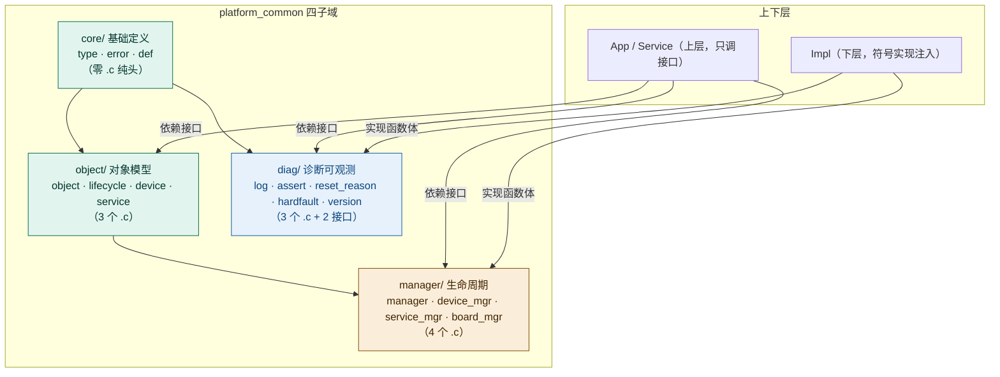
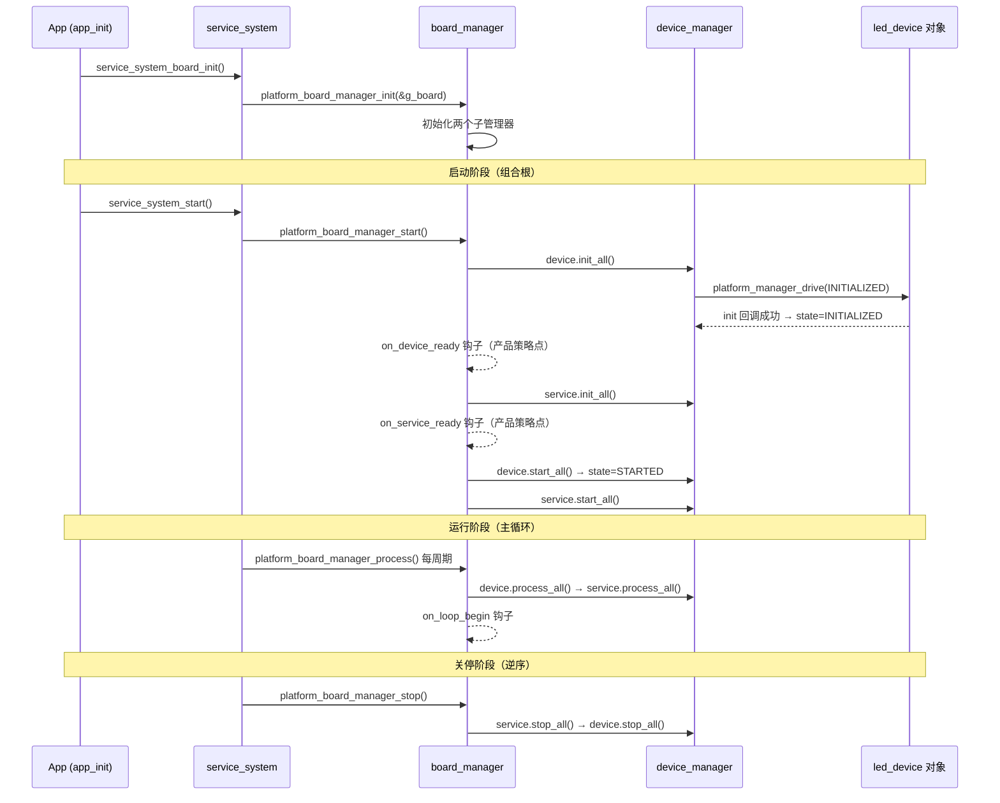

# platform_common 公共平台层架构设计（详细版）

> v2.0（2026-08-10）| 依据：ADR-001（四子域 + P1-P5）、软件层契约 v2.0（五层 + Port 注入）
> 配套实践工程：`D:\zhuomian\embedded_framework`（03_Platform/platform_common/，四子域 17 个文件：core 3 头 + object 3.c + manager 4.c + diag 3.c 2 接口）
> 阅读方式：先看第 0 节全景图建立整体，再逐子域精读，最后回到第 4.5 节看对象全流程。

---

## 0. 全景总览（先建立整体）

`platform_common` 是**平台契约层的公共基础**，一句话心智模型：

> **core 定"语言"（类型/错误码/宏），object 定"身份"（身份证+四元组），manager 管"生命周期"（驱动/编排），diag 保"可观测"（日志/断言/复位/异常）。**



**三条铁律（全文贯穿）：**

1. **准入（P1）**：新能力须被 ≥2 个子域/层共享且零芯片/RTOS/厂商依赖，才进 platform_common；单域能力归属对应层。
2. **零反向**：Platform 不 include Impl/Vendor 任何符号（唯一例外 `platform_type.h → board_types.h` 类型出口）。
3. **接口永不改**：Platform 是"合同文本"；Impl 实现它，Service/App 依赖它。

---

## 1. core 子域（定"语言"）——零 .c，纯头契约

### 1.1 `platform_type.h` —— 类型出口（全层唯一）

```c
#include "board_types.h"        /* 唯一例外：从 Impl 的板级类型源引出 */
typedef int8  int8_t;           /* 套一层：板级命名 → 平台公共命名 */
typedef uint8 uint8_t;
...
typedef uint8 bool_t;           /* 不用 bool：避免与 <stdbool.h> 冲突 */
```

| 组 | 类型 |
|---|---|
| 整型 | `int8_t..uint64_t`（8 个） |
| 浮点 | `float_t` / `double_t` |
| 字符/布尔 | `char_t` / `uchar_t` / `bool_t` |

**为什么套一层**：`board_types.h` 是"板级类型源"（换编译器/换板只改它）；`platform_type.h` 是"平台公共词汇表"（上层只认 `int8_t`）。中间这层**把变化挡在最底部**——换板零改动（供应商零件命名 vs 公司物料编号）。

### 1.2 `platform_error.h` —— 错误码基线（全层唯一返回码来源）

```c
typedef enum
{
    PLATFORM_ERR_OK              = 0,
    PLATFORM_ERR_GENERAL         = 1,
    PLATFORM_ERR_TIMEOUT         = 2,
    PLATFORM_ERR_PARAM           = 3,
    PLATFORM_ERR_NO_MEMORY       = 4,
    PLATFORM_ERR_NO_RESOURCE     = 5,
    PLATFORM_ERR_NOT_SUPPORTED   = 6,
    PLATFORM_ERR_NOT_INITIALIZED = 7,
    PLATFORM_ERR_ALREADY_INIT    = 8,
    PLATFORM_ERR_BUSY            = 9,
    PLATFORM_ERR_FAIL            = 10,
    PLATFORM_ERR_RESERVED        = 0x7FFFFFFF   /* 尺寸哨兵 */
} platform_err_t;
#define PLATFORM_IS_ERR(err) ((err) != PLATFORM_ERR_OK)
#define PLATFORM_IS_OK(err)  ((err) == PLATFORM_ERR_OK)
```

关键设计：
- **用 enum 不用 #define**：类型检查 + 调试器可读；宏会把枚举名预处理期替换成数字导致同名冲突。
- **`PLATFORM_ERR_RESERVED = 0x7FFFFFFF`**：int 最大值哨兵，强制 `platform_err_t` 占 4 字节，跨编译单元 ABI/存储布局稳定；也是合法值上界（不是错误码）。
- **Service/Impl 只在其后扩展**，禁止重复编号。
- `PLATFORM_OK/PLATFORM_ERROR`（platform_def.h）是**遗留兼容宏**，新代码一律用 `PLATFORM_ERR_*` 枚举。

### 1.3 `platform_def.h` —— 通用宏

| 宏 | 值/作用 | 备注 |
|---|---|---|
| `PLATFORM_OK/ERROR` | 0/1 | 遗留兼容，新代码禁用 |
| `PLATFORM_TRUE/FALSE` | 1/0 | 工程布尔约定（不用 true/false 关键字） |
| `NULL` / `ARRAY_SIZE` | 空指针 / 数组长度 | 未由环境提供才定义 |
| `PLATFORM_ALIGN(n)` | 按 4 字节上取整 | `((n)+3) & ~3`，size 必须 2 的幂 |
| `PLATFORM_DELAY_MS/US` | 转发 `platform_delay_ms/us` | **只声明**，实现在 Impl（绑硬件） |

---

## 2. object 子域（定"身份"）——3 个 .c

### 2.1 `platform_object_t` —— 对象身份证（9 字段，四组）

```c
typedef struct
{
    uint32_t magic;                              /* 0x504F424A='POBJ' 防伪水印 */
    const char *name;                            /* 对象名，如 "display0" */
    platform_object_type_t type;                 /* DEVICE/SERVICE/MANAGER/APP */
    platform_object_state_t state;               /* CREATED..ERROR */
    uint32_t flags;                              /* 扩展标志（保留） */
    void *p_self;                                /* 本尊指针 */
    void *p_parent;                              /* 归属 manager */
    const platform_lifecycle_ops_t *p_lifecycle; /* 操作手册（7 回调） */
    void *user_data;                             /* 用户扩展口袋 */
} platform_object_t;
```

| 组 | 字段 | 解决什么问题 |
|---|---|---|
| 身份组 | `magic` `name` `type` | 验钞（防野指针/内存被踩）、姓名、职业类别 |
| 状态组 | `state` | 生命周期阶段记录（标签） |
| 关系组 | `p_self` `p_parent` `user_data` | 本尊在哪、归谁管、扩展数据 |
| 行为组 | `p_lifecycle` `flags` | 怎么启动/停止、扩展标记 |

- **API**：`platform_object_init()`（写身份证）、`platform_object_set_state()`（更新标签）、`platform_object_is_valid(p_obj, type)`（**双校验：magic 验真 + type 验类**）。
- **偏移 0 铁律**：具体对象 struct 首字段必须是 `platform_object_t` → 零成本向上转型（`led_device_t*` 直接当 `platform_object_t*` 用，地址一致，免 container_of）。

### 2.2 `platform_lifecycle_ops_t` —— 生命周期回调表（7 回调，签名统一）

```c
typedef struct
{
    platform_err_t (*init)(void *p_self);    /* 初始化 */
    platform_err_t (*start)(void *p_self);   /* 启动入口 */
    platform_err_t (*process)(void *p_self); /* 周期处理（可选） */
    platform_err_t (*stop)(void *p_self);    /* 停止入口 */
    platform_err_t (*sleep)(void *p_self);   /* 低功耗入口（可选） */
    platform_err_t (*wakeup)(void *p_self);  /* 唤醒入口（可选） */
    platform_err_t (*deinit)(void *p_self);  /* 资源释放 */
} platform_lifecycle_ops_t;
```

**state vs 回调的关系**：`state` 是**里程碑标签**（被动记录），回调是**施工队**（主动执行）——manager 先调回调，成功才贴标签。`process/sleep/wakeup` 可 NULL（不是所有对象都需要周期处理/休眠）。

### 2.3 `platform_device_t` —— 设备基类（只带身份证）

```c
typedef struct
{
    platform_object_t object;          /* 身份证（首字段） */
    platform_device_class_t dev_class; /* 14 类：DISPLAY/TOUCH/IMU/BATTERY/... */
    uint32_t caps;                     /* 8 位能力掩码：READ/WRITE/CONTROL/IRQ/DMA/SLEEP/WAKEUP/PERIODIC */
} platform_device_t;
```

**设备不带四元组槽**：设备差异巨大（LED 的 cfg 是引脚、电机是 PWM、屏幕是分辨率），塞统一 `void*` 槽 = 每台 16 字节浪费 + 类型不安全。设备用**继承式内联扩展**（自定义 struct 补四槽，`led_cfg_t cfg` 直接嵌入）。

### 2.4 `platform_service_t` —— 服务基类（内嵌四元组指针槽）

```c
typedef struct
{
    platform_object_t object;                /* 身份证 */
    platform_service_class_t service_class;  /* 8 类：SYSTEM/SENSOR/BATTERY/POWER/... */
    const void *cfg;                         /* 静态配置 ptr */
    void *ctx;                               /* 运行上下文 ptr */
    void *data;                              /* 当前数据 ptr */
    const void *ops;                         /* 行为表 ptr */
} platform_service_t;
```

**服务带四元组指针槽**：服务共性大（都是"配置+状态+数据+行为"模式），统一槽让 manager 能通用访问服务四件套。

### 2.5 四元组模板（两种形态，模板统一）

| 槽 | 装什么 | LED 例子 |
|---|---|---|
| `base` | 平台身份（首字段，偏移 0） | `platform_device_t` |
| `cfg` | 静态配置（出生定死） | 引脚号、极性 |
| `ctx` | 运行上下文（运行时持有） | **GPIO 句柄**（void* 隔离） |
| `data` | 当前数据（业务快照） | 开关状态、翻转计数 |
| `ops` | 行为表（能干什么） | `led_set/get/toggle`（由使用方注入） |

- **判定标准（MUST）**：定义了承载平台身份的 struct → 必须套四元组（base 首字段 + 四槽）；仅纯行为函数表（`pf_*` + p_context）可豁免（须注释显式声明）。
- **为什么 GPIO 句柄放 ctx 不放 ops**：ops = 行为（菜谱，可复用），ctx = 资源持有（锅，各设备各的）；行为表绑死资源就无法复用了。

---

## 3. manager 子域（管"生命周期"）——4 个 .c，对象管理核心

### 3.1 `platform_manager_t` —— 通用管理器基类

```c
typedef struct
{
    platform_object_t object;             /* MANAGER 身份 */
    platform_object_t **pp_objects;       /* 对象槽数组（调用方提供静态数组） */
    uint32_t capacity;                    /* 槽数组长度 */
    uint32_t count;                       /* 已注册数量 */
    platform_object_type_t expected_type; /* 期望对象类型（注册时校验） */
} platform_manager_t;
```

**完整 API 表：**

| API | 作用 | 关键返回值 |
|---|---|---|
| `platform_manager_init()` | 初始化管理字段，绑槽数组/容量/期望类型 | OK / PARAM |
| `platform_manager_register()` | **注册**：类型校验→拒重复/拒满/拒窗口关闭→置 REGISTERED+绑 p_parent | OK / **NO_RESOURCE**（满）/ **ALREADY_INIT**（重复）/ BUSY（窗口关） |
| `platform_manager_unregister()` | 移除对象 | OK / NOT_FOUND |
| `platform_manager_find()` | 按名称查找 | OK / NOT_FOUND |
| `platform_manager_count()` | 已注册数量 | uint32 |
| `platform_manager_drive()` | 驱动**单个**对象到目标状态（查前置状态→调回调→成功才更新 state） | OK / BUSY（前置不符）/ 回调错误 |
| `platform_manager_init_all()` | 批量驱动 init（continue-on-error） | 首个错误码 |
| `platform_manager_start_all()` | 批量驱动 start | 同上 |
| `platform_manager_process_all()` | 批量驱动 process（运行中对象） | 同上 |
| `platform_manager_stop_all()` | 批量驱动 stop | 同上 |
| `platform_manager_deinit_all()` | 批量驱动 deinit | 同上 |

**批量结果统计 `platform_manager_result_t`**：`first_error` / `p_fail_name`（首个失败对象名）/ `total` / `ok_count` / `skip_count`（回调 NULL 跳过）/ `fail_count`——**continue-on-error**：一个失败不中断其余对象，最后汇总。

### 3.2 驱动机制核心规则（platform_manager.h 原文语义）

1. **register 是注册动作，不是对象回调**（state→REGISTERED，p_parent→manager）。
2. **每个生命周期动作先查前置状态，再调回调，成功才更新 state**（标签不撒谎）。
3. **批量驱动出错继续执行**，通过 result 统计。

### 3.3 `platform_device_manager_t` / `platform_service_manager_t` —— 类型安全薄包装

继承 `platform_manager_t`，把 `expected_type` 固定为 DEVICE / SERVICE，注册时做类型收窄——**用法与通用管理器一致，只是类型安全**。

### 3.4 `platform_board_manager_t` —— 整板编排（对象管理流程的总指挥）

```c
typedef struct
{
    platform_object_t object;
    platform_device_manager_t device_mgr;   /* 内嵌设备管理器 */
    platform_service_manager_t service_mgr; /* 内嵌服务管理器 */
    platform_board_hooks_t hooks;           /* 编排策略钩子（默认全 NULL） */
} platform_board_manager_t;

typedef platform_err_t (*platform_board_hook_t)(void *p_context);
typedef struct
{
    platform_board_hook_t on_device_ready;  /* device.init 后、service.init 前 */
    platform_board_hook_t on_service_ready; /* service.init 后、device.start 前 */
    platform_board_hook_t on_loop_begin;    /* 每个主循环周期开始 */
} platform_board_hooks_t;
```

**完整编排顺序（机制默认值）：**

| 阶段 | 顺序 | 说明 |
|---|---|---|
| `board_init()` | 初始化自身 + 两个子管理器 | 显式函数调用（不走回调，**避免递归驱动管理器**） |
| `board_start()` | device.init → service.init → device.start → service.start | 钩子插在阶段转换点 |
| `board_process()` | device.process → service.process | 主循环每周期 |
| `board_stop()` | **service.stop → device.stop**（逆序） | 服务先停，设备后停 |
| `board_deinit()` | **service.deinit → device.deinit**（逆序） | 服务先释放，设备后释放 |

**P3 策略边界**：顺序是**机制默认值**；"先传感器稳定再启动背光"这类**产品策略**经钩子（on_device_ready 等）在 **Service 层**注入，平台层不持有业务先后——写死 = 换产品改契约层，谁改谁崩。

### 3.5 对象管理完整流程（时序）



**注册异常分支（P5）**：注册时——槽满 → `PLATFORM_ERR_NO_RESOURCE`；重复注册 → `PLATFORM_ERR_ALREADY_INIT`；注册窗口关闭（已 init）→ `PLATFORM_ERR_BUSY`；类型不匹配 → `PLATFORM_ERR_PARAM`。

---

## 4. diag 子域（保"可观测"）——3 个 .c + 2 纯接口

### 4.1 `platform_log.h` —— 日志契约（纯接口，实现由 Impl 桥接 elog/RTT）

| 级别宏 | 值 | 用途 |
|---|---|---|
| `PLATFORM_LOG_LVL_ASSERT` | 0 | 断言级 |
| `PLATFORM_LOG_LVL_ERROR` | 1 | 错误 |
| `PLATFORM_LOG_LVL_WARN` | 2 | 警告 |
| `PLATFORM_LOG_LVL_INFO` | 3 | 信息（默认常用） |
| `PLATFORM_LOG_LVL_DEBUG` | 4 | 调试 |
| `PLATFORM_LOG_LVL_VERBOSE` | 5 | 冗长（默认全开） |

- **编译裁剪**：`PLATFORM_LOG_LEVEL`（默认 VERBOSE），低于它的宏整体编译为 `((void)0)`——省 Flash（格式串字面量）/运行时间/栈。
- **API**：`platform_log_init/deinit`、`platform_log_output(level, tag, file, func, line, fmt, ...)`、`platform_log_raw_write`（无前缀原始输出，供 banner）。
- **宏**：`PLATFORM_LOG_A/E/W/I/D/V(tag, fmt, ...)`，调用点捕获 `__FILE__/__FUNCTION__/__LINE__`。
- **注入**：符号实现（链接期占坑）——`impl_middleware/platform_log_elog.c` 直接实现函数体（va_list 组帧，平台头在前防 bool 冲突）。
- **级别宏用 #define 不用 enum**：`#if` 裁剪在预处理期比较，enum 成员预处理不可见（被视为 0），裁剪会失效。

### 4.2 `platform_assert.h/.c` —— 断言统一出口（P2 故障路径自足）

```c
typedef void (*platform_assert_hook_t)(const char *p_expr, const char *p_file,
                                       const char *p_func, int32_t line);
void platform_assert_fail(...);           /* 失败入口（Impl 或平台实现） */
void platform_assert_set_hook(...);       /* 注册 hook（测试注入） */
void platform_assert_output(const char *p_fmt, ...);  /* 独立输出原语（Impl→RTT） */
#define PLATFORM_ASSERT(expr) ...         /* 调用点捕获现场 */
```

**P2 流程**：断言失败 → 有 hook（host 冒烟测试注入记录器）→ 回调并返回（程序继续跑完用例）；无 hook（产品路径）→ `platform_assert_output`（**独立于日志系统的 RTT 裸写**）输出后 `for(;;)` 停机——日志可能未初始化或本身故障，故障路径必须自足。

### 4.3 `platform_reset_reason.h` —— 复位原因（枚举 + get/str 分工）

| 枚举 | 值 | 含义 |
|---|---|---|
| `UNKNOWN` | 0 | 未知（host/暂不支持） |
| `POWER_ON` | 1 | 上电复位 |
| `PIN` | 2 | NRST 引脚复位 |
| `WATCHDOG` | 3 | 看门狗复位（IWDG/WWDG） |
| `SOFTWARE` | 4 | 软件复位 |
| `LOW_POWER_EXIT` | 5 | 低功耗唤醒复位 |
| `BROWNOUT` | 6 | 欠压复位 |
| `MAX` | 7 | 枚举上限（非有效原因） |

- **`platform_reset_reason_str()`**：枚举→字符串，**纯逻辑在 Platform**（platform_reset_reason.c）。
- **`platform_reset_reason_get()`**：读寄存器判原因 + **写 RMVF 清除标志**（黑板擦：不清除，下次开机读到旧的复位原因，误判故障），**绑芯片在 Impl**（impl_reset_reason.c，判定优先级：上电>欠压>引脚>看门狗>软件>低功耗）。

### 4.4 `platform_hardfault.h` —— 硬件异常现场（ARM 契约，实现由 Impl 提供）

```c
typedef struct
{
    uint32_t r0, r1, r2, r3, r12;   /* 异常自动入栈寄存器（8 项） */
    uint32_t lr, pc, psr;
    uint32_t cfsr, hfsr, dfsr;      /* 状态寄存器（5 项，可从 SCB 读取） */
    uint32_t mmfar, bfar;
} platform_hardfault_frame_t;
```

- **P4**：`platform_hardfault_frame_t` 是 **ARM Cortex-M 架构契约**，跨架构（RISC-V）由 Impl 提供等价契约。
- `handler()`：dump 后 `for(;;)` 停机；`dump()`：打印 PC/LR/异常类型/CFSR 置位解析（Impl 用 `PLATFORM_LOG_E` 输出——**hardfault 时机晚、日志已初始化，可依赖**，与 assert 不同）。
- 接入点：目标端 `HardFault_Handler` 用 `TST LR,#4 / MRSEQ R0,MSP / MRSNE R0,PSP` 捕获入栈现场，把 R0 作为 p_frame 传入。

### 4.5 `platform_version.h/.c` —— 版本信息

- 宏：`PLATFORM_VERSION_MAJOR/MINOR/PATCH`、`PLATFORM_VERSION_STRING`、`PLATFORM_PROJECT_NAME`、`PLATFORM_BUILD_DATE/TIME`（`__DATE__/__TIME__`）、`PLATFORM_GIT_HASH`（构建脚本 `-D` 注入，默认 "0000000"）。
- `platform_version_get()`：返回静态版本结构（纯逻辑）；`platform_banner_print()`：**业务编排**——读版本信息按固定排版组帧，经 `platform_log_raw_write()`（Impl）输出，不直接触碰输出库。

---

## 5. 与上下层协作（整体视角）

```text
App（业务流程）→ Service（组合设备能力+策略）→ Platform（本层契约）← Impl（符号实现注入）→ Vendor
```

| 上层/下层 | 怎么接入 | 例子 |
|---|---|---|
| **Service 组合** | 组合 Platform 接口暴露的设备能力 + 策略（阈值/降级/上报），只碰接口不碰实现 | `service_sensor` = IMU 接口 + 气压计接口 + 滤波/上报策略 |
| **Service 编排** | `service_system` 持有 board_manager + 钩子注入产品顺序 | `on_device_ready` 钩子 |
| **Impl 注入（符号实现）** | 直接实现 Platform 声明函数体（链接期占坑） | `platform_log_output` / `platform_delay_ms` / `platform_reset_reason_get` / `platform_assert_output` |
| **Impl 类型出口** | `board_types.h` 提供基础类型（唯一例外） | `platform_type.h` 引出 |
| **App** | 只调 Service 门面（`SERVICE_LOG_*`），不碰 Platform/Impl/Vendor | `app_init.c` |

---

## 6. 设计决策汇总（P1-P5，含背景与后果）

| # | 决策 | 背景（为什么） | 后果（换来/失去） | 费曼版 |
|---|---|---|---|---|
| P1 | 新能力须 ≥2 子域共享且零芯片依赖才准入 | 防止公共层膨胀成杂物间 | 换来：公共层小而稳；失去：单域能力不能白嫖公共层 | 公共设施才归物业 |
| P2 | 断言独立于日志（独立通道 RTT） | 日志可能未初始化或本身故障，故障路径必须自足 | 换来：断言永远能输出；失去：不能复用日志格式 | 报警器自带喇叭 |
| P3 | 产品顺序策略归 Service（钩子注入） | 两个产品顺序不同，写死 = 换产品改契约层 | 换来：Platform 跨产品复用；失去：策略要显式注入（多一步配置） | 流水线不配工序表 |
| P4 | hardfault 是 ARM 架构契约，实现由 Impl 提供 | 寄存器布局随架构变，契约声明不绑寄存器 | 换来：跨架构可移植；失去：平台层不提供默认实现 | 契约是国家的，执行是地方的 |
| P5 | 满槽 NO_RESOURCE、重复 ALREADY_INIT | 注册错误必须有明确、可判定的错误码 | 换来：调用方能精确处理；失去：多两个错误码要处理 | 车位满/重复占位都有明确罚单 |

---

## 7. 自测清单（口述验证，讲给外行能懂即通过）

1. **全景**：四子域各干什么？依赖方向？（core→object→manager；diag 依赖 core）
2. **类型出口**：为什么 platform_type.h 套一层 typedef？board_types.h 为什么不 include stdint.h？
3. **错误码**：为什么 enum 不用宏？RESERVED 干什么？PLATFORM_OK 是啥？
4. **对象身份证**：magic/state 各解决什么？为什么双校验？为什么偏移 0？
5. **四元组**：cfg/ctx/data/ops 各装什么？为什么句柄放 ctx？device 和 service 形态为何不同？
6. **生命周期**：state 和回调表什么关系？谁驱动？manager 驱动规则三条？
7. **board 编排**：start 顺序？stop 为什么逆序？钩子插在哪？为什么策略不能写死？
8. **diag**：日志裁剪省什么？断言为什么独立？RMVF 为什么读后清除？hardfault 为什么可以用日志？
