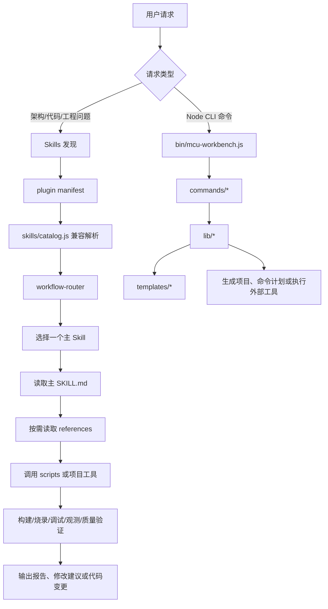

# 嵌入式插件执行流程（草案）

> 状态：当前实现。本文区分 Skills 运行链和 Node CLI 链，避免把两种机制混为一体。

## 1. 总体流程



## 2. Skills 运行链

### 阶段 1：请求识别

输入可以是：

- APP、OS、BSP、Core、Driver、Middleware 架构问题；
- 构建、烧录、调试、观测、质量或发布问题；
- 需要结合项目文件、datasheet、工程配置或测试结果的请求。

第一步应识别请求所属职责，而不是直接加载全部 Skills。

### 阶段 2：选择主 Skill

路由规则：

```text
一个请求 → 一个主 Skill
             ↓
       必要时交接下游 Skill
```

示例：

```text
“Keil 工程编译失败”
    → tools-build
    → tools-linker（如果是链接布局问题）
    → tools-quality（如果需要 Map 分析）
```

```text
“外部 Flash 驱动怎么分层”
    → bsp-adapter / bsp-hal-driver / bsp-handler
    → os-abstraction（如果涉及任务和队列）
    → core-mcu / driver-vendor（如果涉及底层外设）
```

### 阶段 3：渐进式读取上下文

读取顺序：

1. 主 Skill 的 frontmatter 和职责说明；
2. 主 Skill 中的选择流程和边界；
3. 与请求匹配的 `references/`；
4. 必要的脚本、模板或项目文件；
5. 不读取与当前请求无关的全部资料。

### 阶段 4：执行项目工作

根据 Skill 类型执行不同动作：

| 类型 | 执行动作 |
|---|---|
| 架构类 | 读取工程、绘制边界、输出目录和调用链 |
| 代码类 | 修改实现、保持层间依赖、补充测试 |
| 构建类 | 识别工程格式、运行或生成构建命令、定位产物 |
| 调试类 | 收集日志、寄存器、回溯、波形或任务证据 |
| 质量类 | 运行审查、Map、静态分析或单元测试 |
| 发布类 | 打包、签名、升级、回滚和验收 |

### 阶段 5：验证与交付

所有可执行任务都应区分：

- 已实际执行的结果；
- 根据代码或文档推断的结果；
- 因缺少工具、硬件或输入而未完成的检查。

交付内容应至少包含：

```text
变更内容
验证命令
实际结果
未验证项目
后续交接 Skill
```

## 3. Node CLI 执行链

Node CLI 当前是独立链路：

```text
bin/mcu-workbench.js
  → lib/cli.js
  → index.js 兼容 API / commands
  → commands/mcu-new.js
  → commands/mcu-driver.js
  → commands/mcu-build.js
  → commands/mcu-flash.js
  → commands/mcu-debug.js
       ↓
     lib/platform.js
     lib/generator.js
     lib/builder.js
     lib/flasher.js
       ↓
     templates/
```

### 当前真实行为

- `mcu-new` 会写入项目骨架和 CMakeLists；
- `mcu-driver` 会读取模板并返回生成文件内容；
- `build` 和 `flash` 默认生成计划，传入 `--execute` 才运行外部命令；
- `mcu-debug` 主要拼接 OpenOCD/GDB 命令；
- Node CLI 没有通过 `.claude-plugin/plugin.json` 作为 Claude Code command 加载，而是通过 npm `bin` 独立安装。

因此，Node CLI 是 Skills 链之外的可选执行工具，不自动成为 Skills 的后端。

## 4. 校验流程


## 5. 需要进一步确认的流程问题

1. Skills 是否允许直接调用 Node `commands/`，还是只调用各自目录下的 scripts。
2. 构建、烧录、调试是否必须真实执行，还是只输出命令和诊断建议。
3. `workflows/embedded-ai-collab` 是否作为路由后的统一审查阶段。
4. Node 原型与 Skills 是否需要共享平台配置、模板和结果格式。
