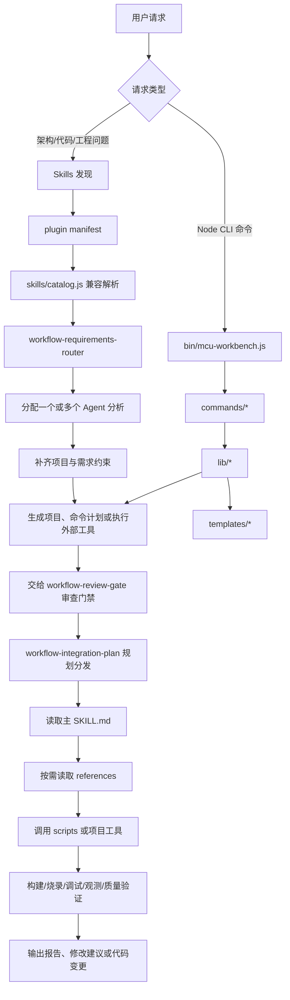

# 嵌入式插件执行流程（草案）

> 状态：当前实现。本文区分 Skills 运行链和 Node CLI 链，避免把两种机制混为一体。

## 1. 总体流程


```mermaid
flowchart TD
    U[用户请求] --> D{请求类型}

    D -->|架构/代码/工程问题| S0[Skills 发现]
    D -->|Node CLI 命令| N0[bin/mcu-workbench.js]

    S0 --> M[plugin manifest]
    M --> C[skills/catalog.js 兼容解析]
    C --> R[workflow-requirements-router]
    R --> A[分配一个或多个 Agent 分析]
    A --> Q[补齐项目与需求约束]
    Q --> P[生成需求约束包提示词]
    P --> S[交给 workflow-review-gate 审查门禁]
    S --> S2[workflow-integration-plan 规划分发]
    S2 --> G[读取主 SKILL.md]
    G --> Ref[按需读取 references]
    Ref --> Tool[调用 scripts 或项目工具]
    Tool --> V[构建/烧录/调试/观测/质量验证]
    V --> O[输出报告、修改建议或代码变更]

    N0 --> Cmd[commands/*]
    Cmd --> Lib[lib/*]
    Lib --> T[templates/*]
    Lib --> P[生成项目、命令计划或执行外部工具]
```

## 2. Skills 运行链

### 阶段 1：请求识别

输入可以是：

- APP、OS、BSP、Core、Driver、Middleware 架构问题；
- 构建、烧录、调试、观测、质量或发布问题；
- 需要结合项目文件、datasheet、工程配置或测试结果的请求。

第一步应识别请求所属职责，而不是直接加载全部 Skills。

### 阶段 2：需求约束分析与补证

`workflow-requirements-router` 先分配 `embedded-lead` 和一个或多个专用 Agent，对需求、项目文件和已有证据进行分析；缺少关键事实时向用户提问。必须补齐项目背景、硬件资源、软件环境、FreeRTOS 任务/队列、分层边界、功能与非功能约束、优先级、依赖、验收标准和人工确认项。

### 阶段 3：生成需求约束包并交接审查门禁

Router 将已确认事实、证据、未决项、Agent 分析和下游提示词组成需求约束包（RCP），固定交接给 `workflow-review-gate`（必经审查门禁）完成反猜测审查与放行/阻塞判定；审查放行后由 `workflow-integration-plan` 完成分层/审计/迁移设计并分发实现层 Skill。RCP 完成前不生成实现代码。

路由规则：

```text
一个请求 → 一个需求约束包 → workflow-review-gate（必经审查门禁）
             ↓ 放行
        workflow-integration-plan（分层/审计/迁移设计）
             ↓
       只分发一个实现层 Skill；执行 agent 执行中如需其他 Skill 的领域知识（分层约束、验收依据等），按需自行查阅，不预分配参考清单、不设数量上限
```

以下示例展示 project-integration 分层审查完成后的分发结果（所有请求均先经过 project-integration 门禁）：

```text
“Keil 工程编译失败”
    → workflow-review-gate（审查门禁）
    → workflow-integration-plan（规划与分发）
    → tools-build（唯一实现层 Skill）
    → 执行中按需查阅 tools-linker（链接布局问题）、tools-quality（Map 分析）
```

```text
“外部 Flash 驱动怎么分层”
    → workflow-review-gate（审查门禁）
    → workflow-integration-plan（规划与分发）
    → platform_bsp（唯一实现层 Skill）
    → 执行中按需查阅 impl_board / impl_bsp / impl_bsp_handler（器件链路）、platform_os / impl_os（任务/队列/Runtime）、platform_mcu / vendor_stm32（底层外设）

当前 active 目录为 **45 catalog / 43 canonical**；`platform_os`、`impl_os`、`platform_bsp`、`platform_common`、`platform_middleware`、`impl_board`、`platform_mcu` 与 `vendor_stm32` 是当前入口，旧名仅作为兼容映射。
```

### 阶段 4：渐进式读取上下文

读取顺序：

1. 主 Skill 的 frontmatter 和职责说明；
2. 主 Skill 中的选择流程和边界；
3. 与请求匹配的 `references/`；
4. 必要的脚本、模板或项目文件；
5. 不读取与当前请求无关的全部资料。

### 阶段 5：执行项目工作

根据 Skill 类型执行不同动作：

| 类型 | 执行动作 |
|---|---|
| 架构类 | 读取工程、绘制边界、输出目录和调用链 |
| 代码类 | 修改实现、保持层间依赖、补充测试 |
| 构建类 | 识别工程格式、运行或生成构建命令、定位产物 |
| 调试类 | 收集日志、寄存器、回溯、波形或任务证据 |
| 质量类 | 运行审查、Map、静态分析或单元测试 |
| 发布类 | 打包、签名、升级、回滚和验收 |

### 阶段 5：验证与交付

所有可执行任务都应区分：

- 已实际执行的结果；
- 根据代码或文档推断的结果；
- 因缺少工具、硬件或输入而未完成的检查。

交付内容应至少包含：

```text
变更内容
验证命令
实际结果
未验证项目
必经交接 workflow-review-gate（审查门禁）→ workflow-integration-plan（分发实现层 Skill）
```

## 3. Node CLI 执行链

Node CLI 当前是独立链路：

```text
bin/mcu-workbench.js
  → lib/cli.js
  → index.js 兼容 API / commands
  → commands/mcu-new.js
  → commands/mcu-core.js
  → commands/mcu-driver.js
  → commands/mcu-build.js
  → commands/mcu-flash.js
  → commands/mcu-debug.js
       ↓
     lib/platform.js
     lib/generator.js
     lib/builder.js
     lib/flasher.js
       ↓
     templates/
```

### 当前真实行为

- `mcu-new` 会写入项目骨架和 CMakeLists；
- `core` 返回一类 MCU Core 外设的固定 `.c/.h` 生成内容；
- `driver` 返回固定 Driver/Handle/Port/Wrapper 切片，不接触既有 `System/**`；
- `build` 和 `flash` 默认生成计划，传入 `--execute` 才运行外部命令；
- `mcu-debug` 主要拼接 OpenOCD/GDB 命令；
- Node CLI 没有通过 `.claude-plugin/plugin.json` 作为 Claude Code command 加载，而是通过 npm `bin` 独立安装。

因此，Node CLI 是 Skills 链之外的可选执行工具，不自动成为 Skills 的后端。

## 4. 校验流程


```mermaid
flowchart LR
    Edit[编辑 Skill 或脚本] --> Unit[npm test]
    Unit --> Structure[npm run validate:plugin]
    Structure --> Claude[claude plugin validate .]
    Claude --> Diff[git diff --check]
    Diff --> Sync[sync Codex dry-run]
    Sync --> Publish[提交或发布]
```

## 5. 需要进一步确认的流程问题

1. Skills 是否允许直接调用 Node `commands/`，还是只调用各自目录下的 scripts。
2. 构建、烧录、调试是否必须真实执行，还是只输出命令和诊断建议。
3. 旧 `embedded-ai-collab` 已归档（Skill 名称不再解析）；统一审查由 `verification-engineer` Agent 和 `tools-quality` 承担。
4. Node 原型与 Skills 是否需要共享平台配置、模板和结果格式。
