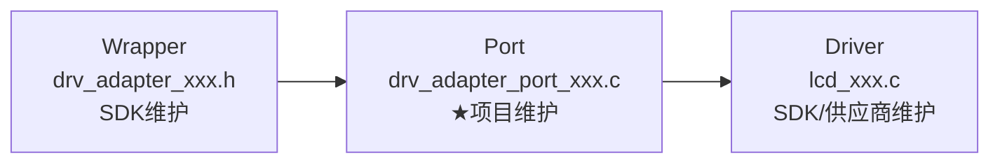

# BSP Adapter

## 三段式 Adapter（核心模式）



| 段 | 文件 | 维护者 | 换外设时 |
|----|------|--------|---------|
| **Wrapper** | `drv_adapter_display.h` | SDK | 不动 |
| **Port** | `drv_adapter_port_disp.c` | 项目 | **只改这个文件** |
| **Driver** | `lcd_st77916.c` | SDK/供应商 | 替换 |

**示例**：

```c
// Wrapper 层：drv_adapter_display.h
typedef struct {
    void (*init)(struct _disp_drv_t *dev);
    void (*flush)(struct _disp_drv_t *dev, void *buf, uint32_t fmt, uint16_t w, uint16_t h);
    void (*sleep)(struct _disp_drv_t *dev);
    void (*wakeup)(struct _disp_drv_t *dev);
} disp_drv_t;

// Port 层：drv_adapter_port_disp.c
static void _init(disp_drv_t *dev) { lcd_st77916_init(360, 360); }
static void _flush(disp_drv_t *dev, void *buf, uint32_t fmt, uint16_t w, uint16_t h) {
    lcd_st77916_flush(buf, fmt, w, h);
}
void drv_adapter_disp_register(void) {
    disp_drv_t dev = { .init = _init, .flush = _flush };
    drv_adapter_disp_reg(0, &dev);
}
```

## 两段式边界

`Wrapper` 定义设备无关的 `drv_adapter_*` API、状态和错误码；`Port` 通过函数表把 Wrapper 绑定到目标板的 `hal_driver`。上层只调用 Wrapper，不能直接拿函数表或 Port 符号。

## 工作流

1. 从设备用例提取最小读写、初始化和电源接口。
2. 设计函数表，明确同步/异步、缓存、超时和 ISR 约束。
3. 编写 Wrapper 分发与注册，编写 Port 的板级绑定和 Mock。
4. 把器件协议实现交给 [`bsp-hal-driver`](../bsp-hal-driver/SKILL.md)，多实例和资源交给 [`bsp-handler`](../bsp-handler/SKILL.md)。

## 5 南向接口适配矩阵

| 接口 | 类型 | 绑定时机 | 典型来源 |
|------|------|---------|---------|
| IIC | `iic_driver_interface_t` | 总线初始化后 | `core-mcu` + 软件 I2C |
| SPI | `spi_driver_interface_t` | 总线初始化后 | `core-mcu` + 硬件/模拟 SPI |
| Timebase | `timebase_interface_t` | RTOS 启动后 | `os-abstraction` / `rtos-freertos` |
| IRQ | `irq_interface_t` | 中断配置后 | `core-mcu` NVIC |
| DMA | `dma_interface_t` | DMA 初始化后 | `core-mcu` DMA |
| Trace | `trace_interface_t` | 调试需要时 | GPIO 翻转 |

## 外设初始化编排

```c
void app_periph_init(void) {
    board_init();                    // ① 时钟→引脚→外设时钟→中断
    drv_adapter_disp_register();     // ② 注册屏幕
    drv_adapter_norflash_register(); // ③ 注册 Flash
    drv_adapter_touchpad_register();   // ④ 注册触摸
    pwr_mgmt_mode_set(SLEEP_MODE);   // ⑤ 低功耗必须最后！
}
```

**关键约束**：低功耗必须在最后设置。先设省电再初始化外设，会导致寄存器写入后时钟被关闭，产生静默故障。

## 配置中心模式

```c
// config/custom_config.h —— 属项目，不 #include 任何 SDK
#define SOC_STM32F411
#define BSP_DEVICE_AHT21_I2C_ADDR  0x38
#define DISP_HOR_RES               360

// SDK 默认值兜底
#ifndef DISP_HOR_RES
#define DISP_HOR_RES 240
#endif
```

- `custom_config.h` 只被读取，不依赖其他模块
- SDK 用 `#ifndef` 提供保守默认值
- 项目级配置，不是 SDK 级配置

## 控制反转：__weak vs 函数指针

| 特性 | `__weak` 覆盖 | 函数指针注册 |
|------|--------------|-------------|
| 绑定时机 | 编译/链接期 | 运行期 |
| 运行时开销 | 0 | 一次指针解引用 |
| 多实例 | ❌ | ✅ |
| 适用场景 | 系统回调（按键、中断） | 多实例外设（屏幕、传感器） |

## 四铁律依赖规则

| 规则 | 含义 | 违反后果 |
|------|------|---------|
| 单向依赖 | 上层可调下层，下层不能调上层 | 循环依赖 |
| 横向隔离 | 同层通过接口通信，不直接耦合 | 改一模块牵动同层 |
| 跨层禁止 | APP 不能跳过 Adapter 调 Driver/OS | 换 RTOS/芯片时大面积改动 |
| 配置只读 | 所有层读 `custom_config.h`，它不读任何层 | 配置回路 |

## 变更影响矩阵

| 变更场景 | 不改的层 | 只改的层/文件 |
|---------|---------|-------------|
| 换 MCU | APP、OS、Middleware | Platform + Driver |
| 换 RTOS | APP、BSP、Middleware | OSAL Impl（1 个目录） |
| 换外设芯片 | APP、OS、Middleware | Adapter Port（1 个文件） |
| 换业务需求 | Platform、OS、Driver | APP（1 个目录） |

## 代码量成本

| 组件 | 代码量 | 维护者 |
|------|--------|--------|
| Wrapper | ~100 行 | SDK |
| Port | ~110 行 | 项目 |
| Driver | ~500 行 | SDK/供应商 |

换 LCD 时：有 Adapter 改 1 个文件 vs 无 Adapter 改 5-10 个文件。

## 模拟 SPI 适配

```c
static uint8_t SPI_ReadWriteByte(uint8_t data) {
    for (uint8_t i = 0; i < 8; i++) {
        if (data & 0x80) MOSI_HIGH(); else MOSI_LOW();
        delay_1us();
        SCK_HIGH();              // 上升沿采样
        delay_1us();
        data <<= 1;
        if (MISO_READ()) data |= 1;
        SCK_LOW();
    }
    return data;
}
```

- SPI Mode 0：CPOL=0（空闲低），CPHA=0（上升沿采样）
- MOSI/SCK/CS 推挽输出，MISO 浮空输入
- CS 独立管理，支持多设备挂接

## 设计禁区

- Adapter 只做平台映射和状态转换，不实现业务逻辑
- 不把 AHT21 命令、限频或回调塞进适配函数
- 不隐藏初始化顺序和锁策略
- 不让 Driver 直接 include HAL

Wrapper/Port 的证据和 GR5526 验收项见 [`bsp-layer-evidence.md`](references/bsp-layer-evidence.md)。
器件适配、平台绑定、Mock 与完整脚本见 [`capability-index.md`](references/capability-index.md)。
跨 skill 通用错误模式与调试教训见 [`../common-error-patterns.md`](../common-error-patterns.md)。

## GR5526

检查 `drv_adapter_display.*`、`drv_adapter_port_disp.c`、norflash 和 touchpad 三组 Wrapper/Port；确认 Port 调用具体驱动而不是反向调用 APP。

共享契约见 [`software-layer-contract.md`](../../workflow/workflow-project-integration/references/software-layer-contract.md)。
