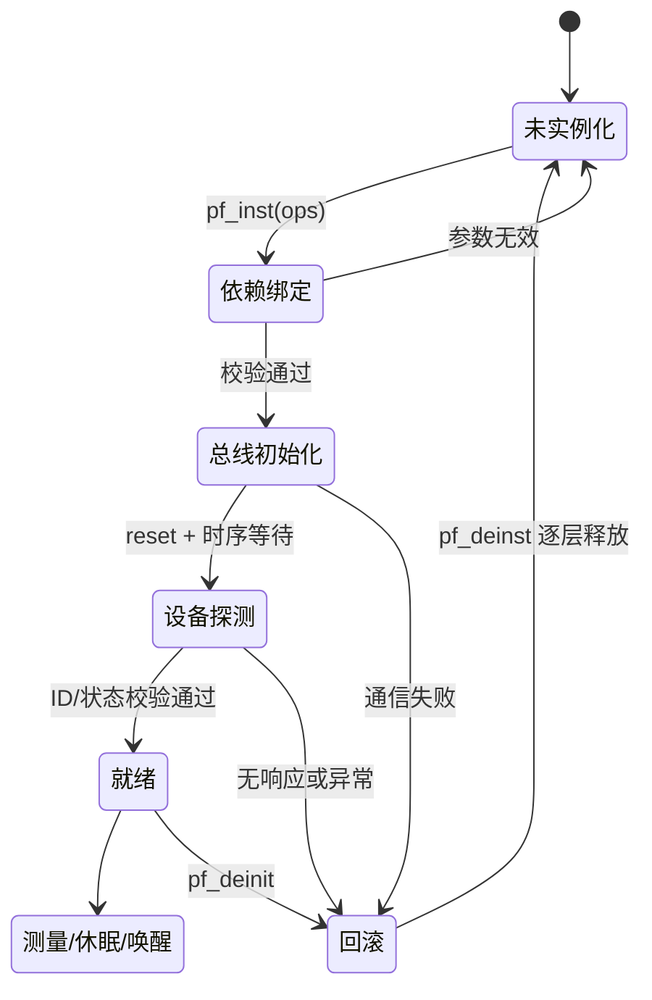

# BSP hal_driver

## 职责

面向一个具体器件或芯片，封装寄存器/总线序列、复位、探测、配置、读写、错误恢复和睡眠唤醒。它调用 Core 提供的 MCU 外设接口，不调用 Driver 以外的上层 Adapter。

## 输出

给 BSP Port 提供清晰的 `init/read/write/control/sleep/wakeup` 原语、错误码和时序前置条件；不管理跨实例队列或业务状态。

## 通用实例化状态机



设备差异：

| 设备 | 特殊步骤 | 注意 |
|------|---------|------|
| AHT21 | 状态读取 + 校准寄存器序列 | 上电等待 ≥100ms |
| MPU6050 | set_config + 中断/DMA 使能 | 需配置 DLPF、量程 |
| W25Qxx | 读 JEDEC ID + 容量计算 | `is_inited` 需提前设置，因 `check_ready` 依赖它 |

## 工作流

先从数据手册确定协议，再实现最小状态机，最后用 Wrapper/Port 注入的总线和时间接口验证。显示、Flash、Touch 分别保持独立驱动，避免互相持有资源。

### 4 级 NULL 校验链

所有公共 API 入口强制按顺序校验：

```c
static device_status_t device_write_reg(device_t *self, uint8_t reg, uint8_t val) {
    // Layer 1: 实例指针
    if (NULL == self) return DEVICE_ERROR_PARAMETER;
    // Layer 2: ops 聚合体
    if (NULL == self->p_ops_instance) return DEVICE_ERROR_PARAMETER;
    // Layer 3: 具体接口实例
    if (NULL == self->p_ops_instance->p_bus_instance) return DEVICE_ERROR_PARAMETER;
    // Layer 4: 具体函数指针
    if (NULL == self->p_ops_instance->p_bus_instance->pf_send_bytes)
        return DEVICE_ERROR_PARAMETER;
    return self->p_ops_instance->p_bus_instance->pf_send_bytes(reg, &val, 1U);
}
```

### 多协议支持矩阵

| 协议 | 典型器件 | Driver 南向接口 | 关键约束 |
|------|---------|----------------|---------|
| I2C | AHT21、MPU6050 | `iic_driver_interface_t` | ACK 时序、repeated start vs 两段式事务 |
| SPI | W25Qxx | `spi_driver_interface_t` | CPOL/CPHA、CS 独立管理、MSB first |
| I2C + DMA + INT | MPU6050 | `iic` + `dma` + `irq` + `trace` | ISR < 5μs，下半部解码/限频/回调 |

### 中断上下半部分离

带中断/DMA 的 Driver 必须遵守：

| 上半部 (ISR) | 下半部 (Thread) |
|---|---|
| 清中断源、读状态寄存器、启动 DMA | 解码帧、lifetime 限频、更新数据、回调 |
| 只调 `FromISR` 后缀 API | 可调普通 API |
| 禁止 `printf`/`elog`/`delay`/`malloc` | 可执行耗时计算 |
| 典型 < 5μs | 无严格时限 |

关键约束：DMA 启动成功后保持 EXTI 关闭，等 `dma_callback` 恢复，否则永久丢失后续中断。

### DMA 双缓冲交换

```c
completed_buffer = dma->dma_buffer->write_buffer;
dma->dma_buffer->write_buffer = dma->dma_buffer->read_buffer;
dma->dma_buffer->read_buffer = completed_buffer;
```

- DMA 写 `write_buffer` 时任务读 `read_buffer`
- 指针交换在 EXTI 关闭期间完成，天然互斥
- 检查 `write != read` 且均非空

### 编译期数据源/特性选择

```c
#define DEVICE_DATA_SOURCE DEVICE_DATA_SOURCE_REGISTERS  // or FIFO
#define DEVICE_OS_SUPPORTING 1                            // 0=裸机降级

#if (DEVICE_DATA_SOURCE != DEVICE_DATA_SOURCE_REGISTERS) && \
    (DEVICE_DATA_SOURCE != DEVICE_DATA_SOURCE_FIFO)
  #error "DEVICE_DATA_SOURCE must be REGISTERS or FIFO"
#endif
```

### 白名单范围校验

配置型 API 优先用范围上限判断：

```c
if (config->sample_rate > SAMPLE_RATE_MAX ||
    config->scale > SCALE_MAX) {
    return DEVICE_ERROR_PARAMETER;
}
```

比 `switch` 更简洁，自动覆盖未来非法值。

### 反初始化清理

`pf_deinst()` 必须逐层置空函数指针和 ops，不能只设 `is_inited = 0`：

```c
self->is_inited = NOT_INITED;
self->p_ops_instance->p_bus_instance->pf_send_bytes = NULL;
// ... 所有函数指针
self->p_ops_instance = NULL;
```

防止去初始化后误调用导致 HardFault。

## 错误处理模式

| 模式 | 说明 | 典型来源 |
|------|------|---------|
| 枚举返回值禁止魔数比较 | `DEVICE_OK != func()`，不用 `0x38 != func()` | AHT21 调试 |
| 协议专用接口 | 特殊事务（如状态读取）单独定义函数指针 | AHT21 状态读取 |
| 严格时序 | 上电等待、测量等待以数据手册为准并设最大超时 | AHT21/W25Qxx |
| CRC/ID 校验失败即拒 | 不将损坏数据继续向上传递换算 | AHT21 |
| 写使能锁 | W25Qxx 每次页编程/擦除前发 `0x06` | W25Qxx |

状态机、错误恢复和交接证据见 [`hal-driver-evidence.md`](references/hal-driver-evidence.md)。
器件 Driver 的协议流程、参考资料和样例见 [`capability-index.md`](references/capability-index.md)。
跨 skill 通用错误模式与调试教训见 [`../common-error-patterns.md`](../common-error-patterns.md)。

交接：总线和 MCU 内设交给 [`core-mcu`](../../platform/core-mcu/SKILL.md)，厂商库交给 [`driver-vendor`](../../platform/driver-vendor/SKILL.md)，绑定交给 [`bsp-adapter`](../bsp-adapter/SKILL.md)。
