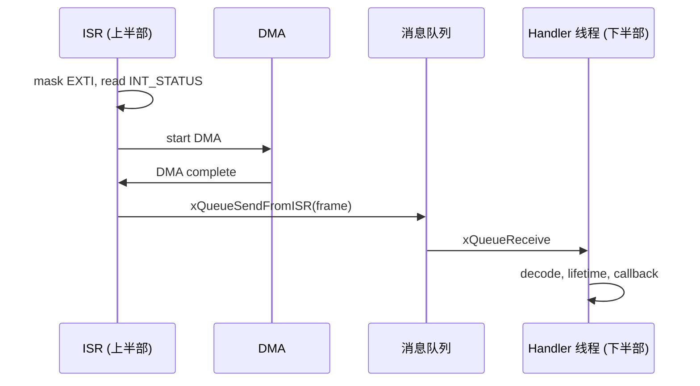

# MPU6050 Driver 模式

## 设计目标

- 与芯片平台和 RTOS 解耦：所有外部依赖通过 `mpu6050_ops_t` 聚合注入
- 高频数据采集：INT + DMA 双缓冲实现 ISR 最小化
- 可测试：PC 注入 Fake IIC/DMA/IRQ 即可跑全部逻辑

## 南向接口

```c
typedef struct {
    iic_driver_interface_t *p_iic_driver_instance;
    timebase_interface_t   *p_timebase_instance;
    irq_interface_t        *p_irq_instance;
    dma_interface_t        *p_dma_instance;
    trace_interface_t      *p_trace_instance;
} mpu6050_ops_t;
```

| 接口 | 用途 |
|------|------|
| IIC | 寄存器读写 |
| Timebase | tick、毫秒延时 |
| IRQ | 临界区、中断 mask/unmask |
| DMA | 双缓冲配置 + 启动 |
| Trace | GPIO 翻转调试（可选） |

## 北向接口

`bsp_mpu6050_driver_t` 暴露 11 个方法函数指针：

```c
pf_init / pf_deinit / pf_get_data / pf_sleep / pf_wakeup / pf_set_config
pf_irq_callback / pf_dma_callback / pf_dma_notify / pf_deinst
```

在 `bsp_mpu6050_driver_inst()` 中一次性静态绑定到内部 static 函数。

## 4 级 NULL 校验链

```c
static mpu6050_status_t mpu6050_write_reg(bsp_mpu6050_driver_t *self,
                                          uint8_t reg, uint8_t value) {
    if (NULL == self) return MPU6050_ERRORPARAMETER;
    if (NULL == self->p_ops_instance) return MPU6050_ERRORPARAMETER;
    if (NULL == self->p_ops_instance->p_iic_driver_instance)
        return MPU6050_ERRORPARAMETER;
    iic_driver_interface_t *iic = self->p_ops_instance->p_iic_driver_instance;
    if (NULL == iic->pf_send_bytes) return MPU6050_ERRORPARAMETER;
    return iic->pf_send_bytes(reg, &value, 1U);
}
```

## 中断上下半部分离



- 上半部只清中断、读状态、启动 DMA，< 5μs
- 下半部做解码、限频、回调
- 任何失败路径都必须恢复 EXTI，否则永久丢失中断

## DMA 双缓冲

```c
completed_buffer = dma->dma_buffer->write_buffer;
dma->dma_buffer->write_buffer = dma->dma_buffer->read_buffer;
dma->dma_buffer->read_buffer = completed_buffer;
```

- DMA 写 `write_buffer` 时任务读 `read_buffer`
- 指针交换在 EXTI 关闭期间完成，天然互斥
- 检查：读指针非空、写指针非空、两者不相等

## set_config 白名单校验

```c
if (config->dlpf_cfg > MPU6050_DLPF_CFG_MAX ||
    config->accel_fs > MPU6050_ACCEL_FS_16G ||
    config->gyro_fs > MPU6050_GYRO_FS_2000DPS) {
    return MPU6050_ERRORPARAMETER;
}
```

用 `> MAX` 范围判断覆盖所有未来非法值，校验通过后再逐项写寄存器。

## 编译期数据源选择

```c
#ifndef MPU6050_DATA_READ_SOURCE
#define MPU6050_DATA_READ_SOURCE MPU6050_DATA_READ_SOURCE_REGISTERS
#endif

#if (MPU6050_DATA_READ_SOURCE != MPU6050_DATA_READ_SOURCE_REGISTERS) && \
    (MPU6050_DATA_READ_SOURCE != MPU6050_DATA_READ_SOURCE_FIFO)
  #error "MPU6050_DATA_READ_SOURCE must be REGISTERS or FIFO"
#endif
```

- REGISTERS：每次 INT 后立即读寄存器
- FIFO：数据积攒在 FIFO，DMA 低频批量搬运

## 按位掩码数据选择

```c
typedef enum {
    MPU6050_DATA_NONE  = 0U,
    MPU6050_DATA_ACCEL = 1U << 0,
    MPU6050_DATA_TEMP  = 1U << 1,
    MPU6050_DATA_GYRO  = 1U << 2,
    MPU6050_DATA_ALL   = 0x7U
} mpu6050_data_select_t;
```

即使只选 ACCEL，仍一次 burst read 14 字节保证同一采样时刻。

## DWT 周期计数器调试

```c
#define DBG_DWT_ENABLE  1

#if DBG_DWT_ENABLE
    void DbgDwt_Init(void);
    void DbgDwt_IsrEntry(void);
#else
    #define DbgDwt_Init()      ((void)0)
    #define DbgDwt_IsrEntry()  ((void)0)
#endif
```

`DBG_DWT_ENABLE=0` 时零开销，可用于精确测量 ISR 耗时。

## 设计禁区

- 不把平台 HAL 调用塞进 Driver
- 不用全局可变状态替代实例状态
- 不在 ISR 中解码、打日志、调用非 FromISR API
- 失败路径不静默吞掉底层状态码

## 交付检查

- [ ] 公共头文件说明调用顺序和所有权
- [ ] 依赖接口可被 Mock 完整替换
- [ ] 失败路径可重试且不泄漏资源
- [ ] ISR 耗时 < 5μs（用 DWT 验证）
- [ ] DMA 双缓冲指针交换在中断关闭期间完成
