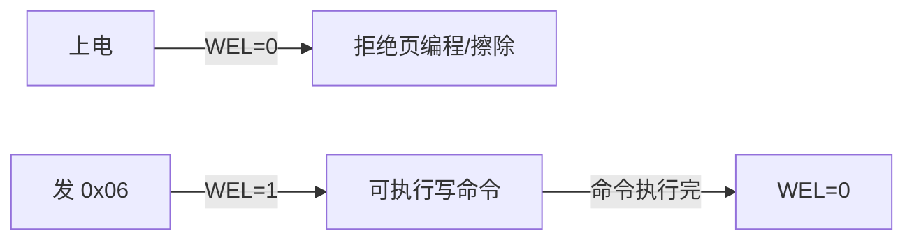

# W25Qxx Driver 模式

## 设计目标

- 平台无关：通过 `spi_driver_interface_t` + `timebase_interface_t` 注入依赖
- 覆盖 W25Q80~W25Q128：通过 JEDEC ID 动态计算容量
- 安全擦写：写使能锁（Write Enable Latch）防止误写

## 南向接口

```c
typedef struct {
    spi_driver_interface_t *p_spi_driver_instance;
    timebase_interface_t   *p_timebase_instance;
} w25qxx_ops_t;
```

| 接口 | 用途 |
|------|------|
| SPI | 收发 + 片选控制 |
| Timebase | tick、毫秒延时 |  

W25Qxx 没有中断引脚，所有操作都是主机主动发起，因此不需要 IRQ/DMA/Yield 接口。

## 北向接口

```c
pf_init / pf_deinit / pf_read_id / pf_read_data / pf_write_data
pf_erase_sector / pf_erase_block / pf_erase_chip
pf_sleep / pf_wakeup / pf_wait_busy / pf_deinst
```

## 页对齐拆分

W25Qxx 页编程一次最多 256 字节，且不能跨页。

```c
static uint32_t w25qxx_page_align(uint32_t addr) {
    return (addr + W25QXX_PAGE_SIZE) & ~(W25QXX_PAGE_SIZE - 1U);
}

// do-while 循环：自动计算每页边界并分拆
uint32_t current_addr = w25qxx_page_align(addr);
do {
    w25qxx_write_enable(self);
    spi_write(cmd_and_data, current_size);
    w25qxx_wait_busy(self, timeout_ms);
    current_addr += current_size;
} while (current_addr < end_addr);
```

> 若跨页写，超出部分会回卷覆盖该页开头（硬件行为），Driver 必须拆分。

## ID → 容量动态计算

```c
uint32_t w25qxx_capacity_from_id(uint16_t id) {
    // W25Q80~W25Q128: 0xEF13~0xEF17
    return (1UL << (id - W25Q80_ID)) * 1024UL * 1024UL;
}
```

## 写使能锁（Write Enable Latch）



- 上电后 WEL=0，任何页编程/擦除命令被忽略
- 每次写操作前发送 `0x06` 置 WEL=1
- 命令执行后 WEL 自动归零
- 这是硬件级防误写，防止 GPIO 抖动或程序跑飞时改写 Flash

## 忙状态轮询

```c
w25qxx_status_t w25qxx_wait_busy(w25qxx_t *self, uint32_t timeout_ms) {
    uint32_t start = self->p_ops->p_timebase_instance->pf_get_tick_ms();
    while ((self->p_ops->p_timebase_instance->pf_get_tick_ms() - start) < timeout_ms) {
        if (0U == (w25qxx_read_status(self) & 0x01U)) {
            return W25QXX_OK;
        }
    }
    return W25QXX_ERRORTIMEOUT;
}
```

| 操作 | 最长阻塞 |
|------|---------|
| 页编程 | ~3ms |
| 子扇区擦除 | ~800ms |
| 扇区擦除 | ~3s |
| 整片擦除 | ~250s |

**所有带阻塞的操作都不能在 ISR 中调用。**

## 提前设置 is_inited

W25Qxx 初始化流程中 `check_ready()` 会检查 `is_inited` 标志。因此必须在 `pf_init` 内部调用 `check_ready()` 之前设置 `is_inited = W25QXX_INITIALIZED`：

```c
self->is_inited = W25QXX_INITIALIZED;
status = w25qxx_read_id(self, &id);
if (status != W25QXX_OK) {
    self->is_inited = W25QXX_NOT_INITIALIZED;
    return status;
}
```

## 阻塞轮询的 RTOS 注意事项

- W25Qxx 没有中断就绪通知，只能用 `delay_ms` 轮询
- 擦除最长 3s，调用任务会阻塞
- 页编程/擦除期间禁止读状态寄存器以外的操作
- 建议在 Handler 层用后台线程异步执行（参见 `w25qxx-handler-pattern.md`）

## 设计禁区

- 不在 Driver 中直接操作 GPIO 寄存器
- 不跨页写而不拆分
- 不在 ISR 或低栈任务中调用阻塞擦除
- 不忽略 WEL 状态
- 不用魔数比较 ID 或状态

## 交付检查

- [ ] 页编程自动拆分且不跨页
- [ ] 每次写/擦除前发送 0x06 并校验 WEL
- [ ] 忙状态轮询有超时保护
- [ ] 容量由 JEDEC ID 动态计算
- [ ] 所有阻塞 API 有 ISR 调用警告注释
