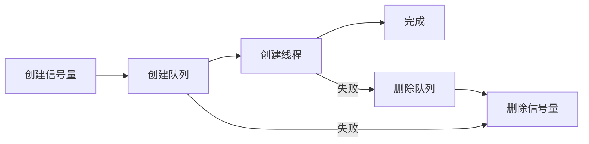

# BSP Handler

Handler 面向产品场景管理一个或多个器件实例，负责生命周期、缓存、队列、事件、互斥和恢复策略；不重复 hal_driver 的器件协议。

## 工作流

1. 画出实例、任务、队列和缓存的所有权图。
2. 定义 init/start/stop/sleep/recover 状态机及幂等性。
3. 通过 BSP Wrapper 访问设备，通过 OS Wrapper 管理并发。
4. 将板级绑定交给 [`bsp-adapter`](../bsp-adapter/SKILL.md)，器件原语交给 [`bsp-hal-driver`](../bsp-hal-driver/SKILL.md)。

## 单消费者消息队列模式

```mermaid
flowchart LR
    A[ISR] -->|xQueueSendFromISR| B[消息队列]
    C[APP 任务] -->|xQueueSend| B
    B -->|xQueueReceive| D[Handler 线程]
    D -->|switch(type)| E[解码/限频/回调]
```

- 一条队列 + 一个永久阻塞点 + 一个 `switch(type)` → 天然无锁
- 避免多队列/多线程方案，减少 RAM 和锁竞争
- ISR 中只投递，不处理业务

## ISR 桥接函数模式

```c
uint32_t mpu_handler_dma_notify_from_isr(const uint8_t *frame,
                                         uint32_t size,
                                         void *context) {
    imu_sensor_node_t *node = (imu_sensor_node_t *)context;
    imu_handler_message_t msg;
    msg.type = IMU_HANDLER_MESSAGE_DMA_FRAME;
    memcpy(msg.payload.dma_frame.frame, frame, size);
    xQueueSendFromISR(node->handler->queue, &msg, &hpw);
    return hpw;
}
```

- `context` 是 `node` 指针，通过 `node->handler` 回指找到队列
- ISR 中只做：复制帧、队列投递
- 禁止在 ISR 中解码、读时间戳、调回调、打日志
- 帧使用固定大小数组，禁止 `malloc`

## 多实例管理（void* + ops）

```c
typedef struct {
    void *instance;                              // 指向具体驱动实例
    sensor_ops_t *ops;                           // 通用操作表
} sensor_node_t;

typedef struct {
    uint32_t instance_num;
    sensor_node_t instance_group[SENSOR_NUM_MAX];
} handler_t;
```

- Handler 遍历实例组时只调用 `ops`，不强制转换具体类型
- 更换传感器（AHT21 → SHT30）时 Handler 代码零改动
- 注册时线性扫描防重复

## 临界区 + 回调外调

```c
handler_enter_critical(self);
self->latest_data = data;
data_callback    = self->pf_data_callback;
callback_context = self->p_data_callback_context;
handler_exit_critical(self);

if (NULL != data_callback) {
    data_callback(&self->latest_data, callback_context);
}
```

- 临界区内只写数据和快照指针
- 回调在临界区外调用，防止用户代码死锁
- 不要持锁调用耗时操作

## lifetime 分类型限频

```c
static uint32_t last_read_time[3] = {0};
// [0]: READ_TEMP       温度独立计时
// [1]: READ_HUMI       湿度独立计时
// [2]: READ_TEMP_HUMI  温湿度组合独立计时

elapsed = now - last_read_time[type];
if (elapsed < lifetime_ms) return HANDLER_OK;  // 跳过
last_read_time[type] = now;
```

- 每种读取类型独立计时，互不干扰
- `lifetime = 0` 表示无限频限制
- ISR 中不做 lifetime 判断，所有帧都入队

## 4KB 缓冲写入（W25Qxx Handler）

```c
typedef struct {
    uint8_t  databuf[4096];
    uint32_t write_databuf_index;
    uint32_t write_sector_index;
    uint8_t  block_erased;
} flash_block_t;
```

- 数据先写入 4KB 缓冲区
- 攒满后一次性写入 Flash 子扇区
- 写放大从 400x 降到 1x
- `block_erased = 1` 表示已擦除，后续写入免擦

## 初始化失败回滚



- 创建：信号量 → 队列 → 线程
- 回滚：线程失败 → 删队列 → 删信号量；队列失败 → 删信号量
- 去初始化按相反顺序：先删线程 → 再删队列 → 再删信号量

## 三段式安全退出


- 先设标志阻止新消息投递
- 用任务通知唤醒阻塞线程
- 等线程自然退出后再释放 OS 资源
- 避免强杀线程时持有互斥锁导致死锁

## OS_SUPPORTING 条件编译

```c
#if (OS_SUPPORTING == 1)
  // 信号量 + 队列 + 线程
  init_create_sem();
  init_create_queue();
  init_create_thread();
#else
  // 裸机降级
  self->is_inited = INITED;
#endif
```

- 带 OS 时启用异步队列和后台线程
- 裸机时仅标记初始化状态
- 同一套 Handler API 两种运行模式

## RTOS 任务栈预算

```text
最小栈 = 业务栈 + 上下文保存(~200B 含 FPU) + 日志格式化预留
安全系数 = 2
```

- FreeRTOS 上下文切换自动保存 ~200 bytes（含 FPU）
- `elog`/printf 的 `vsnprintf` 栈开销大，低栈任务中慎用
- DEBUG 宏改变执行路径，可能使低栈任务中意外调用日志

## 分层锁

| 锁 | 保护对象 | 持锁时长 | 位置 |
|----|---------|---------|------|
| Handler 临界区 | 软件数据结构（实例组数组） | 微秒级 | Handler |
| Driver 互斥锁 | 硬件资源（I2C 总线、传感器） | 毫秒级 | Driver |

- 不可合并为一层锁
- 合并后：Handler 遍历实例组时持锁等待 80ms 测量 → 注册传感器被阻塞

## 错误恢复

- Driver 返回错误后，Handler 负责决策：重试、跳过、降级、通知 APP
- 多实例场景下：单个实例失败不影响其他实例
- 记录错误计数，连续失败触发恢复策略

GR5526 可用 `app_power_manager.c`、显示/触摸任务和 Flash 缓存验收睡眠唤醒与资源释放。

实例、缓存、事件和恢复记录见 [`handler-evidence.md`](references/handler-evidence.md)。
Service 的生命周期、队列和资源所有权资料见 [`capability-index.md`](references/capability-index.md)。
跨 skill 通用错误模式与调试教训见 [`../common-error-patterns.md`](../common-error-patterns.md)。
