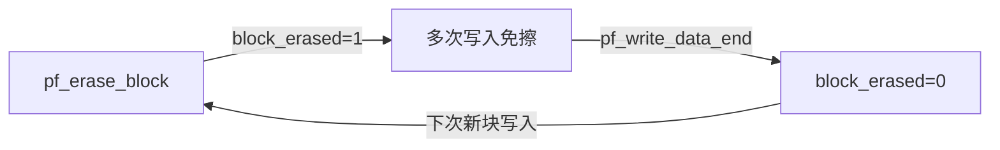

# W25Qxx Handler 模式

## 设计目标

- 将最长 3 秒的 Flash 擦除操作异步化，不阻塞高优先级任务
- 减少写放大：4KB 缓冲一次性写入
- 支持 OTA 固件 + 日志数据双块隔离

## 双块分区

```c
typedef struct {
    uint32_t base_addr;      // 块起始地址
    uint32_t size;           // 块大小
    uint32_t read_index;     // 读索引
    uint32_t write_index;    // 写索引
    uint8_t  databuf[4096];  // 4KB 写缓冲
    uint32_t write_databuf_index;
    uint32_t write_sector_index;
    uint8_t  block_erased;   // 当前块是否已擦除
} flash_block_t;

flash_block_t blocks[2] = {
    { 0x000000, 64*1024 },  // Block 0: OTA 固件
    { 0x010000, 64*1024 }   // Block 1: 日志数据
};
```

- 每个块独立维护读写索引
- 通过 `idx` 参数指定操作哪个块
- OTA 与日志物理隔离

## 4KB 缓冲写入

```c
for (uint32_t i = 0; i < length; i++) {
    b->databuf[b->write_databuf_index] = data[i];
    b->write_databuf_index++;

    if (b->write_databuf_index >= EXTERNFLASH_HANDLER_SUBSECTOR_SIZE) {
        if (0U == b->block_erased) {
            pf_erase_sector(flash, addr);
            b->block_erased = 1;
        }
        pf_write(flash, b->databuf, addr, 4096);
        b->write_databuf_index = 0;
        b->write_sector_index++;
    }
}
```

- 数据先进入 4KB 缓冲区
- 攒满后一次性写入 Flash
- 写放大从 400x 降到 1x

## block_erased 生命周期



- 整块擦除后连续 16 次满 4KB 写入全部免擦
- `pf_write_data_end` 清零标志，同时刷剩余不足 4KB 的缓存
- 掉电时缓存数据可能丢失

## 事件队列异步模式

```c
static void externflash_thread_entry(void *argument) {
    externflash_handler_t *h = (externflash_handler_t *)argument;
    externflash_event_t ev;

    while (1) {
        if (h->stop_requested) break;
        pf_os_queue_get(h->queue_handler, &ev, 0xFFFFFFFF);

        if (ev.type == EVENT_READ) {
            h->pf_read_data(h, ev.block_idx, ev.data, ev.len);
        } else {
            h->pf_write_data(h, ev.block_idx, ev.data, ev.len);
        }
    }
}
```

- APP 往队列塞数据（微秒级返回）
- 后台线程排队执行实际擦写（最长 3 秒）
- 所有 Flash 操作通过同一队列串行化到唯一后台线程
- 天然不需要互斥锁保护 SPI 总线

## 关键约束

- `pf_write_data` 不保证数据立即落 Flash
- 必须调 `pf_write_data_end` 或等攒满 4KB
- 后台线程中的 Flash 操作不能加 `osKernelLock`
- 擦除最长 3 秒，阻塞在后台线程不影响控制任务

## 掉电保护

- 配合 PVD（Programmable Voltage Detector）中断
- 电压下降时紧急刷缓存
- 双块设计使 OTA 和日志互不影响

## 设计禁区

- 不在 APP 任务中直接调用阻塞擦除
- 不忽略 `pf_write_data_end` 的调用
- 不在后台线程中加长时间内核锁
- 多个任务同时直接写 Flash 而不经队列

## 交付检查

- [ ] 所有写操作经队列串行化到唯一后台线程
- [ ] 4KB 缓冲写入，写放大 ≤ 1x
- [ ] `block_erased` 生命周期正确
- [ ] 提供 `pf_write_data_end` 刷剩余缓存
- [ ] 后台线程栈 ≥ 1024B（含 FPU）
- [ ] 掉电时有 PVD 紧急刷缓存机制
