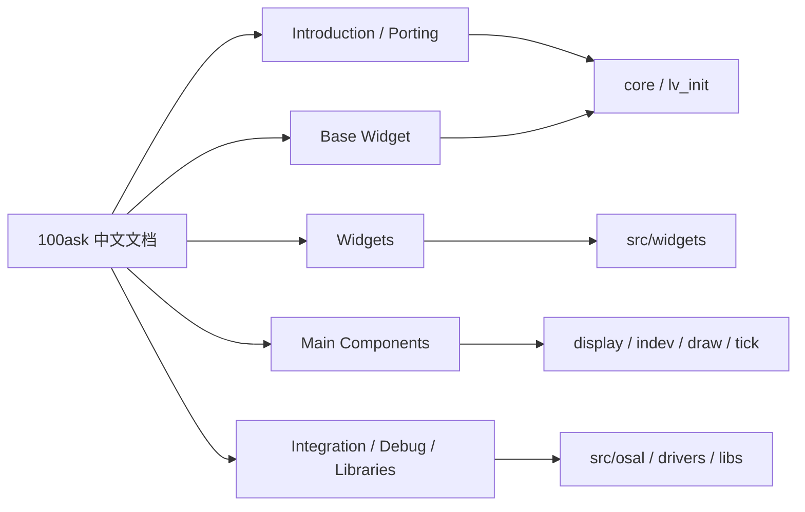
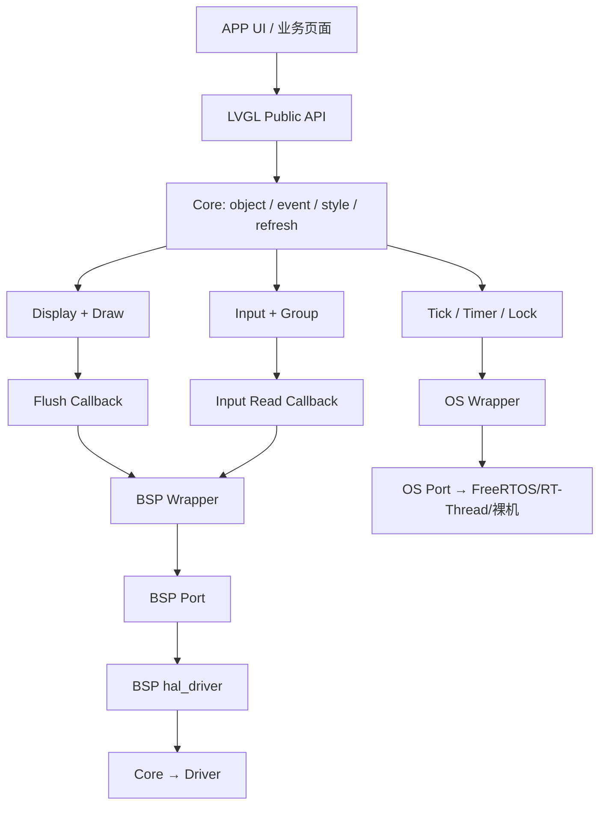

# LVGL 知识图谱

## 来源与版本

| 来源 | 用途 | 分支与提交 | 版本证据 |
| --- | --- | --- | --- |
| [100askTeam/100ask_lvgl_docs](https://github.com/100askTeam/100ask_lvgl_docs) | 中文 Sphinx 文档、示例和 LVGL 源码快照 | `master` / `84d7f584dc4f167709f1d8bc8abb91ca941b1c1a` | `lv_version.h`：9.3.0-dev |
| [lvgl/lvgl](https://github.com/lvgl/lvgl) | 官方源码、配置和最新模块结构 | `master` / `c4424b27d63db752aa75f9fdffe30c6467b55ad1` | `include/lvgl/lv_version.h`：9.6.0-dev |
| GR5526 LVGL 工程 | 验收夹具，不作为上游 API 来源 | 用户提供的 `graphics_lvgl_831_gpu_demo_360p` | LVGL 8.3.x |

## 文档到源码的映射

## 工程调用链

## 节点和关系规则

- 文档主题节点只解释概念、API 和示例，不替代源码证据。
- `core` 管理对象、事件、样式、布局、刷新和全局生命周期。
- `display` 管理显示对象、分辨率、缓冲和 Flush；`draw` 管理软件或硬件绘制后端。
- `indev` 管理触摸、鼠标、键盘、编码器和手势输入。
- `osal`、`tick` 提供系统协作；Widgets、Themes、Fonts、Images、FS 和第三方库按配置启用。
- LVGL 到设备只能经过 BSP Wrapper；LVGL 到系统只能经过 OS Wrapper。

JSON 机器可读版本见 [`lvgl-knowledge-graph.json`](lvgl-knowledge-graph.json)。
