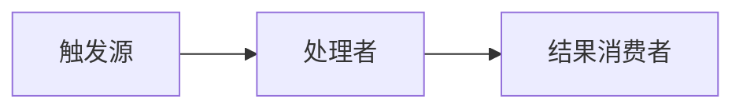
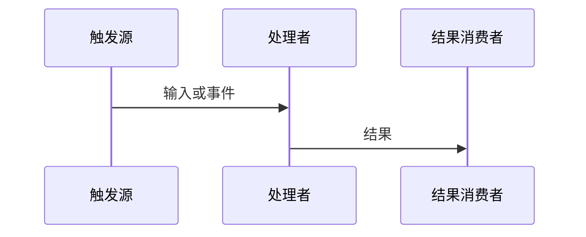

# 嵌入式学习笔记模板

以用户实际 Vault 模板为准。本模板保留其栏目顺序，并规定每一栏必须承接 [question-bank.md](question-bank.md) 中已确认的回答和证据；缺少内容时保留空位或标注“未验证”，不要编造。

````markdown
---
tags: [<domain>, <category>]
date: {{date}}
---

# 📖 引言
> 根据全文概括学习目标；在全部栏目确认后生成。

# 📝 [知识点/模块]的设计思路
> 一句话定义：对象 + 职责 + 机制 + 边界。

## 实际意义
> 对应问题：为什么需要它；没有它会发生什么。

## 应用场景
> 至少两条可定位的项目内使用路径。

## 核心逻辑/原理
### 机制 1

### 机制 2


## 关键公式/结论
> 参数、约束和结论均标明适用条件与证据。

## 实际操作步骤
> 初始化/调用/观察/错误处理或释放顺序。

```c
/* 来源：relative/path.c:line */
```

## 常见问题
### 问题：现象 → 根因 → 修复 → 验证

## 💬 Q&A
### 🟢 基础
#### Q1
**用户原回答：**

**修正后理解：**

**证据：** `relative/path.c:line`

### 🟡 进阶
### 🔴 困难

## 📋 总结
> 优先保留用户 3–5 句话的复述；AI 补充与用户原话分开标注。

## 📎 参考资料
### 🎥 视频链接
### 🔗 博客/文档链接
### 💻 仓库链接
### 📄 代码/附件
````

## 表达与架构训练记录（按需加入）

当本次学习包含能力训练时，在笔记末尾增加以下内容；没有进行的训练保留“未进行”，不要伪造完成状态：

```markdown
## 🧭 架构推理
- 问题与边界：
- 职责与依赖：
- 数据流与控制流：
- 约束：
- 备选方案与取舍：
- 验证计划：

## ✍️ 表达训练
### 技术文档版
### 技术博客版
### 教学讲解版
- 面向对象：
- 用户原始讲解：
- AI 反馈：
- 修正版：
```

## 写作要求

- 代码片段必须来自项目，并标注 `文件路径:行号`；
- Mermaid 图必须反映真实调用链、数据流或时序，不能只画抽象框；
- 内部笔记使用 `[[笔记文件名]]`，不写机器绝对路径；
- 事实、用户确认、推断和未验证项分开标注；
- 笔记应保留用户回答，不把 AI 纠正伪装成用户已掌握。
- 每个核心栏目至少关联一条回答或证据；不要为了填满模板重复同一结论。
