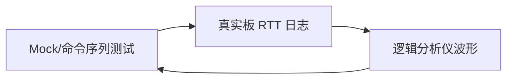

# 质量与验证工具

## 职责

统一处理 AI 生成代码审查、编译产物分析、静态规则、内存占用和目标无关的 Unity 测试。先声明检查范围、基线和输出格式，再选择工具变体。

## 路由边界

本 skill 承担**静态分析流**（编码期/构建期预防）：代码审查、Map/RAM/ROM/栈估算、Cppcheck/MISRA、Unity 行为验证。静态分析只能发现"可疑模式"，不能证明运行时一定正确——发现潜在栈溢出、时序、中断嵌套问题时，交接 [`tools-debug`](../tools-debug/SKILL.md)（调试流）在运行时验证；需要长稳/偶发观测交接 [`tools-observability`](../tools-observability/SKILL.md)（日志流）。静态门禁不替代目标运行、观测通道和实物验收。

## 变体

代码审查、Map 分析、静态分析、格式检查和 Unity 的原始资料分别保留在 `references/quality-*` 或 `references/capabilities/*/GUIDE.md` 下；需要脚本时使用对应命名空间中的脚本。

Unity 源码版本和测试证据见 [`upstream-source-baseline.md`](references/upstream-source-baseline.md)。
AI 生成代码审查、项目风格 profile 与 clang-format 基线由本 Skill 统一承接。
其余质量工具的完整资料见 [`capability-index.md`](references/capability-index.md)。

## AI 代码约束与审查

先按 [项目风格 profile](references/style-profile.md) 建立可追溯约束，再按 [生成代码审查门禁](references/review-gates.md) 分开检查风格、功能和安全风险。

1. 风格优先级为：用户明确要求 → `.editorconfig`、`.clang-format`、IDE 或构建配置 → 相邻源码 → 保守 C 默认。
2. 在生成或重构前说明 profile 的来源和适用目录；审查报告必须把 profile 偏差与功能/安全问题分开分级。
3. 除非项目或用户明确采用其他约定，否则按 [项目风格 profile](references/style-profile.md) 的硬性约束执行：强制 `{proj}_`（项目简称）文件命名、`g_/s_/p_/pf_` 变量前缀、全函数 Doxygen 注释、**注释语言默认中文**、左对齐-填充-右对齐段注释，并将 80 列作为硬限制。
4. 先检查编译、接口、错误路径和资源所有权；再检查 ISR/DMA/并发、数组边界及硬件约束；最后报告风格偏差。

### BSP 生成代码

MCU Workbench 生成的 BSP 切片不使用保守默认注释；统一采用
[`BSP 生成代码完整注释 Profile`](references/generated-bsp-comment-profile.md)。
该规则只约束生成器产物，不能倒灌覆盖用户工程已有的手写风格。

审查 GPIO 输出类生成切片时，额外按 [`GPIO 输出外设检查表`](../../bsp/references/gpio-output-peripheral-checklist.md) 核对极性与上下文、失败后 ready 状态、错误码保留、Port 回滚、并发注册及 Fake GPIO 覆盖；不可用复杂设备的 OSAL/IRQ 模板代替这些证据。

## 三级验证闭环

| 层级 | 工具 | 验证什么 | 局限 |
|------|------|---------|------|
| 第一级 | Mock / PC 测试 | 协议状态机、边界条件、错误注入 | 不验证时序、硬件行为 |
| 第二级 | 目标板 + RTT/串口日志 | 真实寄存器、真实延时、真实错误码 | 不验证电平时序、中断耗时 |
| 第三级 | 逻辑分析仪 / DWT | 电平时序、ISR 耗时、DMA 行为 | 不验证软件逻辑正确性 |

**关键原则**：

- 三层结论必须交叉验证
- 复杂环境（真实板）通过不代表简单环境（Mock）通过
- 简单环境（Mock）通过也不代表复杂环境（真实板）通过
- 改了任何一层都要回其他两层重测

### 实施建议

1. **Mock 测试**：在 PC 上注入 Fake IIC/SPI/Timebase/IRQ/DMA，跑 Driver/Handler 全部状态机
2. **RTT 日志**：在目标板打印关键状态转换、错误码、耗时
3. **逻辑分析仪**：捕获 I2C/SPI 波形、GPIO 翻转、INT/DMA 时序
4. **DWT 周期计数器**：测量 ISR 耗时，验证 < 5μs 等硬实时约束

## 输出

输出可复现命令、问题等级、证据文件、基线差异和修复后的回归结果。构建产物由 [`tools-build`](../tools-build/SKILL.md) 提供，发布验证交接 [`tools-release`](../tools-release/SKILL.md)。

## 多仓库执行规则

质量工具所在仓库与固件仓库可能不同。运行记录必须声明两个绝对根目录，并为每条命令记录绝对 `cwd`；质量命令在工具仓库执行，格式、主机测试和固件构建在固件仓库执行。相对路径解析失败属于流程错误，必须纠正命令上下文后再判断代码质量。

## 软件分层门禁

先运行 `npm run validate:architecture -- --root <firmware-root>`，再运行相关主机 Fake 测试和目标固件构建。门禁按目录角色检查 BSP Driver/Port、Core 公共头、BSP/OS Wrapper 与原生 RTOS 边界，不绑定具体 MCU 或传感器名称。静态门禁不替代目标运行、观测通道和实物验收。

当架构扫描包含已登记基线问题时，退出码非零必须同时报告基线数量、当前数量和新增差异；只有“零新增”才能称为本阶段通过，不能把非零退出码直接改写成全量通过。

对生成外设切片，先执行 `npm run validate:layer -- --root <firmware-root> --core <core> --device-type <type> --device <device>`，再执行 `validate:architecture`、格式检查与主机 Fake 测试。`validate:layer` 只检查该命令参数定位的生成文件，不审计用户工程的其他自定义代码；它按设备 profile 检查 Core 公开头泄漏、Wrapper 依赖、Port 单一公开注册函数、声明的 OSAL 资源注入、Handler 边界、完整注释分区与注释语言（默认中文）。
