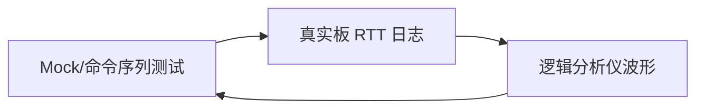

# 质量与验证工具

## 职责

统一处理代码审查、编译产物分析、静态规则、内存占用和目标无关的 Unity 测试。先声明检查范围、基线和输出格式，再选择工具变体。

## 变体

代码审查、Map 分析、静态分析、格式检查和 Unity 的原始资料分别保留在 `references/quality-*` 或 `references/capabilities/*/GUIDE.md` 下；需要脚本时使用对应命名空间中的脚本。

Unity 源码版本和测试证据见 [`upstream-source-baseline.md`](references/upstream-source-baseline.md)。
AI 生成代码审查、嵌入式 C 编码规范与 clang-format 基线由本 Skill 统一承接。
其余质量工具的完整资料见 [`capability-index.md`](references/capability-index.md)。

## 三级验证闭环

| 层级 | 工具 | 验证什么 | 局限 |
|------|------|---------|------|
| 第一级 | Mock / PC 测试 | 协议状态机、边界条件、错误注入 | 不验证时序、硬件行为 |
| 第二级 | 目标板 + RTT/串口日志 | 真实寄存器、真实延时、真实错误码 | 不验证电平时序、中断耗时 |
| 第三级 | 逻辑分析仪 / DWT | 电平时序、ISR 耗时、DMA 行为 | 不验证软件逻辑正确性 |

**关键原则**：

- 三层结论必须交叉验证
- 复杂环境（真实板）通过不代表简单环境（Mock）通过
- 简单环境（Mock）通过也不代表复杂环境（真实板）通过
- 改了任何一层都要回其他两层重测

### 实施建议

1. **Mock 测试**：在 PC 上注入 Fake IIC/SPI/Timebase/IRQ/DMA，跑 Driver/Handler 全部状态机
2. **RTT 日志**：在目标板打印关键状态转换、错误码、耗时
3. **逻辑分析仪**：捕获 I2C/SPI 波形、GPIO 翻转、INT/DMA 时序
4. **DWT 周期计数器**：测量 ISR 耗时，验证 < 5μs 等硬实时约束

## 输出

输出可复现命令、问题等级、证据文件、基线差异和修复后的回归结果。构建产物由 [`tools-build`](../tools-build/SKILL.md) 提供，发布验证交接 [`tools-release`](../tools-release/SKILL.md)。

## 软件分层门禁

先运行 `npm run validate:architecture -- --root <firmware-root>`，再运行相关主机 Fake 测试和目标固件构建。门禁按目录角色检查 BSP Driver/Port、Core 公共头、BSP/OS Wrapper 与原生 RTOS 边界，不绑定具体 MCU 或传感器名称。静态门禁不替代目标运行、观测通道和实物验收。
