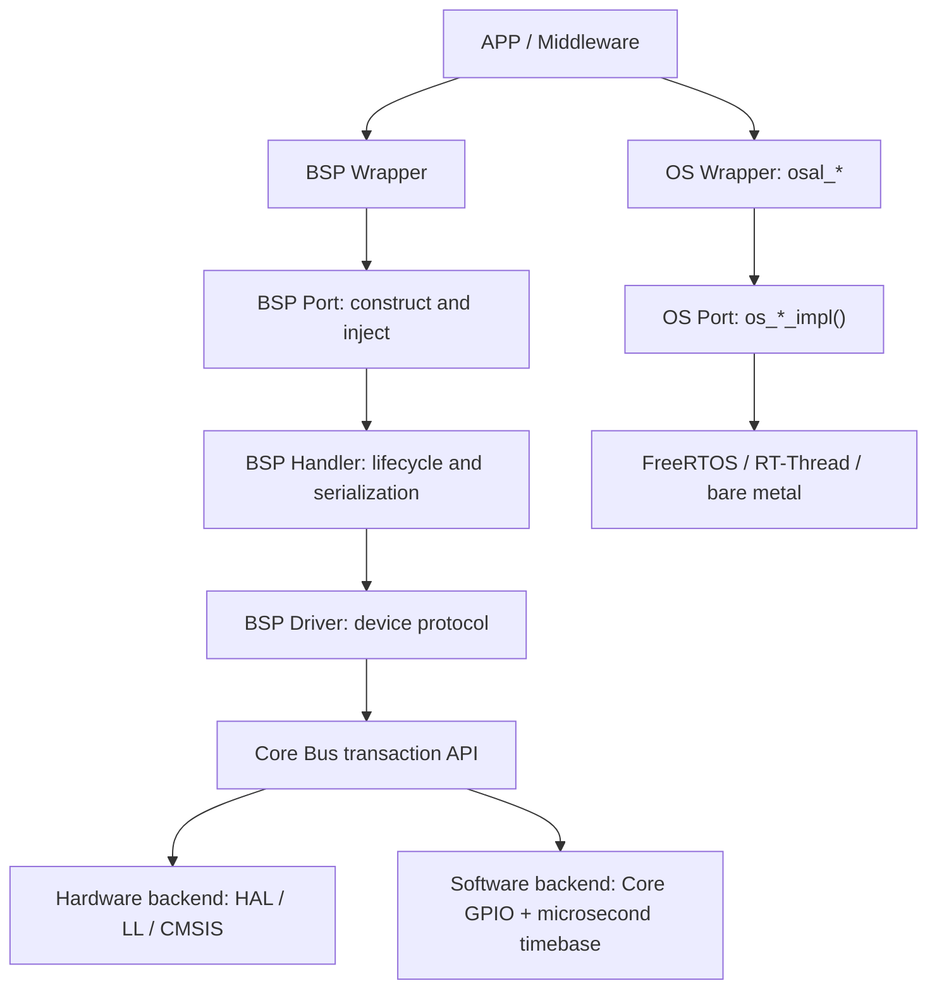

# EC-S100 软件架构证据审计

## 固定证据

- 文档：`EC-S100智能手表软件架构设计文档STM32F411侧 copy.md`
- SHA-256：`71C1FC19DC2B52DE0363B98DA5193760EA27E1C58CD270B9ED486D095D6A0CB1`
- 固件仓库：`https://github.com/shuai-yemao/stm32f411ceu6_freertos_transplant.git`
- 远程分支：`Sensor_temp_humi`
- 固定提交：`eb5f38b3acb55063b6a3e2777aae2fb983cda8bf`

文档哈希或固定提交变化时，本审计失效，必须重新核对段落、图片和源码。本文不记录文档的本机路径，也不复制原图。

## 关键原文摘录

以下短摘录只用于定位设计意图：

- 第 64—70 行：`APP 层 → Middleware 层 → BSP 层 → MCU/OS 平台层 → HAL/驱动 → 硬件`，目标是高内聚、低耦合和可移植。
- 第 114—131 行：BSP 拆分 Driver 与 Handler；Handler 负责线程化采集、异步回调、缓存、仲裁和错误恢复，并通过运行时接口注入降低平台耦合。
- 第 182—194 行：OS Platform 对 FreeRTOS 做二层封装，避免 APP/Handler 直接依赖原生 API。
- 第 962—965 行：MCU 层为片上 I2C、SPI、ADC、UART、TIM、DMA、GPIO 提供统一访问能力。
- 第 1001—1015 行：OS 抽象覆盖任务和 IPC，另有 Trace、栈水位与中断转发设计。
- 第 1079—1086 行：Driver 的 OS、时基和总线依赖通过函数指针注入；Handler 线程串行化设备访问。

原文还把 Bootloader、OTA 回滚、任务看门狗与恢复策略放入 MCU/OS 章节。它们表达系统能力需求，但不决定通用 Skill 的最终归层。

## 图片文字转录

| 图片 | 图中关键节点、箭头或 API |
|---|---|
| `file-20260726211535857.png` | APP、Middleware、BSP、MCU、OS、HAL；OSAL 显示多组 IPC 能力，但没有清楚画出 Wrapper 与 Port 内部边界。 |
| `file-20260726211549256.png` | BSP Wrapper、Adapter、Handler、Driver 的层级关系；图意强调高层接口、运行时注入和设备管理。 |
| `file-20260726212055719.png` | `CoreI2CPort` 同时出现 `iic_bus_t`、`I2C_HandleTypeDef *`、OSAL mutex，以及 START/ACK 等软件 IIC 操作；依赖 HAL、Software IIC 和 OSAL。 |
| `file-20260726212127494.png` | Core GPIO 接口公开使用 `GPIO_TypeDef *`，把厂商类型泄漏到公共边界。 |
| `file-20260726212211773.png` | Core 外设 Port 指向具体 HAL/外设依赖，硬件绑定与公共能力未分层表示。 |
| `file-20260726212322928.png` | 温湿度时序中出现 Handler 直接使用 RTOS 事件组，Driver 一侧出现位级 IIC 操作。 |
| `file-20260726212352446.png` | AdapterPort 依赖 RTOS；Driver 接口暴露 start/stop/ack/critical；Handler 另有 OS 函数表。 |
| `file-20260726212505182.png` | Handler 头文件直接包含 FreeRTOS/task 相关依赖，破坏 OSAL 边界。 |

## 四栏裁决

| 文档设计意图 | 图片实际表达 | 固定源码事实 | 最终通用裁决 |
|---|---|---|---|
| OSAL 是 FreeRTOS 的二层封装。 | OSAL 能力族被画出，但 Wrapper/Port 边界不清。 | `shared/src/osal_*.c` 提供 `osal_*`；`FreeRTOS/src/os_impl_*.c` 实现 `os_*_impl()`；内部头为 `osal_internal_*.h`。 | 两层固定为 Wrapper 与 Port；内部头不是第三层。调用链为 `osal_* → os_*_impl() → native RTOS`。 |
| OSAL 可统一事件组、Notify 等 IPC。 | 图片把这些能力视为目标能力。 | 固定提交没有 `osal_event_*`；实际公开接口以 task/queue/sema/mutex/timer/heap 等为主。 | 设计目标不能当成已实现事实；每项能力必须检查当前 Port，禁止虚构事件、Notify 或取消。 |
| BSP 通过注入隔离设备与平台。 | Driver 接口仍暴露 START、STOP、ACK 和临界区细节。 | AHT21 的 `iic_driver_interface_t` 有 10 个函数，含位级时序；硬件 IIC 为这些操作提供空桩。 | Driver 只注入事务级 Bus Ops；位级 IIC 和硬件控制器差异由 Core Backend 私有化。 |
| Wrapper/Adapter/Handler/Driver 形成设备抽象。 | 图片中 Adapter 和 Handler 的职责存在重叠。 | `drv_adapter_port_temp_humi.c` 同时实现 HAL IIC、GPIO 模拟 IIC、OSAL 映射和依赖装配。 | 调用链固定为 Wrapper → Port → Handler → Driver → Core Bus；Port 只装配，不实现 HAL 或软件 IIC。 |
| 软件 IIC 与平台 GPIO 解耦。 | CoreI2CPort 图片把软硬 IIC、厂商句柄、OSAL 锁混在公共对象中。 | `bsp_gpio_iic` 的 GPIO Ops 已不直接依赖 HAL，但目录位于 BSP；具体 GPIO/DWT 实现在 BSP Port。 | 该解耦方向正确但归层错误；迁移为 Core Software IIC 私有后端，公共 API 保持事务级。 |
| Handler 串行化采集并管理缓存与恢复。 | 图片显示 Handler 直接依赖原生 RTOS。 | 固定源码通过 Port 注入 OS 函数表，但仍有超时单位、输出参数和临界区语义风险。 | Handler 只调用 `osal_*` 或等价注入 Ops；单设备请求串行化归 Handler，共享总线互斥归 Core Bus。 |
| 日志用于运行证据。 | 图片没有区分通道连通与业务通过。 | EasyLogger 输出到 RTT；其输出锁直接 `__disable_irq()` / `__enable_irq()`，时间和任务信息直接调用 HAL/FreeRTOS。 | 观测 Port 要保存并恢复锁状态，避免把日志格式化包进全局关中断；RTT 连通不能替代业务或实物验证。 |
| MCU/OS 章节覆盖启动、OTA、看门狗和恢复。 | 能力按平台章节聚合。 | 固定源码目录结构不能证明这些能力都属于 Core/OSAL。 | Bootloader、OTA 回滚、任务看门狗与恢复策略归 `software-system`；Core 仅保留硬件入口，RTOS Skill 负责 Tickless/Hook。 |

## 修正后的通用架构

## 验证边界

- 固定提交可编译、可链接，只是构建证据；不能推出分层合规或实物正确。
- 未使用函数等 warning 不因构建成功而消失，也不能用“未启用 `-Werror`”解释为无风险。
- RTT Viewer 能连接只证明通道可用；业务值、回调上下文、超时恢复和实物读数仍需独立证据。
