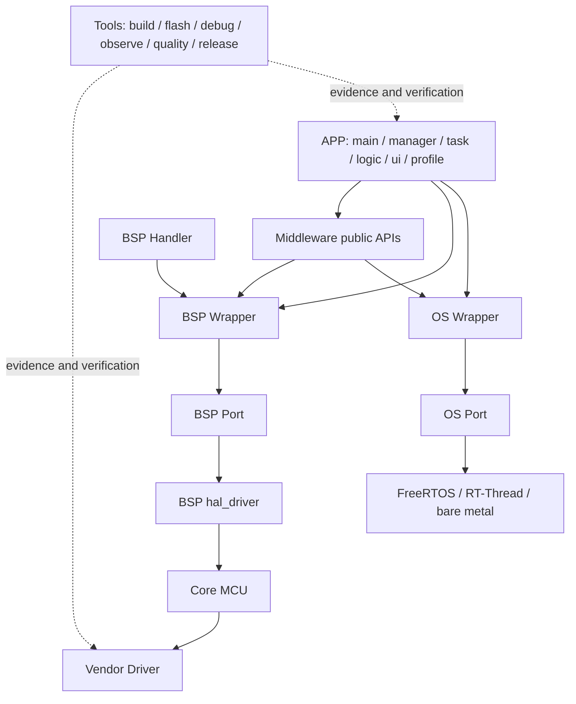

# 软件分层知识图谱

本图谱把当前插件的目录、catalog、CLI 生成器、GR5526 验收工程和已核对的上游源码仓库连接起来。它是后续逐层优化 Skill 的证据索引，不是运行时依赖清单。

## 分层调用主链

## 重要证据结论

1. `commands/mcu-new.js` 目前只生成 `App/main.c`、`BSP/`、`System/`、`Core/` 和 `cmake/`。`manager/`、`task/`、`logic/`、`ui/`、`profile/` 是项目演进结构，不应被误认为生成器已经提供。
2. APP 只使用 OS Wrapper、BSP Wrapper 和 Middleware 公共 API；Core、Driver 和 RTOS 原生 API 是禁止直接依赖。
3. Adapter 只出现在 OS 和 BSP：OS 是 Wrapper → Port，BSP 是 Handler → Wrapper → Port → hal_driver。
4. CMake、J-Link、RTT、SystemView、EasyLogger、CmBacktrace 等属于工具或观测证据，不改变软件层依赖方向。
5. 每个上游仓库都记录了抓取时的 commit；更新 reference 前必须重新核对版本、许可证、源码路径和验证场景。

机器可读版本见 [`software-architecture-knowledge-graph.json`](software-architecture-knowledge-graph.json)。
