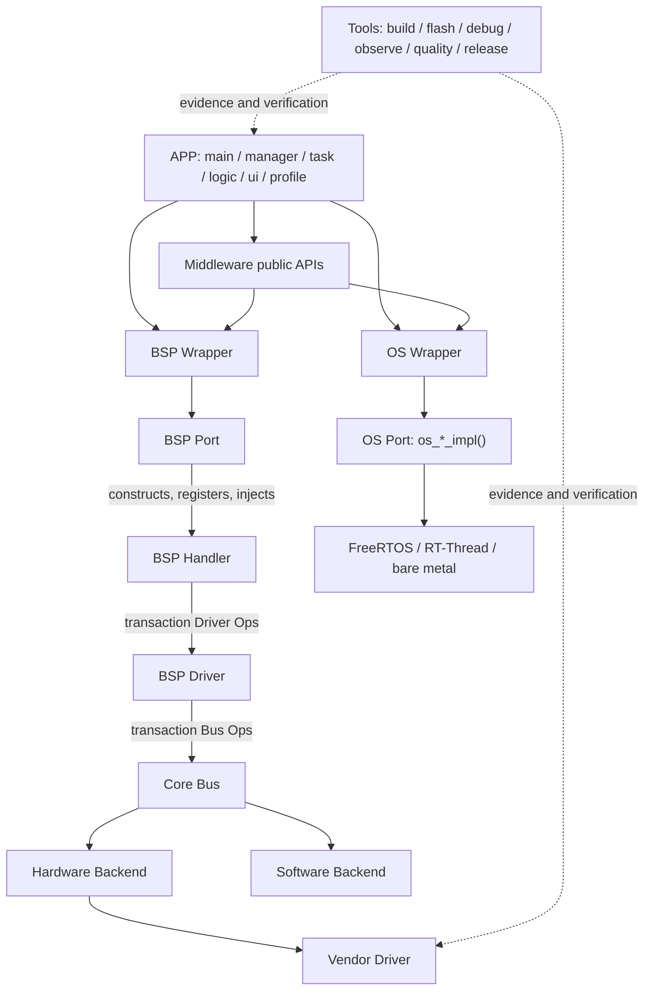

# 软件分层知识图谱

本图谱把当前插件的目录、catalog、CLI 生成器、GR5526 验收工程和已核对的上游源码仓库连接起来。它是后续逐层优化 Skill 的证据索引，不是运行时依赖清单。

## 分层调用主链

```mermaid
flowchart TD
    APP[APP: main / manager / task / logic / ui / profile]
    OW[OS Wrapper]
    BW[BSP Wrapper]
    MID[Middleware public APIs]
    OP["OS Port: os_*_impl()"]
    BH[BSP Handler]
    BP[BSP Port]
    BD[BSP Driver]
    CORE[Core Bus]
    HW[Hardware Backend]
    SW[Software Backend]
    DRIVER[Vendor Driver]
    TOOLS[Tools: build / flash / debug / observe / quality / release]

    APP --> OW
    APP --> BW
    APP --> MID
    MID --> OW
    MID --> BW
    OW --> OP
    OP --> RTOS[FreeRTOS / RT-Thread / bare metal]
    BW --> BP
    BP -->|constructs, registers, injects| BH
    BH -->|transaction Driver Ops| BD
    BD -->|transaction Bus Ops| CORE
    CORE --> HW
    CORE --> SW
    HW --> DRIVER
    TOOLS -. evidence and verification .-> APP
    TOOLS -. evidence and verification .-> DRIVER
```

## 重要证据结论

1. `commands/mcu-new.js` 目前只生成 `App/main.c`、`BSP/`、`System/`、`Core/` 和 `cmake/`。`manager/`、`task/`、`logic/`、`ui/`、`profile/` 是项目演进结构，不应被误认为生成器已经提供。
2. APP 只使用 OS Wrapper、BSP Wrapper 和 Middleware 公共 API；Core、Driver 和 RTOS 原生 API 是禁止直接依赖。
3. Adapter 只出现在 OS 和 BSP：OS 是 `osal_*` Wrapper → `os_*_impl()` Port；BSP 是 Wrapper → Port → Handler → Driver → Core Bus。Port 只装配，不调用 HAL 或实现软件 IIC。
4. Core Bus 统一事务级 API，硬件后端绑定 HAL/LL/CMSIS，软件后端只在私有实现中使用 GPIO 和微秒时基。共享总线锁归 Core，单设备请求串行化归 Handler。
5. CMake、J-Link、RTT、SystemView、EasyLogger、CmBacktrace 等属于工具或观测证据，不改变软件层依赖方向。
6. 每个上游仓库都记录了抓取时的 commit；更新 reference 前必须重新核对版本、许可证、源码路径和验证场景。

机器可读版本见 [`software-architecture-knowledge-graph.json`](software-architecture-knowledge-graph.json)。
