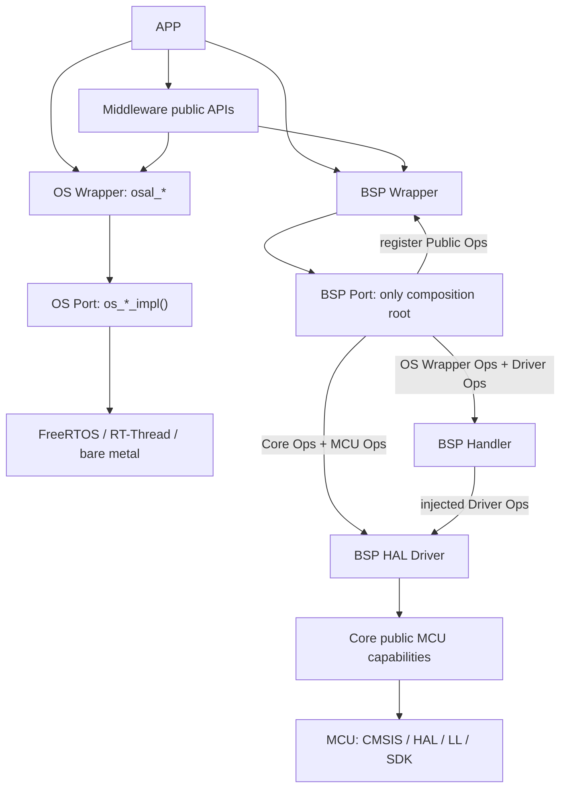

# 软件分层知识图谱

本图谱记录当前插件的 canonical Skill 路径、分层契约和证据索引；它不声明目标项目已经完成构建、烧录或板上验证。

## 分层调用主链

```mermaid
flowchart TD
    APP["APP"] --> OW["OS Wrapper: osal_*"]
    APP --> BW["BSP Wrapper"]
    APP --> MID["Middleware public APIs"]
    MID --> OW
    MID --> BW
    OW --> OP["OS Port: os_*_impl()"]
    OP --> RT["FreeRTOS / RT-Thread / bare metal"]
    BW --> BP["BSP Port: only composition root"]
    BP -->|"Core Ops + MCU Ops"| BD["BSP HAL Driver"]
    BP -->|"OS Wrapper Ops + Driver Ops"| BH["BSP Handler"]
    BP -->|"register Public Ops"| BW
    BH -->|"injected Driver Ops"| BD
    BD --> CORE["Core public MCU capabilities"]
    CORE --> MCU["MCU: CMSIS / HAL / LL / SDK"]
```

## 架构结论

1. APP 只使用 OS Wrapper、BSP Wrapper 和 Middleware 公共 API；Middleware Port 也只能使用两个 Wrapper。
2. OS Wrapper 的公开 API 固定为 `osal_*`；OS Port 的内部实现固定为 `os_*_impl()`；Runtime 承载 FreeRTOS、RT-Thread 或裸机。OS 需要板级能力时也只能调用 BSP Wrapper。
3. BSP Wrapper 仅含函数表、注册槽位和稳定转发；BSP Port 是唯一组合根；Handler 只用注入的 OS Wrapper/Driver Ops；HAL Driver 只用注入的 Core/MCU Ops。
4. Core 提供项目公共 MCU 编程能力；MCU 承载 CMSIS、厂商 HAL/LL/SPL、寄存器和 SDK。MCU Ops 只用于 Core 无法表达的芯片特性。
5. 静态门禁覆盖 Wrapper 独立性、Port 注入、Handler/HAL Driver 具体依赖；其通过不等于构建、运行或实机成功。

机器可读版本见 [`software-architecture-knowledge-graph.json`](software-architecture-knowledge-graph.json)。
