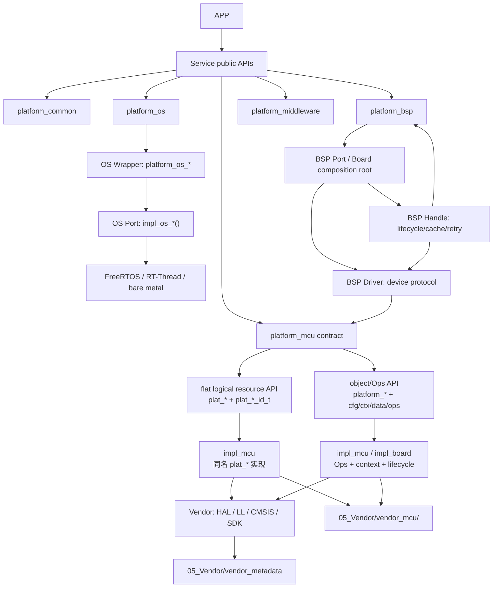

# 软件分层知识图谱

本图谱记录当前插件的 canonical Skill 路径、分层契约和证据索引；它不声明目标项目已经
完成构建、烧录或板上验证。Platform MCU 的具体 API profile 必须来自目标工程文件，而
不是来自目录名或插件模板。

## 分层调用主链

## 架构结论

1. APP 只调用 Service；APP 不直接调用 Platform 能力接口、Wrapper、Port、Impl 或 Vendor
   符号。目标工程若出现 `App → plat_*`，应记录为越层或迁移中的 `mixed` 证据，而不是
   自动修改插件的顶层依赖铁律。
2. Service 承载业务策略，调用 `platform_common` 及 `platform_os`、`platform_bsp`、
   `platform_middleware`、`platform_mcu` 的公共契约。
3. 顶层架构固定为 App / Service / Platform / Impl / Vendor 五层；OS、BSP、MCU 和
   Middleware 是 Platform/Impl 内部能力域，不另造第六个顶层软件层。
4. `platform_mcu` 至少有两个受支持 profile：`flat-logical-resource` 用逻辑 ID 和
   同名 `plat_*` 函数；`object-ops` 用对象、Ops/context 和可选 Platform Model。目标
   工程可以混合，但必须按文件、符号和构建目标分别标记证据。
5. `impl_mcu` 是 Platform MCU 到 Vendor/HAL/SDK 的适配层：它可以直接定义 flat 公共
   函数，也可以提供 object/Ops 后端；不承载器件协议、Service 策略、BSP Handler 状态
   机或 RTOS 任务。
6. BSP Driver 负责单实例器件协议，Handle 负责同类 Driver 的生命周期、队列、缓存、
   重试和回调；两者通过 Platform MCU 能力访问总线，不把 HAL 类型传播到公共契约。
7. BSP Port/Board 负责器件和板级装配；`impl_mcu` 负责芯片物理资源映射。不要把
   `stm32f411_plat_*.c` 误标成 BSP Driver、BSP Handle 或 Vendor 源码。
8. Vendor MCU/RTOS 在目标工程完整保留；中间件/算法按需保留；所有底座由目标工程 Git
   管理，Service/App/Platform 公共头不得直接 include Vendor。
9. 静态门禁覆盖 Service/App 依赖、Platform 公共头纯度、profile 识别、Impl 同名符号/
   Ops 边界、Handle/Driver 具体依赖和 Vendor 路由；通过不等于构建、运行或实机成功。

机器可读版本见 [`software-architecture-knowledge-graph.json`](software-architecture-knowledge-graph.json)。
