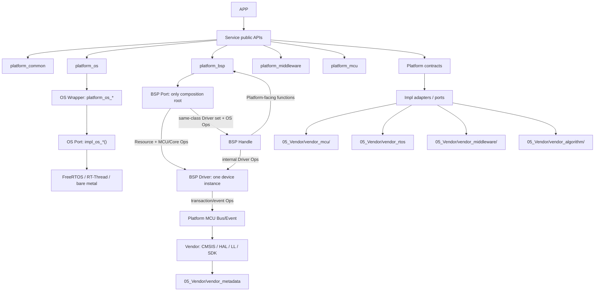

# 软件分层知识图谱

本图谱记录当前插件的 canonical Skill 路径、分层契约和证据索引；它不声明目标项目已经完成构建、烧录或板上验证。

## 分层调用主链

## 架构结论

1. APP 只调用 Service；APP 不直接调用任何 Platform 能力接口、Wrapper、Port、Impl 或 Vendor 符号。
2. Service 承载业务策略，调用 `platform_common` 及 `platform_os`、`platform_bsp`、`platform_middleware`、`platform_mcu` 的公共契约。
3. `platform_common` 统一基础类型、错误码、对象、直接生命周期回调、设备/服务注册表和版本查询契约；其他 Platform 子域不得复制这些基础体系。当前 `diag` 已确认版本接口，断言接口需以目标工程文件证据为准。
4. 顶层架构固定为 App / Service / Platform / Impl / Vendor 五层；OS、BSP、MCU 和 Middleware 是 Platform/Impl 内部能力域，不再作为新的顶层物理层。
5. Platform OS Wrapper 的公开 API 固定为 `platform_os_*`；Impl OS Port 的内部实现固定为 `impl_os_*()`；Runtime 从 `05_Vendor/vendor_rtos` 接入 FreeRTOS、RT-Thread 或裸机。
6. BSP Port 是唯一组合根；Handle 只用注入的 OS/Driver Ops；Driver 只用注入的 Platform MCU/Core Ops。
7. Driver 与 Handle 只属于 BSP Impl 内部：Driver 负责单实例器件协议，Handle 只组合同类 Driver 并负责实例生命周期、队列、缓存、重试和回调。
8. Vendor MCU/RTOS 在目标工程完整保留；Middleware/Algorithm 只保留实际使用内容；所有底座由目标工程 Git 管理，Service/App/Platform 公共头不得直接 include Vendor。
9. 静态门禁覆盖 Service/App 依赖边界、Model 纯度、Port 注入、Handle/Driver 具体依赖和 Vendor 内容路由；其通过不等于构建、运行或实机成功。

机器可读版本见 [`software-architecture-knowledge-graph.json`](software-architecture-knowledge-graph.json)。
