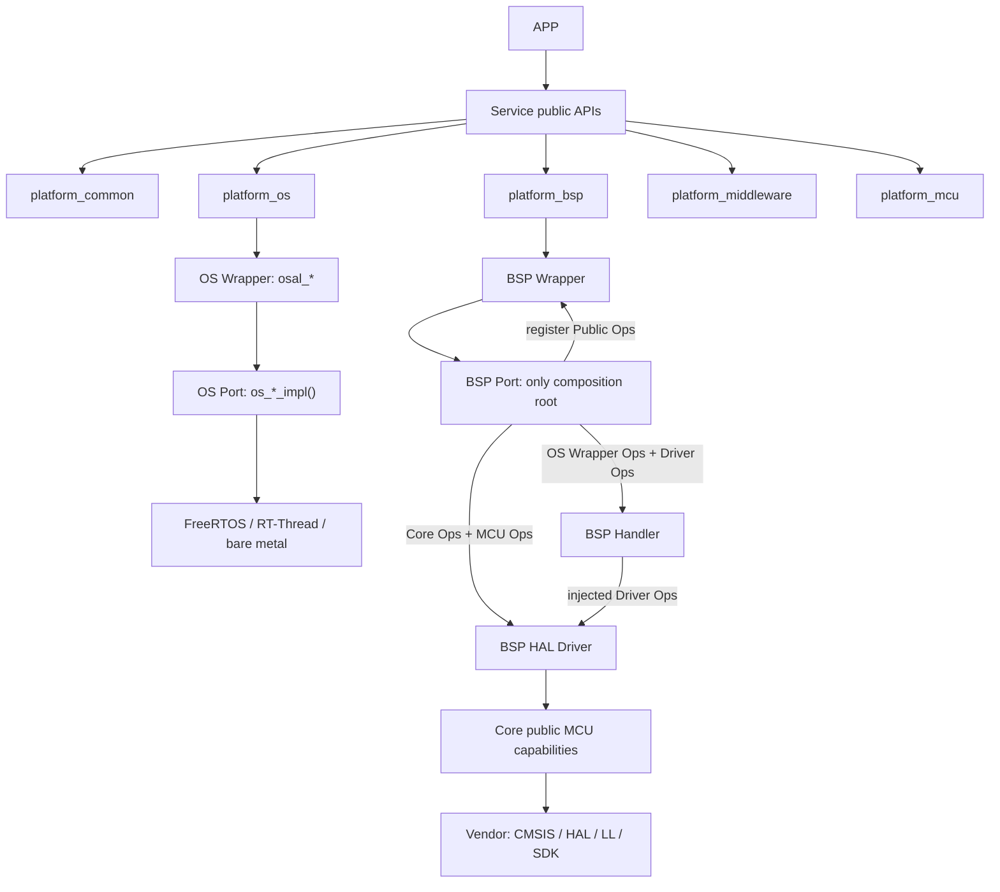

# 软件分层知识图谱

本图谱记录当前插件的 canonical Skill 路径、分层契约和证据索引；它不声明目标项目已经完成构建、烧录或板上验证。

## 分层调用主链

## 架构结论

1. APP 只调用 Service；APP 不直接调用任何 Platform 能力接口、Wrapper、Port、Impl 或 Vendor 符号。
2. Service 承载业务策略，调用 `platform_common` 及 `platform_os`、`platform_bsp`、`platform_middleware`、`platform_mcu` 的公共契约。
3. `platform_common` 统一基础类型、错误码、对象、生命周期、Ops/Context 和诊断契约；其他 Platform 子域不得复制这些基础体系。
4. OS/BSP 的 Adapter 仍由 Wrapper 与 Port 组成，但它们是 Platform/Impl 内部角色，不是新的顶层架构层。
5. OS Wrapper 的公开 API 固定为 `osal_*`；OS Port 的内部实现固定为 `os_*_impl()`；Runtime 承载 FreeRTOS、RT-Thread 或裸机。
6. BSP Wrapper 仅含函数表、注册槽位和稳定转发；BSP Port 是唯一组合根；Handler 只用注入的 OS Wrapper/Driver Ops；HAL Driver 只用注入的 Core/MCU Ops。
7. Driver 与 Handle 只属于 BSP Impl 内部：Driver 负责器件协议，Handle 负责实例生命周期、队列、缓存、重试和回调。
8. 静态门禁覆盖 Service/App 依赖边界、Wrapper 独立性、Port 注入、Handler/Driver 具体依赖；其通过不等于构建、运行或实机成功。

机器可读版本见 [`software-architecture-knowledge-graph.json`](software-architecture-knowledge-graph.json)。
