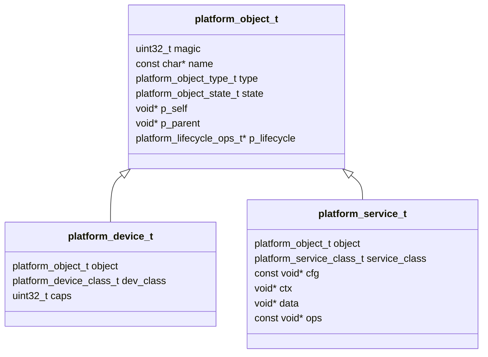
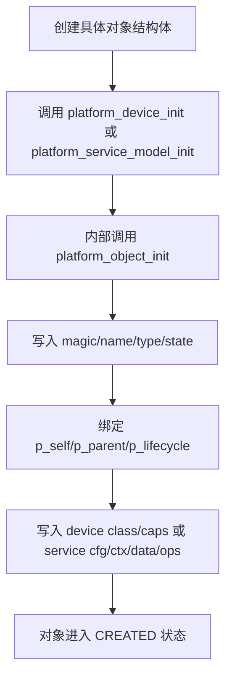
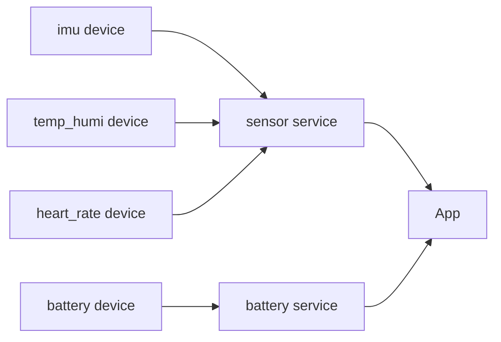

# 第 5 课：对象模型设计 —— object / device / service

> 课程定位：从 platform_common 的类型、错误码、公共宏继续向上长出第一层对象模型。  
>
> 本课不急着写具体 display、touch、imu、battery 的驱动行为，而是先把系统里“对象是谁、是否合法、是什么类型、处于什么阶段、如何被统一启动”这些公共规则定下来。

---

<callout emoji="💡">
本课核心结论：object 解决统一身份，device 解决硬件能力对象的统一管理入口，service 解决业务能力对象的统一管理入口，lifecycle 解决对象被统一 init/start/process/stop/sleep/wakeup/deinit 的入口。
</callout>

课程代码目录：

```Plain Text
D:\01-Work-Space\62-Integration-Class\05-Platform-BaseObjectTarget-V2\本节课代码\05-platform-object-model
```

本课重点文件：

```Plain Text
03_Platform/platform_common/
  platform_lifecycle.h
  platform_object.h
  platform_object.c
  platform_device.h
  platform_device.c
  platform_service.h
  platform_service.c
```

---

## **0. 本课解决什么问题**

很多嵌入式工程写到中期后，会出现一个现象：

```Plain Text
display 有 display_init()
touch 有 touch_init()
imu 有 imu_init()
battery 有 battery_init()
storage 有 storage_init()
```

每个模块单独看都能跑，但系统集成时会开始变乱：

1. 上层不知道这些模块能不能被统一注册；
2. 启动链路不知道每个模块当前处于什么阶段；
3. 出错时不知道传进来的指针到底是不是合法对象；
4. device 和 service 的边界不清楚；
5. 后续做 manager、board init、service init 时没有统一入口。

本课要解决的不是“怎么读触摸坐标”或“怎么画屏幕”，而是先建立一套对象公共语言：

```Plain Text
这个对象是谁？
它是 device 还是 service？
它是否合法？
它现在是 created、initialized 还是 started？
它的生命周期入口在哪里？
```

<callout emoji="✅" background-color="light-green" border-color="green">
推荐理解方式：第 5 课先做对象的身份证和管理面，不做每种设备的完整行为接口。
</callout>

---

## **1. 本课目标**

### **1.1 知识目标**

学完本课，你需要理解：

| 知识点 | 你要能说清楚什么 |
|-|-|
| `platform_object_t` | 为什么所有平台对象都需要统一的 `magic / name / type / state` |
| 对象类型 | `PLATFORM_OBJECT_DEVICE` 和 `PLATFORM_OBJECT_SERVICE` 的区别 |
| 对象状态 | `CREATED / INITIALIZED / STARTED / STOPPED` 这类状态记录解决什么问题 |
| 生命周期入口 | 为什么生命周期函数表独立成 `platform_lifecycle_ops_t` |
| 设备基类 | 为什么 `platform_device_t` 的第一个字段必须是 `platform_object_t object` |
| 服务基类 | 为什么 `platform_service_t` 在对象身份之外还要绑定 `cfg / ctx / data / ops` |
| 校验逻辑 | 为什么 `platform_object_is_valid()` 要同时检查 `magic` 和 `type` |
| 本课边界 | 为什么本课不把 display/touch/imu 都塞进同一个通用 `read/write/control` 行为接口 |

### **1.2 技能目标**

本课结束后，你应该能独立看懂并解释以下代码：

```Plain Text
platform_lifecycle_ops_t
platform_object_t
platform_object_init()
platform_object_set_state()
platform_object_is_valid()
platform_device_t
platform_device_init()
platform_service_t
platform_service_init()
platform_service_model_init()
```

你还应该能画出：

```Plain Text
platform_object_t
  ├── platform_device_t
  └── platform_service_t
```

以及它们在五层架构中的位置。

### **1.3 本课产物**

本课最终得到一个轻量对象模型：

```Plain Text
object      统一对象身份、类型、状态、生命周期绑定
device      硬件能力对象的公共管理面
service     业务能力对象的公共管理面
lifecycle   init/start/process/stop/sleep/wakeup/deinit 入口表
```

后续课程会在这个基础上继续扩展：

```Plain Text
第 6 课：cfg / ctx / data / ops 数据模型
第 7 课：device_manager / service_manager / lifecycle manager
第 12~14 课：具体板级设备和手表核心器件接入
第 19~21 课：Service 层系统能力搭建
```

---

## **2. 本课最终目录**

当前第 5 课代码在 `platform_common` 中新增并落地对象模型：

```Plain Text
05-platform-object-model/
├── 03_Platform/
│   └── platform_common/
│       ├── README.md
│       ├── platform_type.h
│       ├── platform_error.h
│       ├── platform_def.h
│       ├── platform_lifecycle.h
│       ├── platform_object.h
│       ├── platform_object.c
│       ├── platform_device.h
│       ├── platform_device.c
│       ├── platform_service.h
│       └── platform_service.c
└── 04_Impl/
    └── impl_board/
        └── board_types.h
```

| 文件 | 职责 |
|-|-|
| `platform_lifecycle.h` | 定义对象生命周期回调表 |
| `platform_object.h/.c` | 定义对象统一身份、状态、校验与初始化 |
| `platform_device.h/.c` | 定义硬件设备对象的公共管理面 |
| `platform_service.h/.c` | 定义业务服务对象的公共管理面 |

---

## **3. 前置知识**

本课默认你已经掌握：

| 前置知识 | 本课会怎么用 |
|-|-|
| C 结构体 | 定义 `platform_object_t / platform_device_t / platform_service_t` |
| C 枚举 | 定义对象类型、对象状态、设备类别、服务类别 |
| 函数指针 | 定义 `platform_lifecycle_ops_t` 生命周期入口表 |
| 指针与空指针 | 理解 `p_self / p_parent / user_data` 和参数校验 |
| 头文件依赖 | 理解 `platform_object.h` 为什么依赖 `platform_lifecycle.h` |
| 错误码 | 使用 `platform_err_t / PLATFORM_ERR_OK / PLATFORM_ERR_PARAM` |
| 分层架构 | 区分 device 是硬件能力对象，service 是业务能力对象 |

你不需要提前掌握 C++ 的继承。本课使用的是 C 语言里的“结构体首字段约定”和“组合式扩展”。

---

## **4. 问题引入**

### **4.1 会写函数，不等于有对象模型**

很多工程早期会这样写：

```C
int display_init(void);
int touch_init(void);
int imu_init(void);
int battery_init(void);
```

这些函数能工作，但它们没有共同身份。系统想统一管理时，会遇到几个问题：

| 问题 | 结果 |
|-|-|
| 没有对象类型 | 不知道传进来的是 device、service 还是普通结构体 |
| 没有对象状态 | 不知道模块是刚创建、已初始化还是已启动 |
| 没有生命周期入口 | 启动链路只能写大量特殊分支 |
| 没有统一校验 | 野指针或错误类型很难尽早发现 |

第 5 课开始引入对象模型，就是为了让后续 manager、初始化主线、服务组合有共同基础。

### **4.2 一个真实的系统集成场景**

假设手表系统里有这些对象：

```Plain Text
display0     显示设备
touch0       触摸设备
imu0         运动传感器设备
battery0     电池采样设备
sensor_svc   传感器服务
power_svc    电源策略服务
```

系统启动时，App 不应该直接知道每个底层对象的细节。更好的做法是先让它们拥有统一的对象头：

```Plain Text
name      对象名，例如 display0 / sensor_svc
type      对象大类，例如 DEVICE / SERVICE
state     对象生命周期阶段
lifecycle 统一生命周期入口表
```

这样后续 manager 才能做统一动作：

```Plain Text
register -> init -> start -> process -> stop -> deinit
```

### **4.3 两种做法对比**

| 做法 | 优点 | 问题 |
|-|-|-|
| 每个模块各写各的 init/start | 快，适合 demo | 后续无法统一注册、统一状态、统一启动 |
| 先建立 object/device/service | 前期多一点结构 | 后续 manager、service 组合、启动链路都能共用规则 |

本课程选择第二种。因为我们要做的是一个完整手表系统，不是单个外设 demo。

### **4.4 device 和 service 的边界**

| 对象 | 代表什么 | 举例 |
|-|-|-|
| device | 硬件能力对象 | display、touch、imu、battery、storage、backlight |
| service | 业务能力对象 | sensor service、battery service、power service、storage service |

一个 service 可以组合多个 device，例如：

```Plain Text
sensor service
  ├── imu device
  ├── temp_humi device
  └── heart_rate device
```

这就是本课必须把 device 和 service 分开的原因：硬件能力和业务能力不是同一层东西。

---

## **5. 设计讲解**

### **5.1 从第 4 课的 platform_common 继续演进**

第 4 课已经建立：

```Plain Text
platform_type.h
platform_error.h
platform_def.h
```

第 5 课在这个基础上增加：

```Plain Text
platform_lifecycle.h
platform_object.h/.c
platform_device.h/.c
platform_service.h/.c
```

依赖方向如下：

```Plain Text
platform_type.h
  -> platform_error.h
    -> platform_lifecycle.h
      -> platform_object.h
        -> platform_device.h
        -> platform_service.h
```

### **5.2 先定义生命周期入口：platform_lifecycle_ops_t**

当前代码中的生命周期入口表是：

```C
typedef struct
{
    platform_err_t (*init)(void *p_self);
    platform_err_t (*start)(void *p_self);
    platform_err_t (*process)(void *p_self);
    platform_err_t (*stop)(void *p_self);
    platform_err_t (*sleep)(void *p_self);
    platform_err_t (*wakeup)(void *p_self);
    platform_err_t (*deinit)(void *p_self);
} platform_lifecycle_ops_t;
```

它表达的是：对象怎么被统一驱动。

| 回调 | 含义 |
|-|-|
| `init` | 初始化资源 |
| `start` | 进入运行 |
| `process` | 周期处理，可选 |
| `stop` | 停止运行 |
| `sleep` | 进入低功耗，可选 |
| `wakeup` | 从低功耗恢复，可选 |
| `deinit` | 释放资源 |

<callout emoji="ℹ️" background-color="light-blue" border-color="blue">
说明：生命周期入口只是统一动作名，不要求每个对象都必须实现所有回调；是否为空、如何调度，是后续 manager 课程要处理的事情。
</callout>

### **5.3 再定义对象身份：platform_object_t**

`platform_object_t` 是所有平台对象的共同对象头：

```C
typedef struct
{
    uint32_t magic;
    const char *name;
    platform_object_type_t type;
    platform_object_state_t state;
    uint32_t flags;
    void *p_self;
    void *p_parent;
    const platform_lifecycle_ops_t *p_lifecycle;
    void *user_data;
} platform_object_t;
```

每个字段都有明确职责：

| 字段 | 含义 |
|-|-|
| `magic` | 运行时识别值，用于判断是不是平台对象 |
| `name` | 对象名，例如 `display0`、`sensor_svc` |
| `type` | 对象大类，例如 device、service、manager、app |
| `state` | 对象生命周期阶段 |
| `flags` | 预留扩展标志 |
| `p_self` | 指向具体拥有者对象 |
| `p_parent` | 指向父对象或 manager |
| `p_lifecycle` | 生命周期回调表 |
| `user_data` | 用户扩展指针 |

### **5.4 为什么需要 magic + type 双重校验**

当前代码的校验函数是：

```C
bool_t platform_object_is_valid(const platform_object_t *p_obj,
                                platform_object_type_t type)
{
    return (NULL != p_obj) &&
           (PLATFORM_OBJECT_MAGIC == p_obj->magic) &&
           (type == p_obj->type);
}
```

它同时检查三件事：

| 检查 | 解决的问题 |
|-|-|
| `NULL != p_obj` | 防止空指针 |
| `magic == PLATFORM_OBJECT_MAGIC` | 防止把普通结构体误当成平台对象 |
| `type == expected type` | 防止把 service 当 device 使用 |

### **5.5 device：硬件能力对象的公共管理面**

当前 `platform_device_t` 只保留公共管理字段：

```C
typedef struct
{
    platform_object_t object;
    platform_device_class_t dev_class;
    uint32_t caps;
} platform_device_t;
```

它不负责定义 display、touch、imu 的具体行为。它只说明：

```Plain Text
这是一个平台 device；
它属于哪类 device；
它声明了哪些静态能力。
```

当前设备类别包含：

```Plain Text
DISPLAY / TOUCH / IMU / TEMP_HUMI / HEART_RATE / BATTERY / STORAGE
BACKLIGHT / MOTOR / CPU / CLOCK / POWER / RTC / KEY
```

当前能力位包含：

```Plain Text
READ / WRITE / CONTROL / IRQ / DMA / SLEEP / WAKEUP / PERIODIC
```

注意：`caps` 是能力声明，不是函数实现。具体 `display_ops_t`、`touch_ops_t`、`storage_ops_t` 会在后续具体设备模型里展开。

### **5.6 service：业务能力对象的公共管理面**

当前 `platform_service_t` 在对象身份之外，还绑定了四类指针：

```C
typedef struct
{
    platform_object_t object;
    platform_service_class_t service_class;
    const void *cfg;
    void *ctx;
    void *data;
    const void *ops;
} platform_service_t;
```

| 字段 | 含义 |
|-|-|
| `object` | 服务首先也是一个平台对象 |
| `service_class` | 服务类别，例如 SENSOR、BATTERY、POWER |
| `cfg` | 静态配置 |
| `ctx` | 运行上下文 |
| `data` | 当前数据 |
| `ops` | 服务行为表 |

这为第 6 课的数据模型做铺垫：

```Plain Text
cfg   静态配置
ctx   运行上下文
data  当前数据
ops   行为表
```

### **5.7 p_self 的意义**

`platform_object_init()` 支持传入 `p_self`：

```C
if (NULL == p_self)
{
    p_self = p_obj;
}
```

这表示：如果没有传具体拥有者，就默认认为对象自己就是拥有者。

在 `platform_device_init()` 中，也有相同逻辑：

```C
if (NULL == p_self)
{
    p_self = p_dev;
}
```

这样后续 lifecycle 回调拿到的是具体对象地址，而不是只能拿到对象头地址。

### **5.8 本课边界**

本课只建立对象公共骨架，不做以下内容：

| 本课不做 | 原因 |
|-|-|
| 不实现 `device_manager` | 管理模型放到后续课程 |
| 不强行定义通用 `read/write/control` 函数指针 | 各类设备行为差异太大，后续用 typed ops 扩展 |
| 不实现具体 display/touch/imu 驱动 | 具体器件接入在板级资源和 BSP 课程 |
| 不让 App 直接操作 HAL | App 应该通过 Service 获取系统能力 |

<callout emoji="❗" background-color="light-yellow" border-color="yellow">
注意：本课代码里的 `platform_device_t` 当前没有 `power_state` 字段，课件讲解必须以当前源码为准。低功耗状态管理会在后续 power/service/lifecycle 课程继续展开。
</callout>

---

## **6. 图解设计**

### **6.1 本课在五层架构中的位置**

```Plain Text
01_App
  使用 service 暴露的系统能力

02_Service
  通过 platform_service_t 进入统一管理面

03_Platform
  platform_common/object/device/service 定义公共对象协议

04_Impl
  提供板级类型和具体实现

05_Vendor
  厂商库和第三方组件
```

### **6.2 对象继承关系**



### **6.3 初始化链路**



### **6.4 device 与 service 的组合关系**



### **6.5 state 与 lifecycle 的区别**

| 名称 | 负责什么 | 是否执行动作 |
|-|-|-|
| `state` | 记录对象当前阶段 | 不执行 |
| `p_lifecycle->init()` | 初始化对象资源 | 执行 |
| `p_lifecycle->start()` | 让对象进入运行 | 执行 |
| `p_lifecycle->process()` | 周期处理 | 执行 |
| `p_lifecycle->stop()` | 停止运行 | 执行 |

一句话：

```Plain Text
state 是记录，lifecycle 是入口。
```

### **6.6 后续演进方向**

```Plain Text
第 5 课：object/device/service 基类
第 6 课：cfg/ctx/data/ops 数据模型
第 7 课：manager 和生命周期调度
第 14 课：具体核心器件接入
第 20 课：设备服务聚合
```

---

## **7. 代码实现**

### **7.1 platform_lifecycle.h**

位置：

```Plain Text
03_Platform/platform_common/platform_lifecycle.h
```

核心代码：

```C
typedef struct
{
    platform_err_t (*init)(void *p_self);
    platform_err_t (*start)(void *p_self);
    platform_err_t (*process)(void *p_self);
    platform_err_t (*stop)(void *p_self);
    platform_err_t (*sleep)(void *p_self);
    platform_err_t (*wakeup)(void *p_self);
    platform_err_t (*deinit)(void *p_self);
} platform_lifecycle_ops_t;
```

为什么这样写：

| 设计 | 含义 |
|-|-|
| 所有回调都接收 `void *p_self` | 不绑定具体对象类型 |
| 返回 `platform_err_t` | 生命周期动作可以统一返回错误码 |
| `process` 独立存在 | 支持周期处理或轮询型服务 |
| `sleep/wakeup` 预留 | 为后续低功耗链路留入口 |

### **7.2 platform_object.h**

位置：

```Plain Text
03_Platform/platform_common/platform_object.h
```

核心代码：

```C
#define PLATFORM_OBJECT_MAGIC   0x504F424Au

typedef enum
{
    PLATFORM_OBJECT_DEVICE,
    PLATFORM_OBJECT_SERVICE,
    PLATFORM_OBJECT_MANAGER,
    PLATFORM_OBJECT_APP
} platform_object_type_t;

typedef enum
{
    PLATFORM_OBJECT_CREATED,
    PLATFORM_OBJECT_REGISTERED,
    PLATFORM_OBJECT_INITIALIZED,
    PLATFORM_OBJECT_STARTED,
    PLATFORM_OBJECT_STOPPED,
    PLATFORM_OBJECT_DEINITIALIZED,
    PLATFORM_OBJECT_ERROR
} platform_object_state_t;

typedef struct
{
    uint32_t magic;
    const char *name;
    platform_object_type_t type;
    platform_object_state_t state;
    uint32_t flags;
    void *p_self;
    void *p_parent;
    const platform_lifecycle_ops_t *p_lifecycle;
    void *user_data;
} platform_object_t;
```

函数声明：

```C
platform_err_t platform_object_init(platform_object_t *p_obj,
                                    const char *p_name,
                                    platform_object_type_t type,
                                    void *p_self,
                                    void *p_parent,
                                    const platform_lifecycle_ops_t *p_lifecycle);

platform_err_t platform_object_set_state(platform_object_t *p_obj,
                                         platform_object_state_t state);

bool_t platform_object_is_valid(const platform_object_t *p_obj,
                                platform_object_type_t type);
```

### **7.3 platform_object.c**

位置：

```Plain Text
03_Platform/platform_common/platform_object.c
```

初始化函数：

```C
platform_err_t platform_object_init(platform_object_t *p_obj,
                                    const char *p_name,
                                    platform_object_type_t type,
                                    void *p_self,
                                    void *p_parent,
                                    const platform_lifecycle_ops_t *p_lifecycle)
{
    if (NULL == p_obj)
    {
        return PLATFORM_ERR_PARAM;
    }
    if (NULL == p_self)
    {
        p_self = p_obj;
    }

    p_obj->magic = PLATFORM_OBJECT_MAGIC;
    p_obj->name = p_name;
    p_obj->type = type;
    p_obj->state = PLATFORM_OBJECT_CREATED;
    p_obj->flags = 0u;
    p_obj->p_self = p_self;
    p_obj->p_parent = p_parent;
    p_obj->p_lifecycle = p_lifecycle;
    p_obj->user_data = NULL;

    return PLATFORM_ERR_OK;
}
```

状态更新：

```C
platform_err_t platform_object_set_state(platform_object_t *p_obj,
                                         platform_object_state_t state)
{
    if (NULL == p_obj)
    {
        return PLATFORM_ERR_PARAM;
    }

    p_obj->state = state;

    return PLATFORM_ERR_OK;
}
```

对象校验：

```C
bool_t platform_object_is_valid(const platform_object_t *p_obj,
                                platform_object_type_t type)
{
    return (NULL != p_obj) &&
           (PLATFORM_OBJECT_MAGIC == p_obj->magic) &&
           (type == p_obj->type);
}
```

### **7.4 platform_device.h**

位置：

```Plain Text
03_Platform/platform_common/platform_device.h
```

设备类别：

```C
typedef enum
{
    PLATFORM_DEVICE_CLASS_DISPLAY,
    PLATFORM_DEVICE_CLASS_TOUCH,
    PLATFORM_DEVICE_CLASS_IMU,
    PLATFORM_DEVICE_CLASS_TEMP_HUMI,
    PLATFORM_DEVICE_CLASS_HEART_RATE,
    PLATFORM_DEVICE_CLASS_BATTERY,
    PLATFORM_DEVICE_CLASS_STORAGE,
    PLATFORM_DEVICE_CLASS_BACKLIGHT,
    PLATFORM_DEVICE_CLASS_MOTOR,
    PLATFORM_DEVICE_CLASS_CPU,
    PLATFORM_DEVICE_CLASS_CLOCK,
    PLATFORM_DEVICE_CLASS_POWER,
    PLATFORM_DEVICE_CLASS_RTC,
    PLATFORM_DEVICE_CLASS_KEY
} platform_device_class_t;
```

能力位：

```C
typedef enum
{
    PLATFORM_DEVICE_CAP_READ     = 1u << 0,
    PLATFORM_DEVICE_CAP_WRITE    = 1u << 1,
    PLATFORM_DEVICE_CAP_CONTROL  = 1u << 2,
    PLATFORM_DEVICE_CAP_IRQ      = 1u << 3,
    PLATFORM_DEVICE_CAP_DMA      = 1u << 4,
    PLATFORM_DEVICE_CAP_SLEEP    = 1u << 5,
    PLATFORM_DEVICE_CAP_WAKEUP   = 1u << 6,
    PLATFORM_DEVICE_CAP_PERIODIC = 1u << 7,
} platform_device_cap_t;
```

设备基类：

```C
typedef struct
{
    platform_object_t object;
    platform_device_class_t dev_class;
    uint32_t caps;
} platform_device_t;
```

函数声明：

```C
platform_err_t platform_device_init(platform_device_t *p_dev,
                                    const char *p_name,
                                    platform_device_class_t dev_class,
                                    uint32_t caps,
                                    void *p_self,
                                    const platform_lifecycle_ops_t *p_lifecycle);
```

### **7.5 platform_device.c**

位置：

```Plain Text
03_Platform/platform_common/platform_device.c
```

核心代码：

```C
platform_err_t platform_device_init(platform_device_t *p_dev,
                                    const char *p_name,
                                    platform_device_class_t dev_class,
                                    uint32_t caps,
                                    void *p_self,
                                    const platform_lifecycle_ops_t *p_lifecycle)
{
    platform_err_t ret = PLATFORM_ERR_OK;

    if (NULL == p_dev)
    {
        return PLATFORM_ERR_PARAM;
    }

    if (NULL == p_self)
    {
        p_self = p_dev;
    }

    ret = platform_object_init(&p_dev->object,
                               p_name,
                               PLATFORM_OBJECT_DEVICE,
                               p_self,
                               NULL,
                               p_lifecycle);
    if (PLATFORM_ERR_OK != ret)
    {
        return ret;
    }

    p_dev->dev_class = dev_class;
    p_dev->caps = caps;

    return PLATFORM_ERR_OK;
}
```

讲解重点：

| 代码 | 含义 |
|-|-|
| `platform_object_init(&p_dev->object, ...)` | 设备对象先建立 object 身份 |
| `PLATFORM_OBJECT_DEVICE` | 标记这是一个 device 对象 |
| `p_self = p_dev` | lifecycle 默认拿到完整 device 对象 |
| `p_dev->dev_class = dev_class` | 记录设备类别 |
| `p_dev->caps = caps` | 记录静态能力 |

### **7.6 platform_service.h**

位置：

```Plain Text
03_Platform/platform_common/platform_service.h
```

服务类别：

```C
typedef enum
{
    PLATFORM_SERVICE_CLASS_SYSTEM,
    PLATFORM_SERVICE_CLASS_SENSOR,
    PLATFORM_SERVICE_CLASS_BATTERY,
    PLATFORM_SERVICE_CLASS_POWER,
    PLATFORM_SERVICE_CLASS_STORAGE,
    PLATFORM_SERVICE_CLASS_BACKLIGHT,
    PLATFORM_SERVICE_CLASS_BLE,
    PLATFORM_SERVICE_CLASS_OTA
} platform_service_class_t;
```

服务基类：

```C
typedef struct
{
    platform_object_t object;
    platform_service_class_t service_class;
    const void *cfg;
    void *ctx;
    void *data;
    const void *ops;
} platform_service_t;
```

函数声明：

```C
platform_err_t platform_service_init(platform_service_t *p_svc,
                                     const char *p_name,
                                     platform_service_class_t service_class,
                                     const void *p_cfg,
                                     void *p_ctx,
                                     const platform_lifecycle_ops_t *p_lifecycle);

platform_err_t platform_service_model_init(platform_service_t *p_svc,
                                           const char *p_name,
                                           platform_service_class_t service_class,
                                           const void *p_cfg,
                                           void *p_ctx,
                                           void *p_data,
                                           const void *p_ops,
                                           const platform_lifecycle_ops_t *p_lifecycle);
```

### **7.7 platform_service.c**

位置：

```Plain Text
03_Platform/platform_common/platform_service.c
```

简化初始化：

```C
platform_err_t platform_service_init(platform_service_t *p_svc,
                                     const char *p_name,
                                     platform_service_class_t service_class,
                                     const void *p_cfg,
                                     void *p_ctx,
                                     const platform_lifecycle_ops_t *p_lifecycle)
{
    return platform_service_model_init(p_svc,
                                       p_name,
                                       service_class,
                                       p_cfg,
                                       p_ctx,
                                       NULL,
                                       NULL,
                                       p_lifecycle);
}
```

完整模型初始化：

```C
platform_err_t platform_service_model_init(platform_service_t *p_svc,
                                           const char *p_name,
                                           platform_service_class_t service_class,
                                           const void *p_cfg,
                                           void *p_ctx,
                                           void *p_data,
                                           const void *p_ops,
                                           const platform_lifecycle_ops_t *p_lifecycle)
{
    platform_err_t ret = PLATFORM_ERR_OK;

    if (NULL == p_svc)
    {
        return PLATFORM_ERR_PARAM;
    }

    ret = platform_object_init(&p_svc->object,
                               p_name,
                               PLATFORM_OBJECT_SERVICE,
                               p_svc,
                               NULL,
                               p_lifecycle);
    if (PLATFORM_ERR_OK != ret)
    {
        return ret;
    }

    p_svc->service_class = service_class;
    p_svc->cfg = p_cfg;
    p_svc->ctx = p_ctx;
    p_svc->data = p_data;
    p_svc->ops = p_ops;

    return PLATFORM_ERR_OK;
}
```

讲解重点：

| 代码 | 含义 |
|-|-|
| `PLATFORM_OBJECT_SERVICE` | 标记这是一个 service 对象 |
| `p_svc` 作为 `p_self` | lifecycle 回调拿到完整 service 对象 |
| `cfg/ctx/data/ops` | 为服务的数据模型预留统一槽位 |
| `platform_service_init()` | 简化版本，暂不绑定 `data/ops` |
| `platform_service_model_init()` | 完整版本，绑定四元模型 |

---

## **8. 代码走读与易错点**

### **8.1 为什么 object 必须放在第一个字段**

`platform_device_t` 和 `platform_service_t` 都是这样开头：

```C
typedef struct
{
    platform_object_t object;
    ...
} platform_device_t;
```

这样做的好处是：所有对象都有一致的对象头。后续 manager 可以先拿到 `platform_object_t`，再根据 `type` 判断对象属于哪一类。

<callout emoji="⚠️" background-color="light-red" border-color="red">
风险：如果把 `platform_object_t object` 放到中间或末尾，后续按统一对象头处理时就容易产生偏移和类型理解错误。
</callout>

### **8.2 magic 不是万能的，type 也必须检查**

只检查 magic，只能说明“它像一个平台对象”。但不能说明它是 device 还是 service。

因此当前校验函数要求：

```Plain Text
非空指针 + magic 正确 + type 正确
```

这能避免把 `PLATFORM_OBJECT_SERVICE` 当成 `PLATFORM_OBJECT_DEVICE` 使用。

### **8.3 state 只记录阶段，不直接执行动作**

`platform_object_set_state()` 只做一件事：

```C
p_obj->state = state;
```

它不会自动调用 `init()`、`start()`、`stop()`。

原因是：状态记录和动作执行要分开。后续 manager 会负责决定什么时候调用生命周期函数，以及调用成功后什么时候更新 state。

### **8.4 caps 是静态能力，不是当前状态**

`caps` 表示设备支持什么能力：

```Plain Text
READ / WRITE / CONTROL / IRQ / DMA / SLEEP / WAKEUP / PERIODIC
```

它不是“现在正在 read”，也不是“当前已经 sleep”。它只是静态能力声明。

### **8.5 service 的 cfg/ctx/data/ops 只是绑定，不负责内存所有权**

`platform_service_model_init()` 只是记录指针：

```C
p_svc->cfg = p_cfg;
p_svc->ctx = p_ctx;
p_svc->data = p_data;
p_svc->ops = p_ops;
```

它不分配内存，也不释放内存。谁创建这些对象，谁负责它们的生命周期。

### **8.6 本课不要急着写 manager**

第 5 课只是先让 object、device、service 长出来。注册表、对象集合、生命周期统一调度是第 7 课的重点。

如果本课过早把 manager、具体驱动、业务策略都塞进来，学生会分不清：

```Plain Text
对象模型
数据模型
管理模型
生命周期调度
具体设备行为
```

---

## **9. 本课实验**

### **9.1 实验一：验证 object 初始化与合法性**

目标：理解 `platform_object_init()` 写入对象身份，`platform_object_is_valid()` 检查对象类型。

```C
#include "platform_object.h"

void lesson05_object_test(void)
{
    platform_object_t obj;
    bool_t valid;

    (void)platform_object_init(&obj,
                               "object0",
                               PLATFORM_OBJECT_APP,
                               NULL,
                               NULL,
                               NULL);

    valid = platform_object_is_valid(&obj, PLATFORM_OBJECT_APP);

    (void)valid;
}
```

预期结果：

| 检查项 | 预期 |
|-|-|
| `obj.magic` | 等于 `PLATFORM_OBJECT_MAGIC` |
| `obj.name` | 指向 `"object0"` |
| `obj.type` | `PLATFORM_OBJECT_APP` |
| `obj.state` | `PLATFORM_OBJECT_CREATED` |
| `valid` | true |

### **9.2 实验二：验证 device 初始化**

目标：理解 device 如何继承 object 身份。

```C
#include "platform_device.h"

void lesson05_device_test(void)
{
    platform_device_t dev;
    bool_t valid;

    (void)platform_device_init(&dev,
                               "imu0",
                               PLATFORM_DEVICE_CLASS_IMU,
                               PLATFORM_DEVICE_CAP_READ | PLATFORM_DEVICE_CAP_PERIODIC,
                               NULL,
                               NULL);

    valid = platform_object_is_valid(&dev.object, PLATFORM_OBJECT_DEVICE);

    (void)valid;
}
```

预期结果：

| 检查项 | 预期 |
|-|-|
| `dev.object.type` | `PLATFORM_OBJECT_DEVICE` |
| `dev.dev_class` | `PLATFORM_DEVICE_CLASS_IMU` |
| `dev.caps` | 包含 `READ` 和 `PERIODIC` |
| `valid` | true |

### **9.3 实验三：验证 service 完整模型初始化**

目标：理解 service 如何绑定 `cfg/ctx/data/ops`。

```C
#include "platform_service.h"

typedef struct
{
    uint32_t sample_period_ms;
} sensor_service_cfg_t;

typedef struct
{
    uint32_t tick;
} sensor_service_ctx_t;

typedef struct
{
    uint32_t motion_count;
} sensor_service_data_t;

typedef struct
{
    platform_err_t (*poll)(void *p_self);
} sensor_service_ops_t;

void lesson05_service_test(void)
{
    platform_service_t svc;
    sensor_service_cfg_t cfg = { 20u };
    sensor_service_ctx_t ctx = { 0u };
    sensor_service_data_t data = { 0u };
    sensor_service_ops_t ops = { 0 };
    bool_t valid;

    (void)platform_service_model_init(&svc,
                                      "sensor_svc",
                                      PLATFORM_SERVICE_CLASS_SENSOR,
                                      &cfg,
                                      &ctx,
                                      &data,
                                      &ops,
                                      NULL);

    valid = platform_object_is_valid(&svc.object, PLATFORM_OBJECT_SERVICE);

    (void)valid;
}
```

预期结果：

| 检查项 | 预期 |
|-|-|
| `svc.object.type` | `PLATFORM_OBJECT_SERVICE` |
| `svc.service_class` | `PLATFORM_SERVICE_CLASS_SENSOR` |
| `svc.cfg` | 指向 `cfg` |
| `svc.ctx` | 指向 `ctx` |
| `svc.data` | 指向 `data` |
| `svc.ops` | 指向 `ops` |

### **9.4 实验四：验证对象状态更新**

目标：理解 state 是对象当前生命周期阶段记录。

```C
#include "platform_object.h"

void lesson05_state_test(void)
{
    platform_object_t obj;

    (void)platform_object_init(&obj,
                               "state_obj",
                               PLATFORM_OBJECT_APP,
                               NULL,
                               NULL,
                               NULL);

    (void)platform_object_set_state(&obj, PLATFORM_OBJECT_INITIALIZED);
    (void)platform_object_set_state(&obj, PLATFORM_OBJECT_STARTED);
    (void)platform_object_set_state(&obj, PLATFORM_OBJECT_STOPPED);
}
```

预期结果：

```Plain Text
obj.state 会随 set_state 调用依次变化。
```

### **9.5 实验五：验证空指针错误路径**

目标：理解初始化函数如何返回参数错误。

```C
#include "platform_object.h"
#include "platform_device.h"
#include "platform_service.h"

void lesson05_null_param_test(void)
{
    platform_err_t ret_obj;
    platform_err_t ret_dev;
    platform_err_t ret_svc;

    ret_obj = platform_object_init(NULL, "bad", PLATFORM_OBJECT_APP, NULL, NULL, NULL);
    ret_dev = platform_device_init(NULL, "bad_dev", PLATFORM_DEVICE_CLASS_IMU, 0u, NULL, NULL);
    ret_svc = platform_service_init(NULL, "bad_svc", PLATFORM_SERVICE_CLASS_SYSTEM, NULL, NULL, NULL);

    (void)ret_obj;
    (void)ret_dev;
    (void)ret_svc;
}
```

预期结果：

| 返回值 | 预期 |
|-|-|
| `ret_obj` | `PLATFORM_ERR_PARAM` |
| `ret_dev` | `PLATFORM_ERR_PARAM` |
| `ret_svc` | `PLATFORM_ERR_PARAM` |

---

## **10. 本课验收**

### **10.1 口头验收**

你应该能回答：

| 问题 | 期待回答 |
|-|-|
| 为什么要有 `platform_object_t` | 统一对象身份、类型、状态和生命周期绑定 |
| `magic` 解决什么问题 | 判断一个指针是否像平台对象 |
| 为什么还要检查 `type` | 防止把 service 当 device 使用 |
| `platform_device_t` 解决什么问题 | 让硬件能力对象进入统一管理面 |
| `platform_service_t` 解决什么问题 | 让业务能力对象进入统一管理面 |
| device 和 service 的区别是什么 | device 面向硬件能力，service 面向业务能力和策略 |
| `state` 和 `lifecycle` 的区别是什么 | state 记录阶段，lifecycle 提供动作入口 |
| `cfg/ctx/data/ops` 为什么在 service 里出现 | 为服务的数据模型和行为表预留统一绑定位置 |

### **10.2 代码验收**

本课结束时，至少要能做到：

```Plain Text
能创建一个 platform_object_t 并校验类型。
能创建一个 platform_device_t 并说明 dev_class 与 caps。
能创建一个 platform_service_t 并绑定 cfg/ctx/data/ops。
能用 platform_object_set_state() 更新对象阶段。
能解释 NULL 参数为什么返回 PLATFORM_ERR_PARAM。
能说明本课为什么不实现 device_manager。
```

最小测试函数：

```C
#include "platform_object.h"
#include "platform_device.h"
#include "platform_service.h"

void lesson05_object_model_test(void)
{
    platform_device_t imu_dev;
    platform_service_t sensor_svc;
    bool_t is_dev_valid;
    bool_t is_svc_valid;

    (void)platform_device_init(&imu_dev,
                               "imu0",
                               PLATFORM_DEVICE_CLASS_IMU,
                               PLATFORM_DEVICE_CAP_READ | PLATFORM_DEVICE_CAP_PERIODIC,
                               NULL,
                               NULL);

    (void)platform_service_init(&sensor_svc,
                                "sensor_svc",
                                PLATFORM_SERVICE_CLASS_SENSOR,
                                NULL,
                                NULL,
                                NULL);

    is_dev_valid = platform_object_is_valid(&imu_dev.object, PLATFORM_OBJECT_DEVICE);
    is_svc_valid = platform_object_is_valid(&sensor_svc.object, PLATFORM_OBJECT_SERVICE);

    (void)platform_object_set_state(&imu_dev.object, PLATFORM_OBJECT_INITIALIZED);
    (void)platform_object_set_state(&sensor_svc.object, PLATFORM_OBJECT_INITIALIZED);

    (void)is_dev_valid;
    (void)is_svc_valid;
}
```

### **10.3 图形验收**

你应该能画出下面这张简化图：

```Plain Text
platform_object_t
  magic
  name
  type
  state
  p_self
  p_lifecycle

    │
    ├── platform_device_t
    │     dev_class
    │     caps
    │
    └── platform_service_t
          service_class
          cfg / ctx / data / ops
```

---

## **11. 常见疑问**

### **Q1：为什么不用 C++ class，而用 C 结构体模拟对象？**

当前工程是 STM32/Keil 风格的 C 工程。用 C 结构体加函数指针，更容易和现有 HAL、FreeRTOS、C 编译链路、裸机代码风格兼容。

### **Q2：为什么 `platform_device_t` 和 `platform_service_t` 的第一个字段都叫 `object`？**

因为它们首先都是平台对象。统一对象头放在首字段，后续 manager 才能用同一套方式读取对象身份、类型、状态和生命周期入口。

### **Q3：只有 `magic` 不够吗？**

不够。`magic` 只能说明它像一个平台对象，不能说明它是不是你期望的对象类型。因此 `platform_object_is_valid()` 同时检查 `magic` 和 `type`。

### **Q4：device 和 service 到底怎么区分？**

device 是硬件能力对象，例如 display、touch、imu、battery。service 是业务能力对象，例如 sensor service、battery service、power service。service 可以组合多个 device，并向 App 提供更稳定的系统能力。

### **Q5：为什么不在 `platform_device_t` 里直接放通用 `read/write/control` 函数？**

因为手表里的设备差异很大：display 要画图，touch 要读坐标，imu 要读运动数据，backlight 要设置亮度。第 5 课先放公共管理面；具体行为表后续按设备类型扩展。

### **Q6：`cfg/ctx/data/ops` 为什么先放在 service 里？**

service 天然承担策略、状态、聚合和行为。当前代码已经在 `platform_service_t` 中预留这些槽位，方便第 6 课继续讲数据模型。

### **Q7：`platform_object_set_state()` 为什么不检查状态跳转是否合法？**

因为第 5 课只提供基础状态记录。状态跳转是否合法，需要结合 manager、启动顺序、错误恢复策略来判断，这属于后续管理模型和生命周期调度内容。

### **Q8：`p_parent` 现在为什么传 NULL？**

当前第 5 课还没有 manager。后续对象注册到 device_manager 或 service_manager 后，`p_parent` 可以指向对应管理者。

## **15. 本课小结**

本课只做了四件事：

```Plain Text
1. 用 platform_lifecycle_ops_t 定义对象生命周期入口
2. 用 platform_object_t 定义所有平台对象的统一身份
3. 用 platform_device_t 定义硬件设备对象的公共管理面
4. 用 platform_service_t 定义业务服务对象的公共管理面
```

本课最重要的结论：

```Plain Text
object 让系统知道“这是谁”。
device 让硬件能力进入统一管理面。
service 让业务能力进入统一管理面。
state 负责记录阶段，lifecycle 负责动作入口。
第 5 课先定对象骨架，第 6、7 课再展开数据模型和管理模型。
```

<callout emoji="✅" background-color="light-green" border-color="green">
课后判断标准：如果你能解释为什么 sensor service 要组合多个 device，并能说清楚 `platform_object_is_valid()` 为什么检查 magic 和 type，本课核心就掌握了。
</callout>
